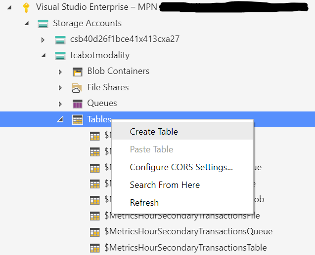

1. Create 3 tables called Approvers, Feature and PeoplePicker, Template, TextField

   

1. Download the following 5 csv files

   * [Approvers.typed.csv](images/Approvers.typed.csv)
   * [Feature.typed.csv](images/Feature.typed.csv)
   * [PeoplePicker.typed.csv](images/PeoplePicker.typed.csv)
   * [Template.typed.csv](images/Template.typed.csv)
   * [TextField.typed.csv](images/TextField.typed.csv)

1. Open all files and change all PartionKey values in each row to the user's Azure TenantID.

   > Note: See [whatsmytenantid.com](https://www.whatismytenantid.com/) to help find this

1. Import all files into their respective tables that you created in the previous step

   
   
1. Adjust values using [Table Storage Configuration](TableStorageConfiguration.md) for guidance
