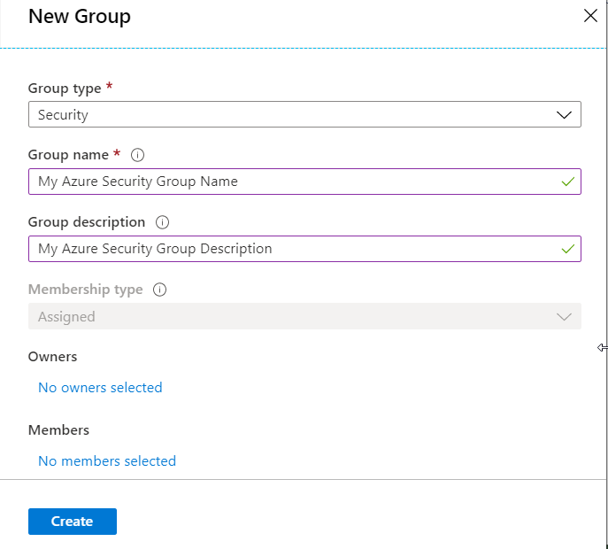

# Create an Azure Security Group

> Global administrator permissions are required create Azure Security Groups

1. Login to the [Azure Portal](https://portal.azure.com/).
2. Select **Azure Active Directory**, and then select **Groups**.
3. On the **Groups - All groups** page select **New group.**

4. In the New Group page, fill out the required information.

- Group type - Select **Security** from the dropdown.
- Group name - Enter the required name for the security Group. The Group name must be unique.
- Group description - Enter an optional description for the Group.
- Membership type - If you have the option to alter this field, make sure **Assigned** is selected.

> Owners and Members can be added at this stage whilst creating the Group, or they [can be added later](#add-members-to-azure-security-groups).

5. Select **Create** and your Group is created.

# Add Members to Azure Security Groups

> Global administrator permissions are required create assign Members to Azure Security Groups

1. Login to the [Azure Portal](https://portal.azure.com/).
2. Select **Azure Active Directory**, and then select **Groups**.
3. On the **Groups - All groups** search for and select the Group that members will be added to.
4. Select the **Members** area from the **Group** page an select **Add members**.
5. Search for the members you wish to add to your group, add members by selecting them in the search results.
6. When you're done adding members, choose **Select**.
7. The **Group Overview** page now updates to show the new number of members in the Group.
