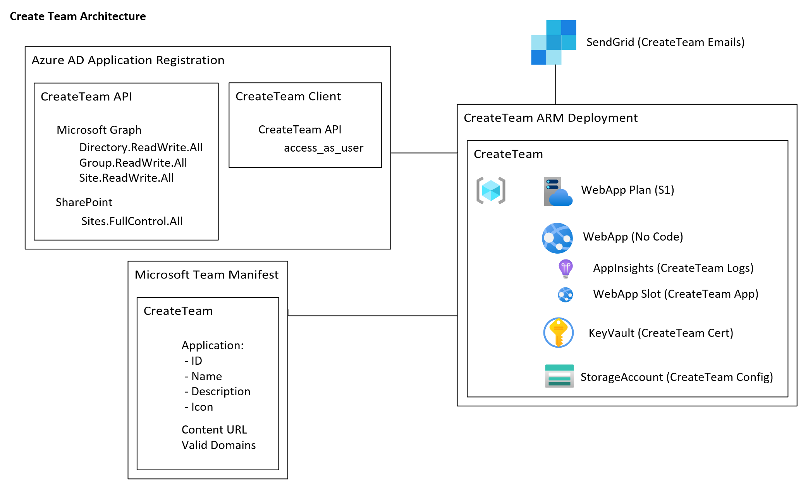

# Welcome

The CreateTeam Documentation site provides access to all of the platform documentation you will need to successfully setup and configure CreateTeam.

>[How to deploy CreateTeam to your Microsoft Teams for SASS](deployteamsapp.md)

>[How to deploy CreateTeam to your Microsoft Teams for Customer Hosted](customerHosted)

>[Removing/disabling the native Microsoft Teams Create a Team Button](RemovingDefaultTeamsCreateButton.md)

>[Managing User Roles](ManagingUserRoles.md)

>[Reporting](Reporting.md)