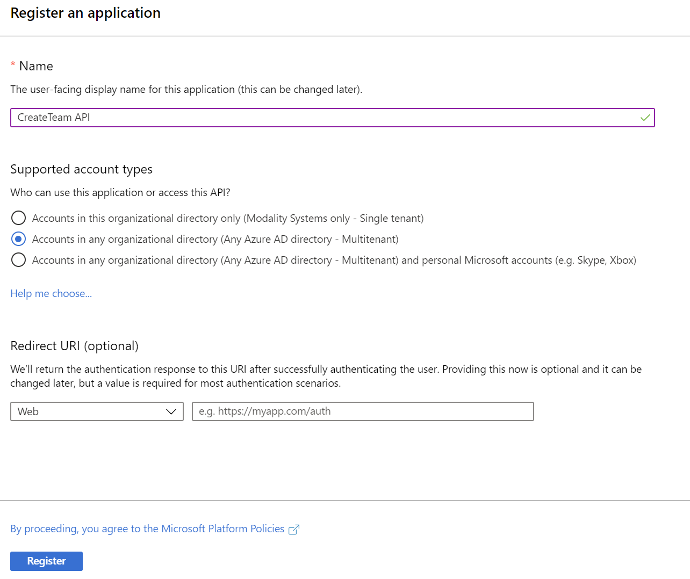

## Registering Create Team as an Azure Application
This document describes the process of registering Create Team as an Azure Application as the first step to deployment.  As part of the registration you will gather the following information for use further along the deployment process.
   * Application ID
   * Application Secret
   * Client ID
   * Tenant ID

Create Team requires two Azure Applications to be configured, one for the API and one for the client.

### Register Create Team with Azure Active Directory
1. Sign in to the [Azure Portal](https://portal.azure.com)
1. Select the **Azure Active Directory** service from the navigation menu on the top
1. Select **App Registrations** from navigation pane on the left and then click **+ New Registration** (Take care not to select **App Registrations (Legacy)** as these instructions do not apply to them)
1. Enter the following application registration details
   * **Name** - Recommend setting this to **Create Team API**
   * **Supported Account Types** - This needs to be set to **Accounts in any Organizational Directory**

   

1. Click **Register** and Azure AD will create an Application ID and present the Overview page

   

From this screen use the "Copy to Clipboard" button next to the Application ID, then open Windows Notepad and paste the value with appropriate title. Repeat these steps for Directory ID.