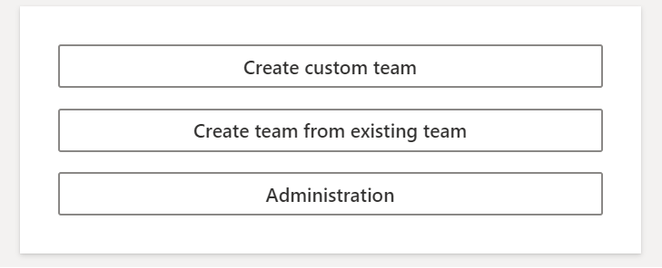
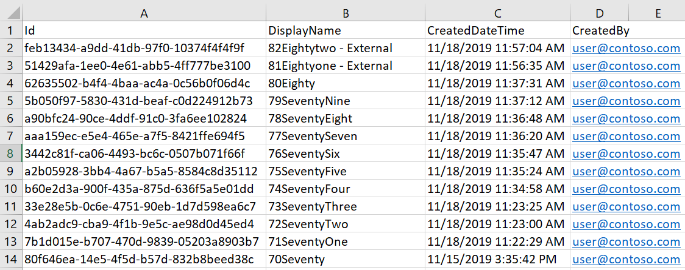

## How to access reports

1. [Ensure the user you are signed in with is in the Admin role](ManagingUserRoles.md)
2. Open the Create Team app inside teams
3. Click Administration

4. Click Generate Report
5. Wait up to 5 minutes, do not close the page. (will most likely complete within 5 seconds)
5. Open CSV once downloaded

## How to interpret reports

The report will contain 4 columns

1. Id of the team, this is also the id of the associated group in microsoft graph and can be used to query extra data
2. Display Name, the name of the team. (if an error occurs, in rare circumstances where this cannot be retrieved this will be displayed as "N/A")
3. Created Date Time, the date the team was original created in dd-MM-yyyy HH:mm format (time is 24 hours, UTC)
4. Created By, that will be a different value depending on if the "hide-pii" feature is enabled or not:
   1. If enabled (default) - the user object ID of the signed in user who created the team
   2. If disabled - the UPN of the user that created the team via CreateTeam. the report will not show the user if the team was created natively (you can however find this in the O365 Security and Governance audit logs.)
   3. If an error occurs when logging the audit, the user object ID will be logged. These errors can be found in App Insights.

>Any unexpected or error mis-configured feature errors will be detailed and accessible in Application Insights

>The report will only contain teams created in the last 90 days

>The report will contain teams created by CreateTeam and natively (excluding the CreatedBy UPN mentioned above)

>The report will only contain teams in the tenant you are currently signed into

>The report will order the teams by date created from newest to oldest (max 90 days)
