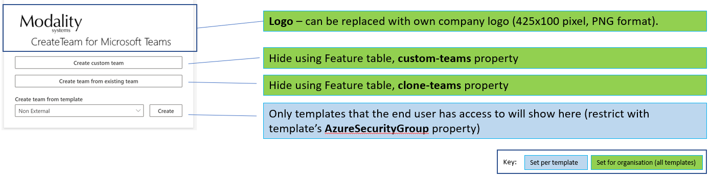
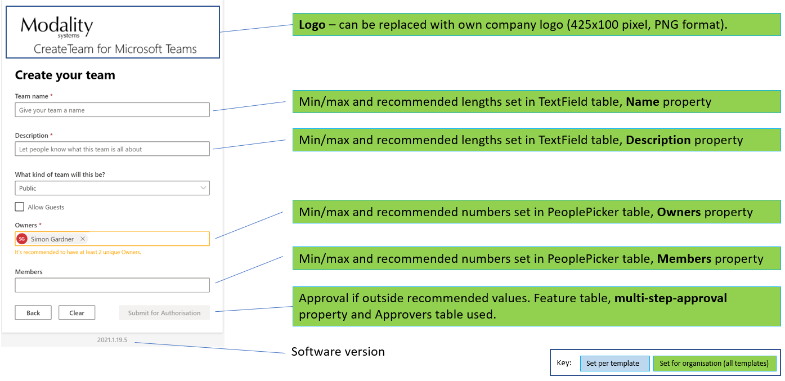
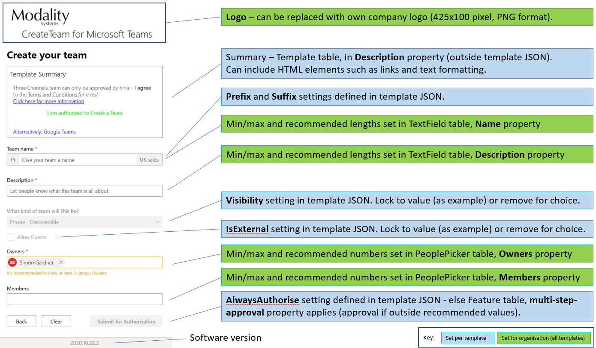

# Configuring CreateTeam

For SaaS customers, Modality Systems configure these options for you - this acts as a reference for what is possible.

For customer Azure tenant (CAT), these are [set in Azure table storage](https://docs.modalitysystems.com/CreateTeam/customerHosted/TableStorageConfiguration.html).

## Inital screen

Control appearance and which options the end user will see.

## Basic team creation ("Create custom team")

Control what end users are allowed, if using the basic (no templates) mode.

## Create team from template

Control visual elements of the template - [please refer to the template JSON format if creating your own](https://docs.modalitysystems.com/CreateTeam/customerHosted/templateJsonConfiguration.html).

Non-visual elements that can be configured in the template include:

* list of approvers for the template
* custom channels
* custom tabs within channels
* retention labels
* Azure security group that is allowed to use the template