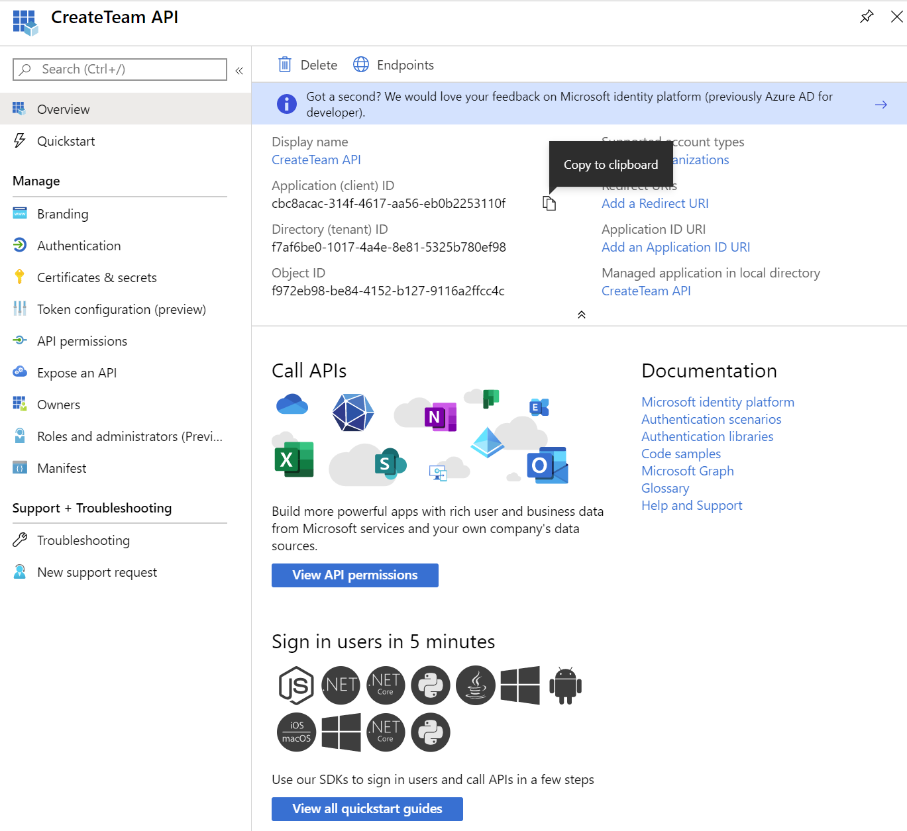
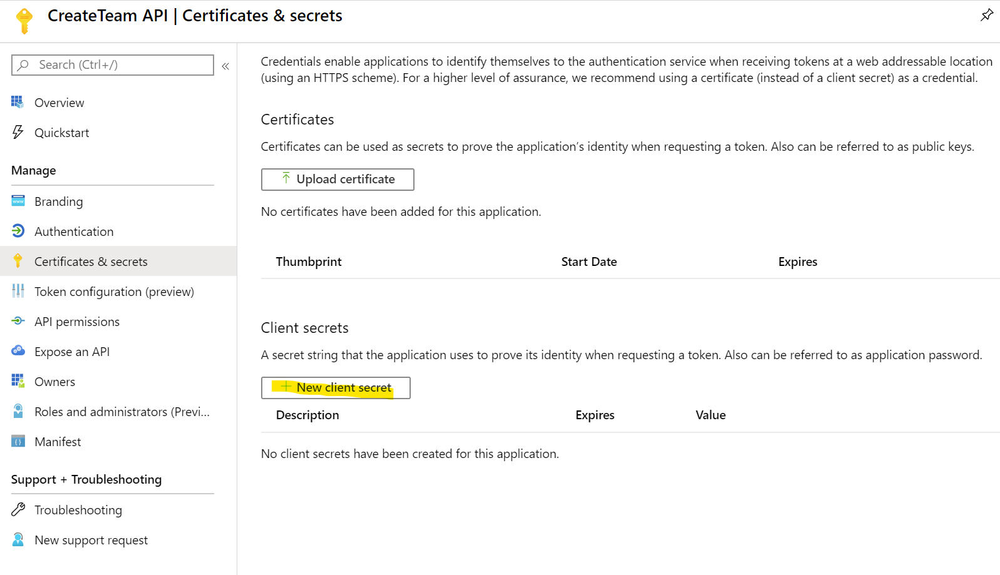
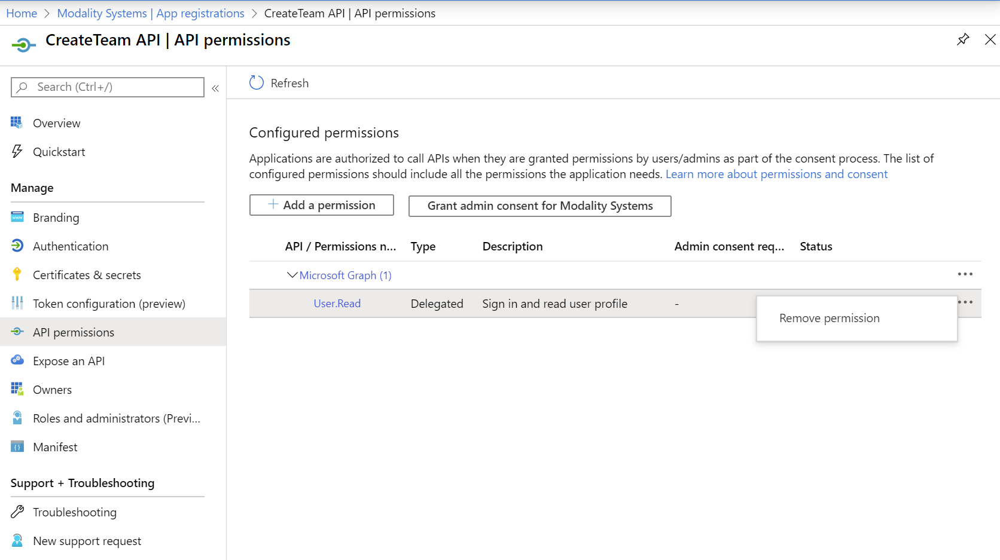
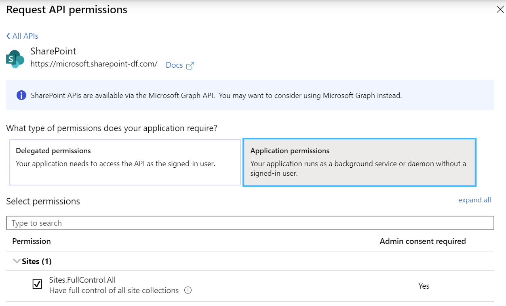
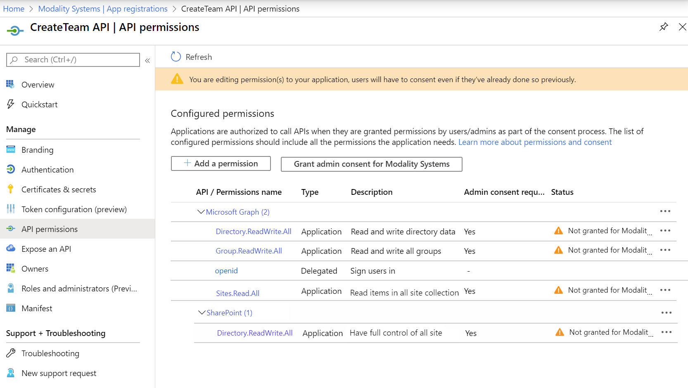
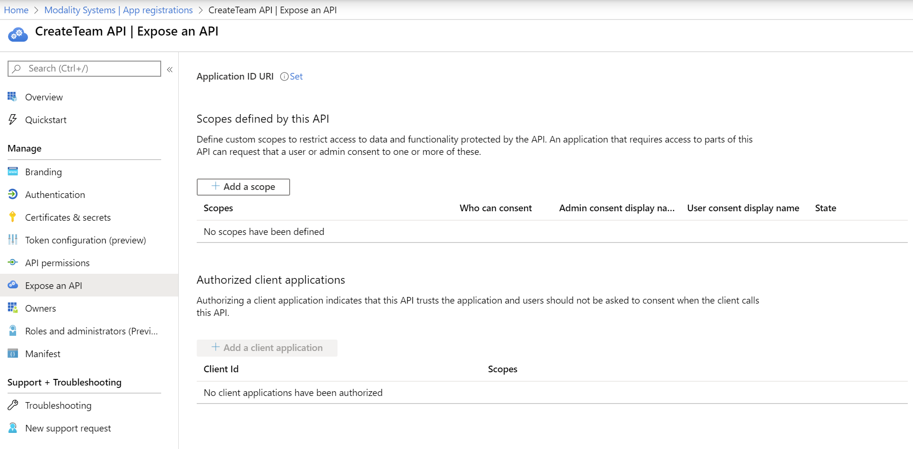
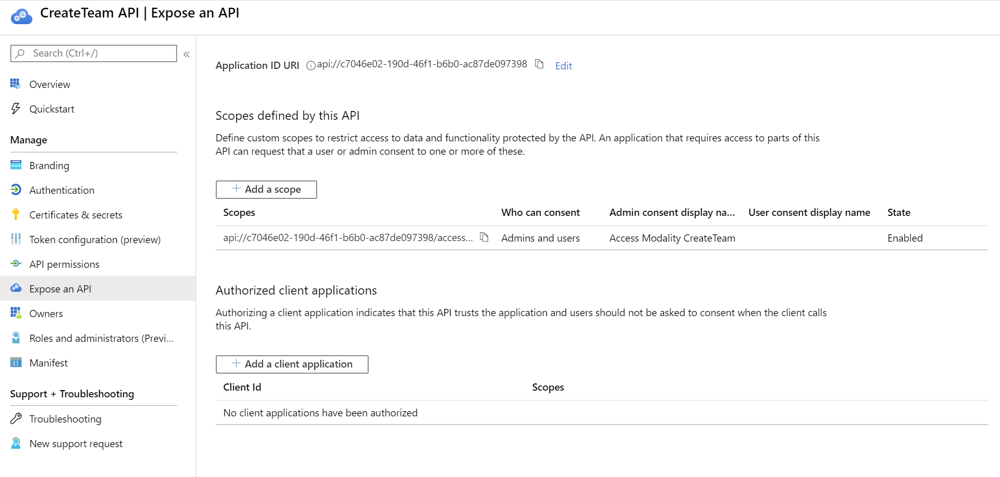

## Registering Create Team as an Azure Application (API)

This document describes the process of registering Create Team as an Azure Application as the first step to deployment. As part of the registration you will gather the following information for use further along the deployment process.
   * Application ID
   * Application Secret
   * Client ID
   * Tenant ID

Create Team requires two Azure Applications to be configured, one for the API and one for the Client. Here we will be looking at the API

### Register Create Team with Azure Active Directory

1. Sign in to the [Azure Portal](https://portal.azure.com)
2. Select the **Azure Active Directory** service from the navigation menu on the top
3. Select **App Registrations** from navigation pane on the left and then click **+ New Registration** (Take care not to select **App Registrations (Legacy)** as these instructions do not apply to them)
4. Enter the following application registration details
   * **Name** - Recommend setting this to **Create Team API**
   * **Supported Account Types** - This needs to be set to **Accounts in any Organizational Directory**

   

5. Click **Register** and Azure AD will create an Application ID and present the Overview page
    * From this screen use the "Copy to Clipboard" button next to the Application ID, then open Windows Notepad and paste the value with appropriate title. Repeat these steps for Directory ID.


   

   

6. Under Manage on the left hand side, click Certificates & Secrets then New Client secret
   * Select an appropriate expiry for the secret from 1 year to Never and click Add

   


7. The next screen will be the only time that the secret will be show so use the "Copy to Clipboard" button and paste into the Windows Notepad window that should still be open with appropriate title.

   

8. Under Manage on the left hand side, click API permissions then click the 3 dots next to the User.Read permission and click Remove permission

   

9. The click + Add a permission, then Mircosoft Graph and select Application permissions

   

   * Search for and Add Directory.ReadWrite.all, Group.ReadWrite.All and Site.Read.All permissions

10. The click + Add a permission, then SharePoint and select Application permissions
   
   

   * Search for and Add Sites.FullControl.All permissions

11. Once the permissions have been Added, they will need to be granted Admin Consent by a Global Admin

   

   * Click the Grant Admin Consent button 

   

12. Under Manage on the left hand side, click Expose an API and the click Set next to Application ID URI and then Save

   

13. Then Click + Add a scope and enter the following and then Add scope

   

   * Which should then look like this

   

14. Under Manage on the left hand side, click Manifest and replace the line "appRoles" with the following

```javascript
"appRoles": [
    {
        "allowedMemberTypes": [
            "User"
        ],
        "description": "Full Admin rights to Create Team",
        "displayName": "Admin",
        "id": "ede44b06-38ac-44dc-827e-598305139252",
        "isEnabled": true,
        "lang": null,
        "origin": "Application",
        "value": "Admin"
    },
    {
        "allowedMemberTypes": [
            "User"
        ],
        "description": "Guest Admin can create Teams that contain guests.",
        "displayName": "Guest Admin",
        "id": "103142b6-3dec-4a0b-a844-aebffb6b741f",
        "isEnabled": true,
        "lang": null,
        "origin": "Application",
        "value": "GuestAdmin"
    }
],
```

   * Which should end up looking like this

   

   * Click Save and continue on to [RegisterApplicationClient](RegisterApplicationClient.md)
