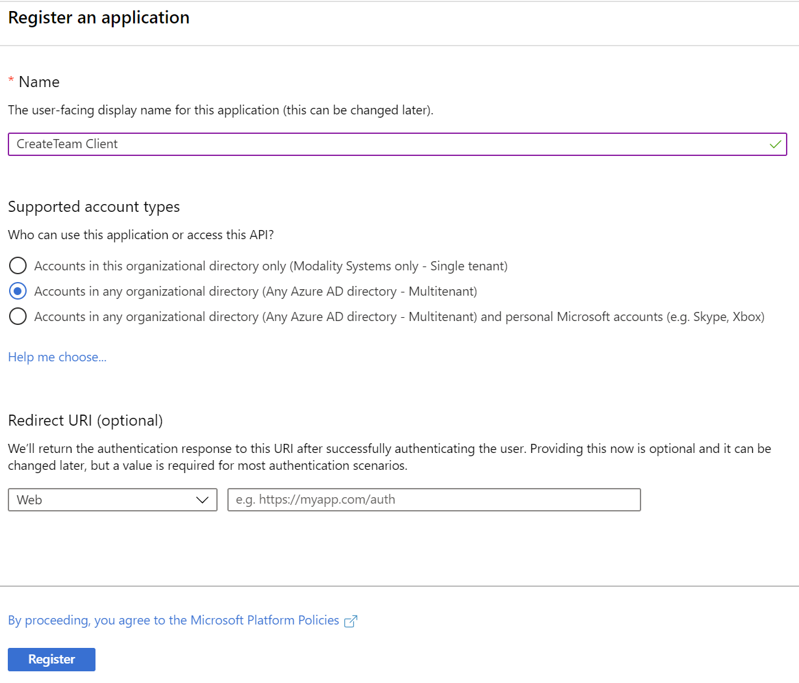
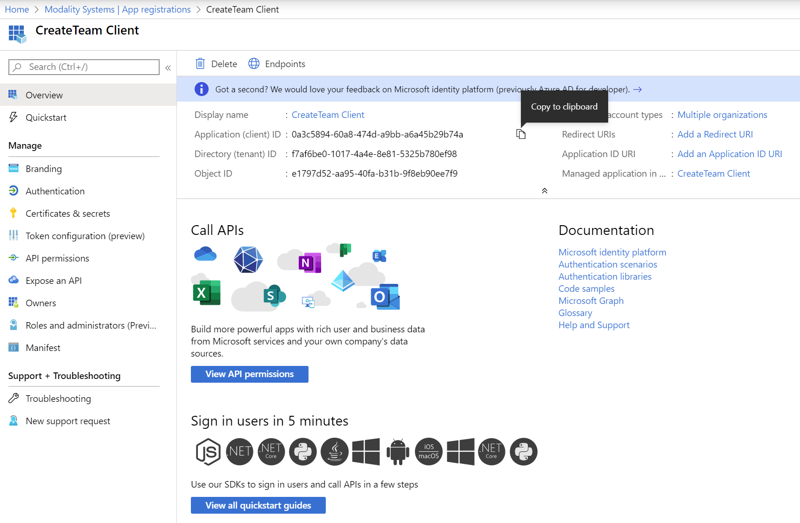
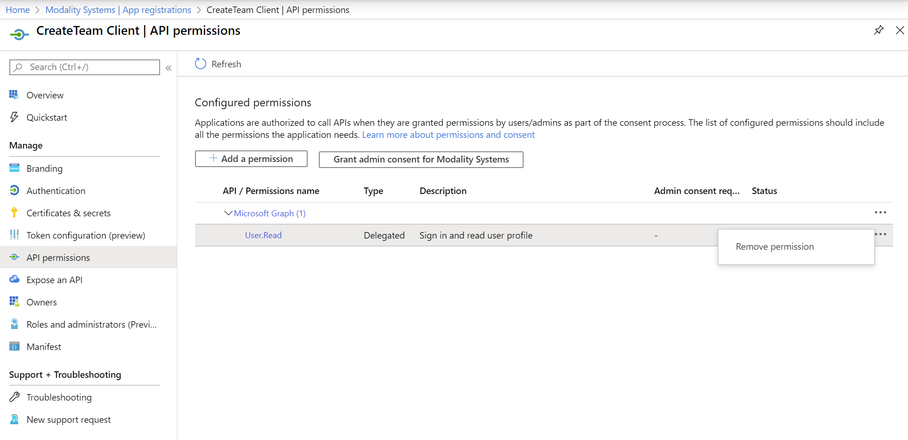
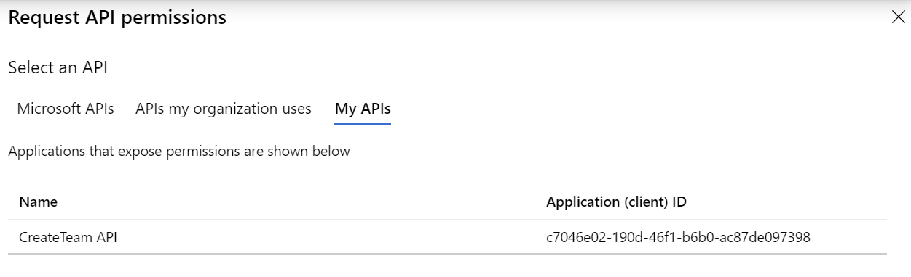
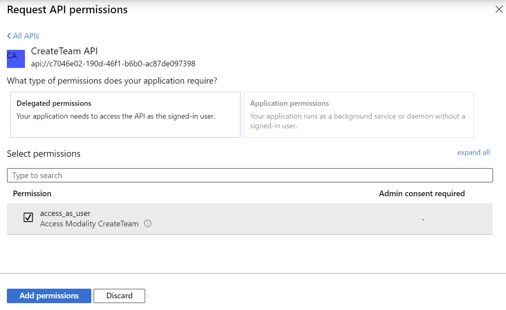
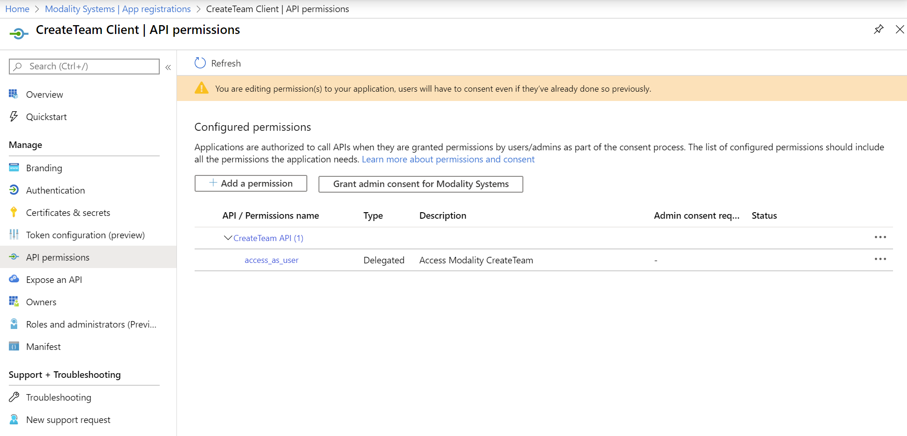

## Registering Create Team as an Azure Application (Client)

This document describes the process of registering Create Team as an Azure Application as the first step to deployment.  As part of the registration you will gather the following information for use further along the deployment process.
   * Application ID (This will be the Client ID)

Create Team requires two Azure Applications to be configured, one for the API and one for the client. Here we will be looking at the Client.

### Register Create Team with Azure Active Directory

1. Sign in to the [Azure Portal](https://portal.azure.com)
1. Select the **Azure Active Directory** service from the navigation menu on the top
1. Select **App Registrations** from navigation pane on the left and then click **+ New Registration** (Take care not to select **App Registrations (Legacy)** as these instructions do not apply to them)
1. Enter the following application registration details
   * **Name** - Recommend setting this to **Create Team Client**
   * **Supported Account Types** - This needs to be set to **Accounts in any Organizational Directory**

   

1. Click **Register** and Azure AD will create an Application ID and present the Overview page

   

   * From this screen use the "Copy to Clipboard" button next to the Application ID, then open Windows Notepad and paste the value with appropriate title.

1. Under Manage on the left hand side, click API permissions then click the 3 dots next to the User.Read permission and click Remove permission

   

1. The click + Add a permission, then My APIs and click the API that you created in previous step.

   

1. Tick the access_as_user permission and click Add permission

   

1. Once the permissions have been Added, they will look like this

   

   * There is no need to Grant admin consent for the Client as the user will give consent the first time they use CreateTeam.

## CreateTeam ARM Deployment

1. The Azure AD Applications are now configured however, we will need to revisit them once the ARM Deployment has finished to update some values. 
   - Please continue to [CreateTeam ARM Deployment](armDeploy.md) for next steps.