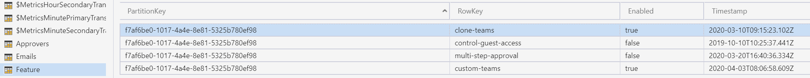
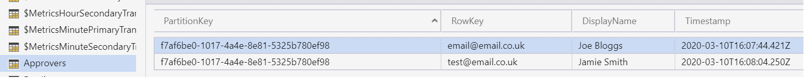
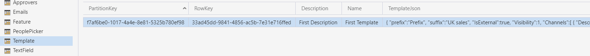

# Azure Table Storage Configuration

1. Open Azure Storage explorer on your PC (Download from https://azure.microsoft.com/en-us/features/storage-explorer/) add your PROD account and subscription if required

1. Open the storage account associated with Create Team

1. Add/Edit rows individualy, or [import the default values into table storage](ImportDefaultValuesTableStorage.md)

## Feature Table

> Default Values can be downloaded from here: [Feature.typed.csv](../images/customerHosted/Feature.typed.csv)



Add a Feature for each of the following RowKeys:

- PartitionKey = [TenantId]
  > Note: See [whatsmytenantid.com](https://www.whatismytenantid.com/) to help find this
- RowKey = This is a unique string to identify the feature.
  - clone-teams
  - custom-teams
  - multi-step-approval
  - control-guest-access
- Enabled (boolean) = whether to enable the feature or not

## PeoplePicker Table

> Default Values can be downloaded from here: [PeoplePicker.typed.csv](../images/customerHosted/PeoplePicker.typed.csv)


Add a PeoplePicker for each of the following RowKeys:

- ParitionKey = [TenantId]
- RowKey = This is a unique string to identifiy the People Picker.
  - members
  - owners
  - guests
- NativeMinCount (Int32) = The minium count of people. If this number is not met, the field will invalidate the form and advise of the minimum count (red)

> For the 'owners' field, the minimum value of NativeMinCount is 1. For the other PeoplePicker fields, 'members' and 'guests', the minimum value of NativeMinCount is 0.

- RecommendedMinCount (Int32) = The recommended minimum count of people. If this number is not met, the field will advise of the recommended minimum count (yellow)
- RecommendedMaxCount (Int32) = The recommended maximum count of people. If this number is exceeded, the field will advise of the recommended maximum count (yellow)
- NativeMaxCount (Int32) = The maximum count of people. If this number is exceeded, the field will invalidate the form and advise of the maximum count (red)

> For the 'members' and 'guests' fields, the maximum value of each individual NativeMaxCount is 5000. However the combined maximum is also 5000. For example if 'members' has a value of 3000, then the maximum for 'guests' is 2000. (3000 + 2000 = 5000)

> For the 'owners' field, the maximum value of NativeMaxCount is 100.

- Validate (boolean) = This will enabled or disable the above validation rules for the People Picker.

> Please note, NativeMinCount <= RecommendedMinCount <= RecommendedMaxCount <= NativeMaxCount

> It's advisable to stick to the default native min and max counts, or, ensure the new values are more strict than the defaults. These match native teams validation.

## TextField Table

> Default Values can be downloaded from here: [TextField.typed.csv](../images/customerHosted/TextField.typed.csv)


Add a TextField for each of the following RowKeys:

- ParitionKey = [TenantId]
- RowKey = This is a unique string to identifiy the Text Field.
  - description
  - name
- NativeMinLength (Int32) = The minium length of input. If this number is not met, the field will invalidate the form and advise of the minimum length (red)

> For the 'name' field, the minimum value of NativeMinLength is 1.

> For the 'description' field, the minimum value of NativeMinLength is 0.

- RecommendedMinLength (Int32) = The recommended minimum length of input. If this number is not met, the field will advise of the recommended minimum length (yellow)
- RecommendedMaxLength (Int32) = The recommended maximum length of input. If this number is exceeded, the field will advise of the recommended maximum length (yellow)
- NativeMaxLength (Int32) = The maximum length of input. If this number is exceeded, the field will invalidate the form and advise of the maximum length (red).

> For the 'name' field, the maximum value of NativeMaxLength is 245. If you have suffixes defined in the Template table, see below. The NativeMaxLength for the 'name' field must be less than the maximum length (245) minus the length of the longest suffix. For example a suffix with the maximum length of 10 would require a 'name' NativeMaxLength of less than 235 (245 - 10).

> For the 'description' field, the maximum value of NativeMaxLength is 1025.

- Validate (boolean) = This will enabled or disable the above validation rules for the Text Field.

> Please note, NativeMinLength <= RecommendedMinLength <= RecommendedMaxLength <= NativeMaxLength

> It's advisable to stick to the default native min and max lengths, or, ensure the new values are more strict than the defaults. These match native teams validation.

## Approvers Table

> Default Values can be downloaded from here: [Approvers.typed.csv](../images/customerHosted/Approvers.typed.csv)



If the multi-step-approval feature is enabled, the email address within this table for the tenant will be sent an email when approval is required. (This is when a user creates a team that does not meet recommended validation as per the TextField and PeoplePicker tables)

- ParitionKey = [TenantId]
- RowKey = The email address of the approver
- DisplayName = The display name of the approver. (this is only used inside table storage as a reference and is not used within the system)

## Emails Table

Ignore, this is a reserved system table and not for configuration

## Template Table

> Default Values can be downloaded from here: [Template.typed.csv](../images/customerHosted/Template.typed.csv)



The templates defined in this table will appear as templates in the main menu for the tenant.

- PartitionKey = [TenantId]
- RowKey = This should be a unique Guid. To generate a Guid visit https://www.guidgenerator.com/, press the “Generate some GUIDs!” button and copy the result into this field. A new Guid needs generating for each row.
- Description = This text will appear in the summary box on the create team form when the template is selected
- Name = The name will appear in the template drop down on the main menu
- TemplateJson = The settings for the template in json format. It should follow the schema

```javascript
{
   "Prefix": "Prefix",
   "Suffix": "UK Sales",
   "IsExternal":true,
   "Visibility":1,
   "AlwaysAuthorise":false,
   "AzureSecurityGroup":"GroupName",
   "Channels":[
      {
         "Description":"Description51edacfe-536e-45df-ab37-cbadcfb7636e",
         "DisplayName":"DisplayName059ad58a-c3d7-4658-93a7-4373e3fa1e68"
      },
      {
         "Description":"Descriptionc89a8bc8-c52d-4de7-86c5-28f74783a7fd",
         "DisplayName":"DisplayNameda9e015d-2500-4353-948d-f772660fc866"
      },
      {
         "Description":"Description1eef67b4-5299-492d-a548-0e791ebc577a",
         "DisplayName":"DisplayName92532b74-b248-4f00-853c-c914f4137931"
      }
   ]
}
```
### Template Settings

Here is an explanation as to what each template setting controls:

- Prefix - The text to be prepended to the start of the team name. The maximum prefix length is 10 characters.
- Suffix - The text to be appended to the end of team name. The maximum suffix length is of 10 characters long. If the team can contain guests (controlled by the IsExternal setting, see below), then the suffix " - IsExternal" is appended after the suffix specified here.
- IsExternal - Whether the team can contain guests or not. When true appends the suffix " - IsExternal" to the team name.
- Visibility - Visibility of the team, 0 = public, 1 = private - discoverable, 2 = private - hidden.
- AlwaysAuthorise - When true, all new Teams will be submitted for Authorisation. The ability to create Teams directly is removed, even if they meet the recommended rules.
- RetentionLabel - When populated, the value is used to assign the retention label for the whole SharePoint site library, if this process fails the **team** will be archived, leaving the IT admin to resolve. Therefore the value must exactly match one of the available retention labels provision on your tenants SharePoint. This is a prerequisite for this feature, for more information [read the following](https://docs.microsoft.com/en-us/microsoft-365/compliance/labels?view=o365-worldwide).
- AzureSecurityGroup - When populated, only users that belong to an Azure security group with a matching name (case sensitive) can use the template. If the field is empty, any logged in user can use the template. [Users can be assigned to security groups, and groups can be set up](../ManagingAzureSecurityGroups.md) in the Azure Portal.
- Channels - The channels the team is created with
  - Description - Description of the channel
  - DisplayName - Name of the channel

## CreateTeam Manifest for ARM Deployment

1. The backend deployment is now complete but for people to interact with CreateTeam you will need to create a manifest file and install into Microsoft Teams.
   - Please continue to [CreateTeam Manifest for ARM Deployment](manifestCreate.md) for next steps.