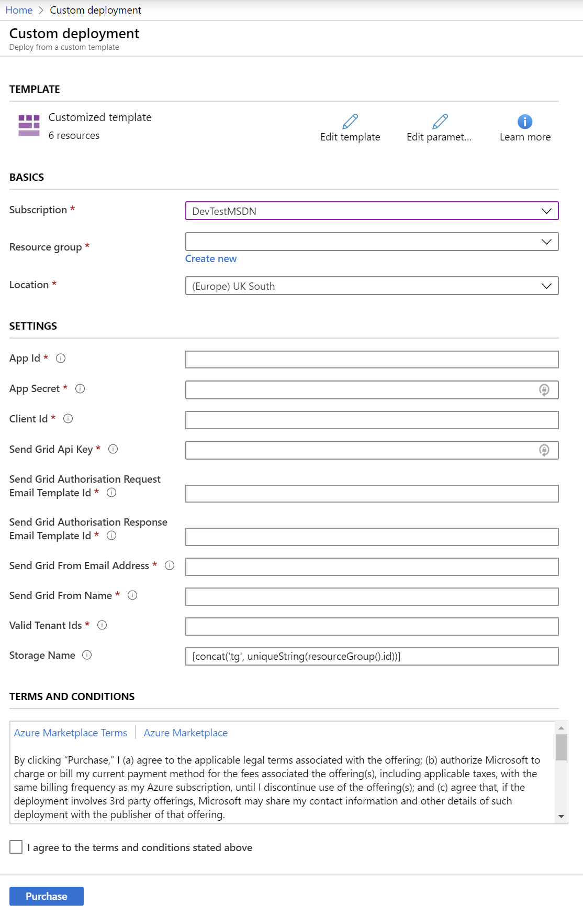
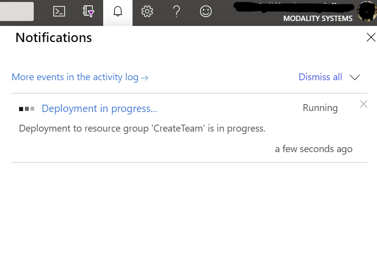
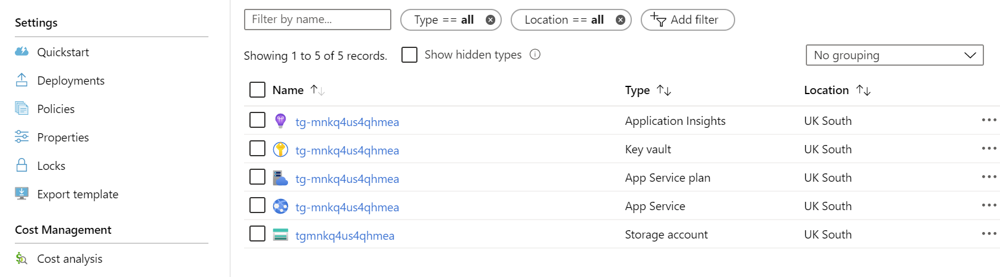

# CreateTeam ARM Deployment

CreateTeam can be provided as an Azure Resource Manager (ARM) template that automatically provisions and starts the required resources in your Azure subscription.

- Contact info@modalitysystems.com for a URL to the ARM Deployment.

> Note: You must have [registered an application](RegisterApplicationAPI.md) beforehand.

> Note: For an introduction to Azure Resource Manager see [docs.microsoft.com](https://docs.microsoft.com/en-us/azure/azure-resource-manager/resource-group-overview).

This ARM Template will install resources in your Azure tenant. The template will deploy the following resources:

| Service Type         | Description                                                                                            |
| -------------------- | ------------------------------------------------------------------------------------------------------ |
| Web App Service      | S1, 100 Total ACU, 1.75GB memory, A-Series Compute Equivalant                                          |
| Key Vault            | Securely stores Web App Secret                                                                         |
| Application Insights | Logs for Web App Bot and Web App Service                                                               |
| Storage Accounts     | Block Blob Storage, General Purpose V2, RA-GRS Redundancy, 1,000 GB Capacity, 100 Storage transactions |

## Installation

1. Click on the ARM template link that was provided by us. You will be taken to Microsoft Azure Portal and a deployment form will open as shown below.

   

1. Carefully fill in the fields. In some cases the tooltips may provide extra guidance.

   - Basics
     - **Subscription** - Choose the Azure subscription to which deployed resources will be billed.
     - **Resource group** - It is strongly recommended that you create a new resource group for logical grouping and management of CreatTeam. _When applying an upgrade choose the Resource Group that already contains CreateTeam._
     - **Location** - The location of the newly created resource group (this only determines the geographical location of resource group and its metadata, to change the location of the resources themselves, see _Location_ below).
   - Settings
     - **Azure Application details** - Use the details you generated when [registering an application](RegisterApplicationAPI.md).
     - **Send Grid Config Details** - These are settings required for SendGrid to send emails
     - **Valid Tenant IDs** - This should be in the format https://sts.windows.net/{TENANTID}/
     - **Storage Name** - It is strongly advised to leave this as default which will create a storage account starting tg followed by a unique string.

1. Read the Terms and Conditions, then click "I agree to the terms and conditions stated above" and click "Purchase" (this refers to the resources hosted on Azure, and is not a usage agreement for CreateTeam.)

1. The notification bell will show the deployment in progress, the when complete click Go to resource group

   

1. After a period of deployment should get a Resource group in your tenant with the following components

   

## Bot Manifest

1. The backend deployment is now complete but for people to interact with CreateTeam you will need to create a manifest file and install into Microsoft Teams.
   - Please see [CreateTeam Manifest for ARM Deployment](manifestCreate.md) for details.
