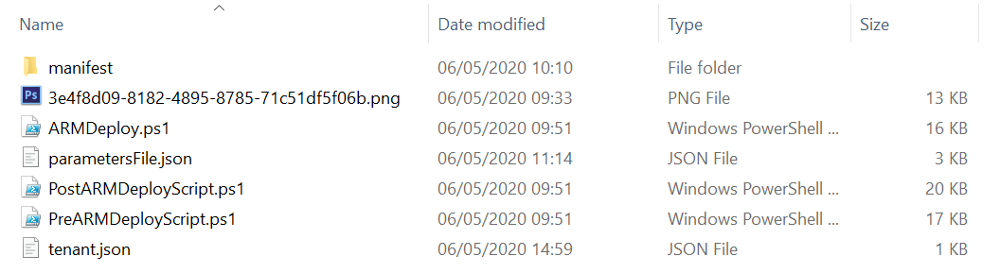

# CreateTeam ARM Deployment Scripts

To facilitate a faster and more consistent CreateTeam deployment process we have developed a set of deployment scripts that can be run by a customer to deploy CreateTeam within their own Azure Subscription. This set of deployment scripts comes in the form of 3 powershell scripts:

| Script Name             | Description                                                                                            |
| ------------------------| ------------------------------------------------------------------------------------------------------ |
| PreARMDeployScript.ps1  | Creates 2 Azure AD Application Registrations and links them together by Exposing the API to the Client |
| ARMDeploy.ps1           | Performs an ARM deployment or upgrade of CreateTeam, adds logo if present                              |
| PostARMDeployScript.ps1 | Applies graph permissions, creates roles, sets redirect URI's, generates key vault certificate, creates tables and teams manifest |

Download [CustomerDeployScripts.zip](https://github.com/modalitysystems/CreateTeamGABuilds/releases/latest) from here 

Each script is signed and will require [Azure PowersShell](https://docs.microsoft.com/en-us/powershell/azure/install-az-ps) to be installed first. It will also need to be able to access the internet so if you are running the scripts from behind a web proxy then this will need to be configured.

> Note: For an introduction to Azure Resource Manager see [docs.microsoft.com](https://docs.microsoft.com/en-us/azure/azure-resource-manager/resource-group-overview).

> Note: Please follow the steps to configure [SendGrid](https://docs.modalitysoftware.com/CreateTeam/customerHosted/sendGrid.html) before using these scripts.

This ARM Template will install resources in your Azure tenant. The template will deploy the following resources:

| Service Type         | Description                                                                                            |
| -------------------- | ------------------------------------------------------------------------------------------------------ |
| Web App Service      | S1, 100 Total ACU, 1.75GB memory, A-Series Compute Equivalent                                          |
| Key Vault            | Securely stores Web App Secret                                                                         |
| Storage Accounts     | Block Blob Storage, General Purpose V2, RA-GRS Redundancy, 1,000 GB Capacity, 100 Storage transactions |
| [Application Insights] | [Logs for Web App Bot and Web App Service] Not installed by default*                                 |

> Important: **Remote Application Logging. By default the application will configure itself to send logging and telemetry data to Modality Systems using an Application Insights instance securely hosted in Microsoft Azure. This enables Modality Systems to investigate and remediate any reported issues remotely. By exception it may be possible instead to keep logging data within the customer's tenant but this may have licensing and support implications which you should discuss with Modality Systems to fully understand.**

## Installation

The scripts are designed to run in sequence starting with **PreARMDeployScript.ps1** followed by **ARMDeploy.ps1** and finally **PostARMDeployScript.ps1**. Each script will either create or update the following settings files **tenant.json**, **parametersFile.json** and **manifest\manifest.json**

## PreARMDeployScript.ps1

This script is used to create two new Azure Active Directory Application Registrations that are required for CreateTeam and links them together to facilitate client authentication to the backend API. The app registrations can be either in the same tenant as CreateTeam or different however, the admin consent **MUST** be done in the same tenant as CreateTeam has been deployed too. 

An **Application Registration** is simply a definition of what settings are **GOING** to be applied and once an admin consents, this then becomes an Enterprise Application within that tenant defining what settings **HAVE** been applied and can be revoked at any time. CreateTeam requires these permissions in order to function within a given tenant.

1. Run the PowerShell script called **PreARMDeployScript**, enter a name that you would like the App Registration to be called or press enter to call it CreateTeam
1. Enter a name for the slot or environment. This should be a string to identify your company and **MUST** be between 2 and 6 characters in length and contain **ONLY** letters
1. Press Enter to log into the tenant where you would like to create the Azure Active Directory Application Registrations
1. This will then create two App Registrations and create a parametersFile.json with the settings as shown on screen. This file is then read be the ARM Deployment and needs to be complete
1. Open **parametersFile.json** that has been created and fill in the following values
   - SendGridApiKey
   - SendGridAuthorisationRequestEmailTemplateId
   - SendGridAuthorisationResponseEmailTemplateId
   - SendGridFromEmailAddress
   - SendGridFromName
   - ValidTenantIds - This should be in the format https://sts.windows.net/{TENANTID}/
1. The other file that gets created is **tenant.json** and stores settings that pass to the other scripts

## ARMDeploy.ps1

This script performs an ARM Deployment or Upgrade of CreateTeam using settings defined in the **parametersFile.json** and **tenant.json** files

1. Run the PowerShell script called **ARMDeploy.ps1**
1. Press Enter to log into the tenant that has the subscription that you would like to deploy or upgrade CreateTeam too
1. Enter the subscription id that you would like to deploy or upgrade CreateTeam too
1. Enter the name of the resource group that you would like to deploy or upgrade CreateTeam too
1. If the resource group doesn't exist enter desired geographic location and press Enter
1. Check the settings that will be used in the deployment and press Enter to continue with deployment
   
> NOTE: If a custom logo is required for the deployment then ensure that it is present in the script root in the format "{tenantid}.png"

   

## PostARMDeployScript.ps1

This script requires a successful ARM Deployment to have completed as it takes most of its parameters from here. It completes the setup of both App Registrations and can be used to apply updated settings as the product develops. It also generates the certificate within Key Vault that is used to secure graph calls, creates blank tables in the configuration storage account and creates a Microsoft Teams App manifest package.

1. Run the PowerShell script called **PostARMDeployScript.ps1**
1. Enter the name of the Microsoft Teams app that your users will see or hit Enter to call it CreateTeam
1. Press Enter to log into the tenant that has the subscription that has CreateTeam deployed too
1. Press Enter to log into the tenant where the Azure Active Directory Application Registrations are
1. When everything has finished setting up, you will see the Admin Consent url. This needs to be ran by someone with Global Admin Privileges against the tenant that you are wanting to use CreateTeam in
1. There should also be a zip package now in the script root folder called **CreateTeamManifest.zip** which will need to be installed into Microsoft Teams

## Perform manual installation steps

1. There are now a few manual steps that are required which can't be done by scripts
   - Please follow steps [Manual Installation Steps](armDeployScriptsMan.md) to continue.