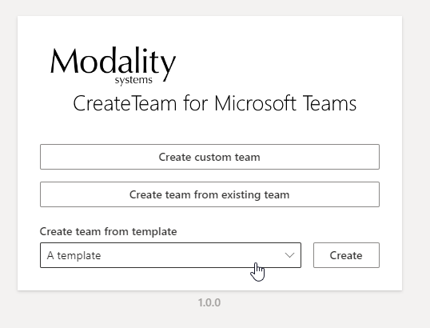
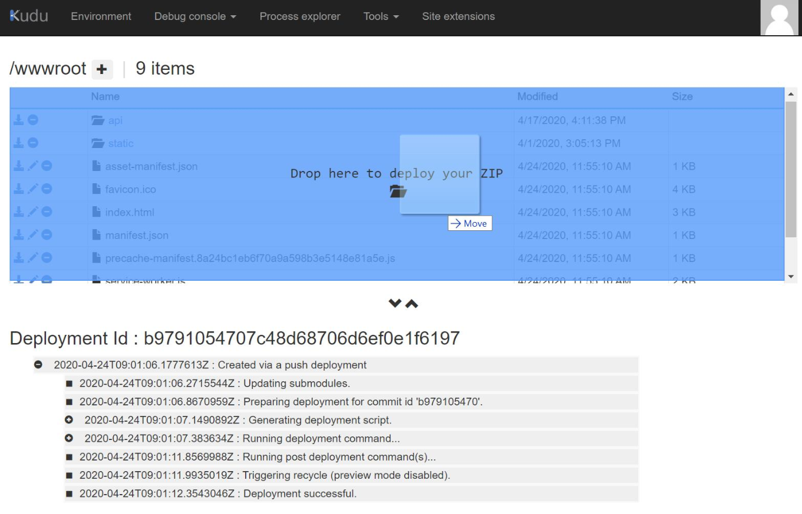

# Upload your company logo to CreateTeam

In order to customise the appearance of Create Team, a logo can be uploaded to the Web App Service. The logo is displayed at the top of all pages once you have logged into CreateTeam.

In order to display a logo in CreateTeam the following actions are required:

1. Set the _enable-logo_ feature in [table storage](TableStorageConfiguration.md) to true.
1. [Upload logo to Web App Service](##upload-logo-to-web-app-service).

## Logo format

CreateTeam will only display a logo that has the same name as your tenantId, for example _32d02036-908b-491b-ad63-6631a0aeaa0d.png_, this means the image format must be PNG.

It is recommended that logo have a size of 425 x 100 pixels. This will appear as a full width banner. Smaller logos will appear smaller on the screen, large images will be scaled down to fit in the available space.

## Upload logo to Web App Service

1. In file explorer on your machine, create a folder named _Logos_, and add your logo to the folder. Be careful to ensure your logo has the [correct format](##logo-format).

1. Zip up you Logos folder containing your logo, so you have a folder named _Logos.zip_.

1. Go to your Web App Kudu Services. The ARM template outputs a link which will take you there. The link will be in the format of _https:// { your web app service name } .scm.azurewebsites.net/_

1. In Kudu Services Select _Tools_ from the toolbar at the top, the choose _Zip Push Deploy_ from the dropdown.

1. The Zip Push Deploy page should open with the _/wwwroot_ folder selected. Drag the Logos.zip folder into the folder pane on Zip Push Deploy page.

6. The Logos folder will be added containing your Logo. The Logo will now be displayed in CreateTeam.

* Return to [CreateTeam ARM Deployment](armDeploy.md) to continue with the installation