# How to deploy CreateTeam App into Teams

Create Team is provided as an Microsoft Teams App that needs to be uploaded to your organisation's Apps section within Microsoft Teams.

> NOTE: Some of the steps below require making changes to your Microsoft Online Tennant which can sometimes take a few hours to take effect

## Admin Consent for CreateTeam App API

For the App to be able to create teams in the target Teams Tenant, it is a requirement that a Office 365 Global Admin of that tenant grants admin consent. 

1. This is achieved by clicking on the following link and logging in with a Global Administrator account

   [Provide Admin Consent](https://login.microsoftonline.com/common/adminconsent?client_id=d992e819-1a67-4840-89d3-1cee8cd4e735&redirect_uri=https://tgmodprod.azureedge.net/AdminConsent)

2. From here a summary screen showing what is required will be displayed

   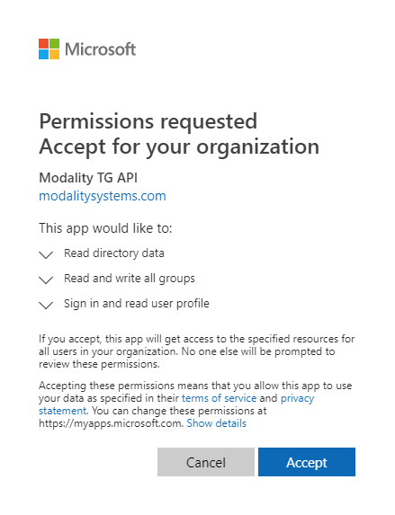

3. The Admin Consent will be visible within the Enterprise Applications section of Azure AD

   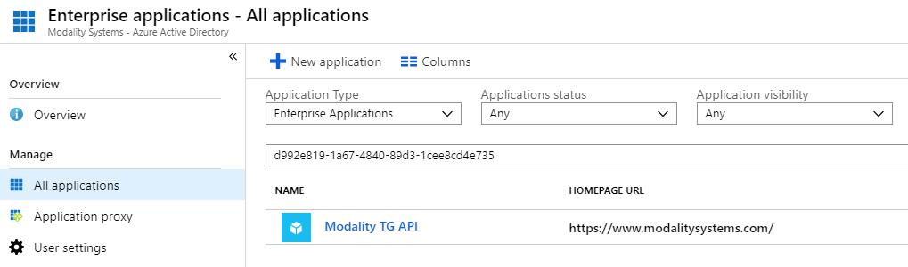

## Installation

1. 1.	From Microsoft Teams go to the Apps section
   
   
   
2. Then select Upload for [YOUR ORGANISATION NAME]
   
   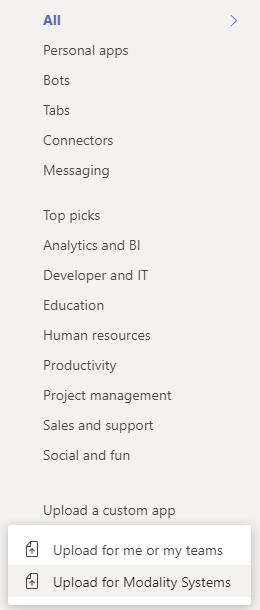
   
3. Then select the App package provided by Modality Systems as a zip file
   
   

4. The App should then appear within your companies Apps section
   
   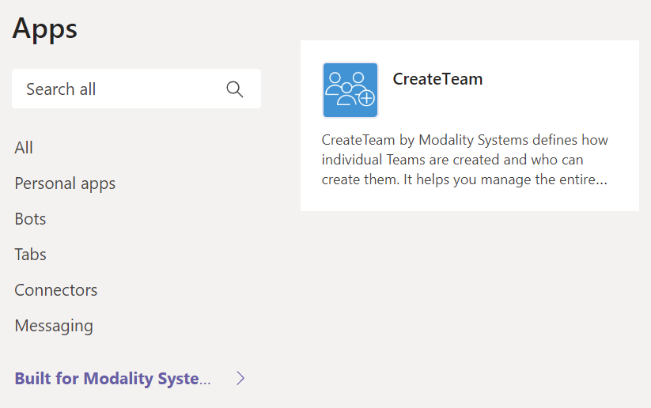
   
> NOTE: To update an App that has already been installed, navigate to the App within your companies Apps section then hover your mouse pointer over the app, click on the ... in the top right corner and click Update
   
   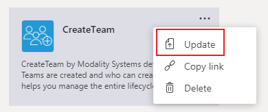
   
## Allow App to be installed within Microsoft Teams

Now that the App has been added to your Microsoft Teams Tenant, your Global policy may need to be adjusted to allow it to be installed by users.

1. From the Microsoft Teams Admin Center, under *Teams apps* click *Permission policies*

   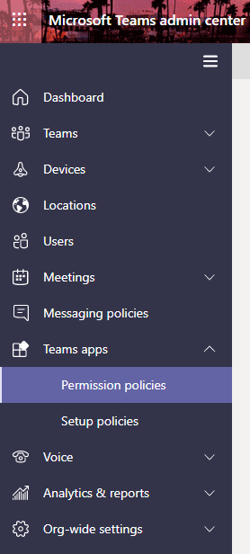
    
2. Click on *Global (Org-wide default)* (or whatever policy is applied to your organisation)

   

3. Make sure the *Tenant apps* policy is set to Allow all apps

   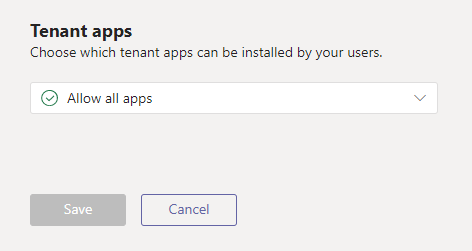

> NOTE: You could also specify a list of allowed apps here 

## Pin App within Microsoft Teams

To improve the end user experience it is recommended to pin the App to the main Microsoft Teams list of Apps

1. From the Microsoft Teams Admin Center, under *Teams apps* click *Setup policies*

   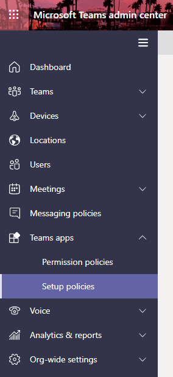
    
2. Either edit *Global (Org-wide default)* or create a new policy and give it a name

   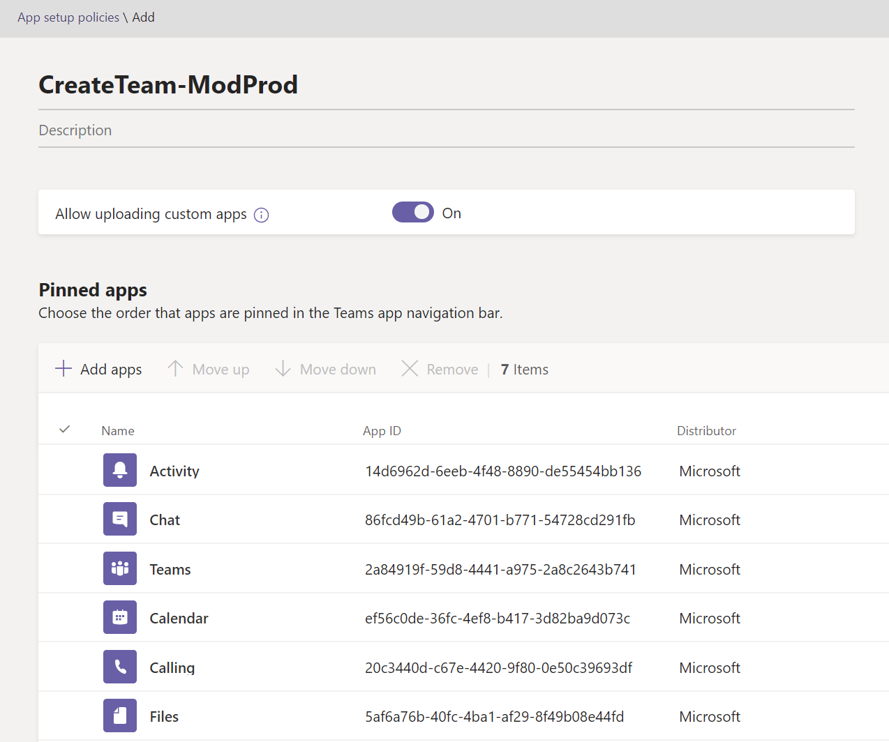

3. Click *Add apps*, select *Permissions policy* from previous step, search for TG and click Add

   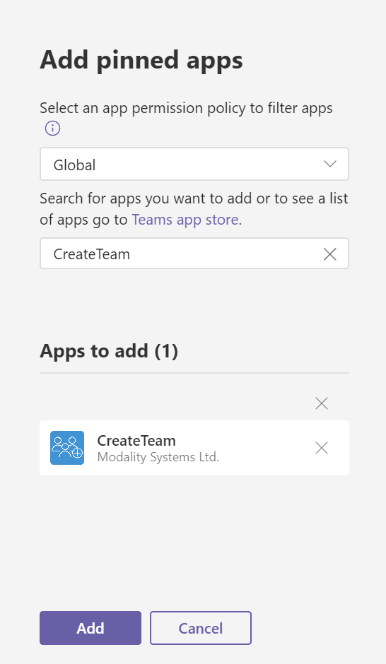

4. Click Save

   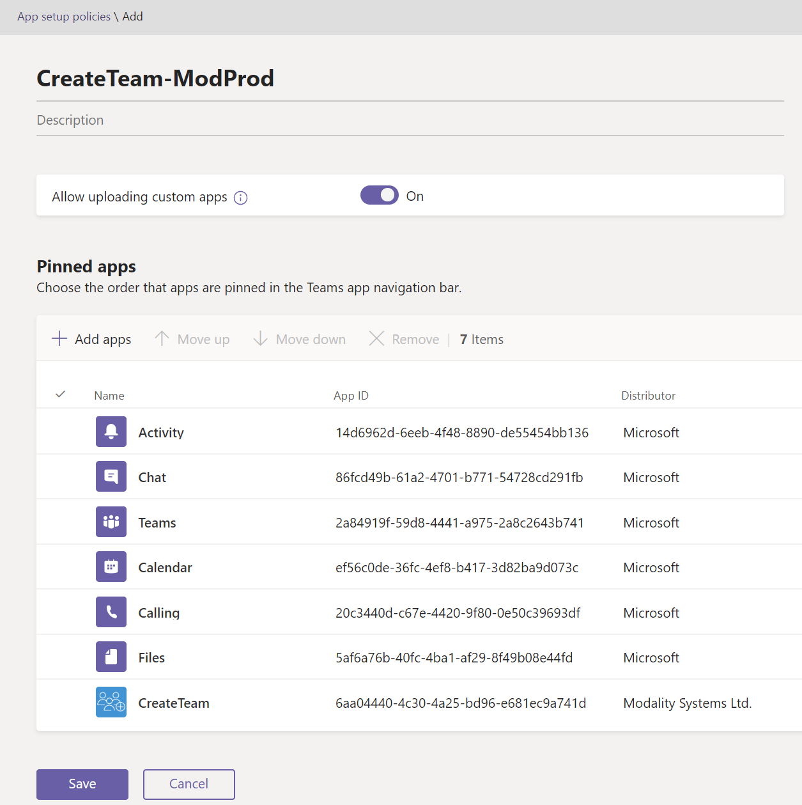

If you created a new Setup policy in step 2 then you will need to assign users to the policy

5. From the Microsoft Teams Admin Center, under *Teams apps* click *Setup policies*, click on the tick next to the required policy name

   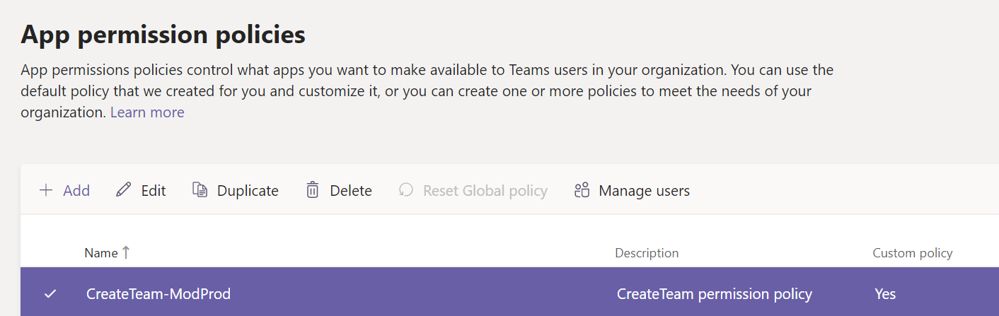

6. Click *Manage users* and add the required users
    
   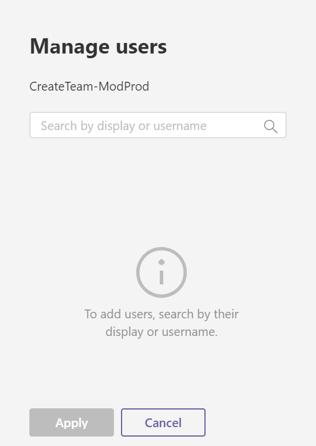
   
Further information about managing app setup policies in Microsoft Teams is available: 

   [Manage app setup policies in Microsoft Teams](https://docs.microsoft.com/en-us/microsoftteams/teams-app-setup-policies)

> NOTE A user can only be assigned to 1 app settings policy so this will remove them from the policy that they are currenlty assigned too

## User Consent for CreateTeam App Client

When a user first launches the App from within Microsoft Team, they are required to provide consent for their details to be accessed by the App

   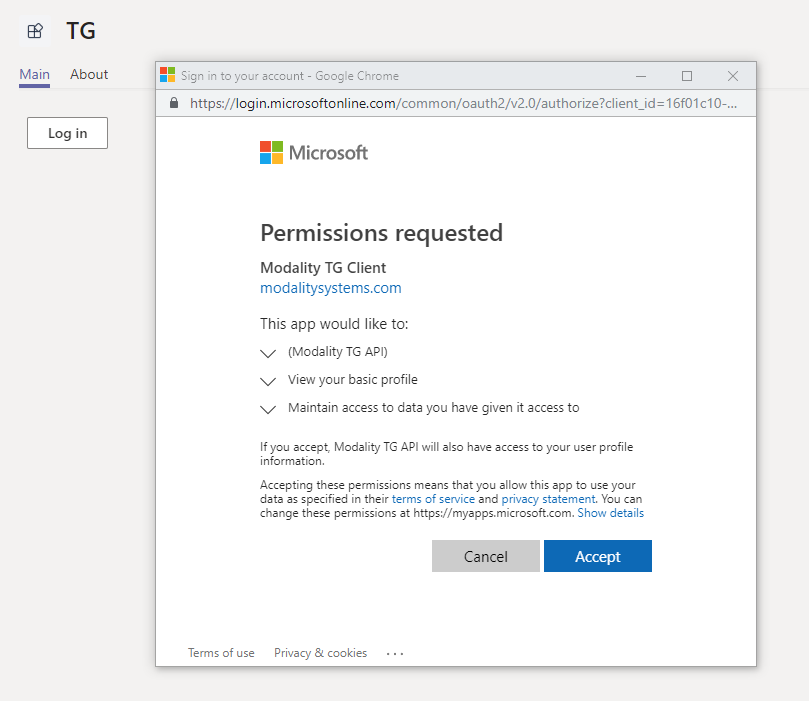
   
## Enabling Users to create teams with Guest Access

If this feature is enabled for your tenant you can enable users in the following steps.

1. Login to Azure Portal
2. Click Azure Active Directory
3. Click Enterprise Applications
4. Search for Modality TG API
5. Click Users and Groups
6. Click Add user
7. Find your users
8. Select the Guest Admin role 
9. Assign.

## Changing default settings

This application looks at your default tenant settings to determine the default value of certain fields.
To change your default tenant settings read the following guide.
https://docs.microsoft.com/en-us/graph/api/resources/groupsetting?view=graph-rest-1.0

The following fields look at tenant default values
1. External Checkbox looks at AllowToAddGuests value
