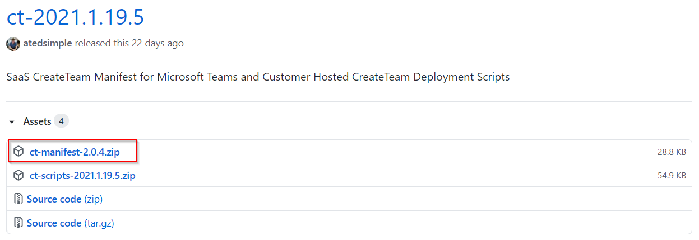
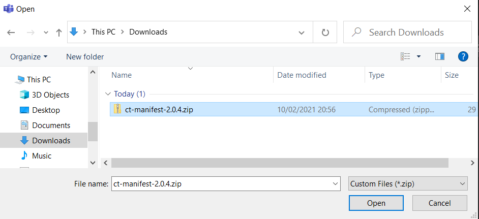

## Update your CreateTeam app manifest

**[Click here to download the current CreateTeam manifest file](https://github.com/modalitysystems/CreateTeamGABuilds/releases/latest)** - this will be the zip file with "manifest" in the title, example shown. 

1.	In Microsoft Teams desktop client, go to the Apps section
   

 
 2. Navigate to the App within your company's Apps section then hover your mouse pointer over the app, click on the ... in the top right corner and click Update
   

3. Select the app manifest zip file and Open

Existing app permission and setup policies will continue to apply to the updated version.