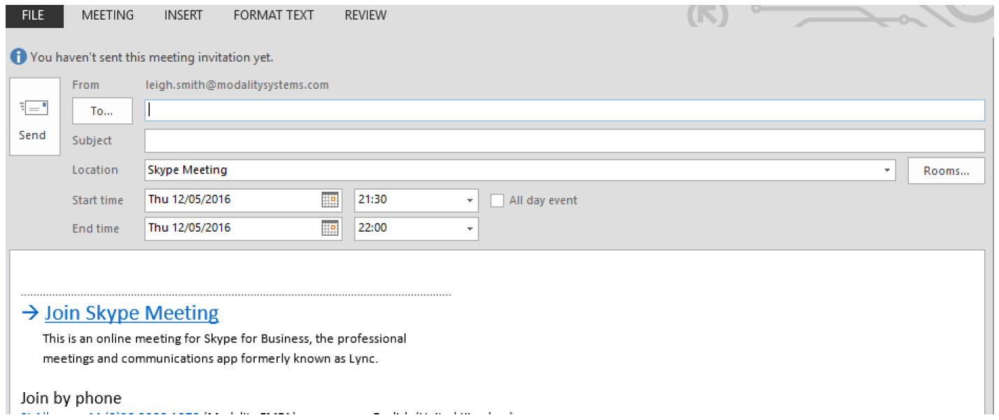

# Freqeuently Asked Questions 
## General Features
_**What can a business do with CustomInvite?**_

CustomInvite allows the business to modify every Skype for Business meeting invitation in the following ways:
* Text – all text in an invite can be modified
* Location – custom text may be included in the location field
* Links – all hyperlinks may be modified and include custom text
* Images – hyperlink enabled images may be included to reflect your organisation
* Preferred Numbers – Skype for Business presents a range of numbers for use, an administrator can simplify the
invite and push audio to the preferred service (toll based or toll-free)
* Single Click Calling – may include single click all feature (currently supported on iPhone) to allow mobile users to
dial in without looking up conference information
* Language – template selection based on local language as well as an ability to select alternative languages

**What can an administrator do with CustomInvite?**
* Define templates for different business groups, managed via Group Policy.
* Provide configurable defaults for users such as preferred language or preferred numbers

## Supported Environments

_**What version of Lync/Skype for Business is supported with CustomInvite?**_

Lync 2013 and Skype for Business are supported. Both on premise and Office 365 Online.

_**What Operating System and version of Office is supported?**_

Windows 7, 8, 8.1, and 10 operating systems along with Office 2013, and 2016. We also support Office 2016 x64bit
and Office click to run.

_**Are there any other environment considerations?**_
Yes, Windows 7, 8 and 8.1 will require the .net 4.6 installation applying.

## Installation

_**How do I install CustomInvite?**_

CustomInvite is delivered via a packaged MSI file and may be deployed via Group Policy to all domain joined
machines. The MSI file includes various switches and keys to enable silent installation.

_**Are there any pre-requisites for installation?**_

Yes, these are dependent on your operating system and version of Office. For Windows 7, 8 and 8.1 we require the
.net 4.6 installation.

_**How do I remove CustomInvite?**_

If deployed via Group Policy – remove the policy and the MSI will uninstall on next reboot. If deployed manually, you
will be required to remove via the control panel Add/Remove Programs. All invites that have been created using
CustomInvite will remain untouched, all new invites after removal will revert to the default Microsoft configuration.

## User Instructions

_**How do I enable CustomInvite?**_

CustomInvite is automatically active after installation. There is no user interaction required.

_**I installed CustomInvite but my invites appear un-changed?**_

By default, the active template used by the tool replicates the Microsoft default configuration. See troubleshooting
below regarding installation failures or template issues.

_**Can I use alternative languages?**_

Yes, the administrator has the option of presenting various dial-in numbers. A user may simply select an alternative
number for that meeting or the administrator may define this as a new “default” for the user.

_**Can I select an alternative dial-in number?**_

Yes, the administrator has the option of presenting various templates. A user may simply select an alternative
number for that meeting or the administrator may define this as the new “default” for the user.

_**Can I create an alternative invite?**_

Yes, the administrator has the option of presenting various templates. A user may simply select an alternative
template to meet that meetings requirements.

_**Can I create a meeting offline?**_

Yes, CustomInvite will cache the information locally for your default selections enabling offline meeting creation. You
may not modify the invite from the defaults unless you are online. 

## Template Modification

_**I have deployed CustomInvite, how do I update the template?**_

Simply update the reference template in the designated directory (either locally or network location). Note: Once
updated, the new template will be authoritative for all new meetings created. Reoccurring meetings created on
previous templates will not be modified unless the users chooses to do so.

_**Can a user modify the template?**_

Any user with local administrator privileges may access and modify templates. If you have restricted access to these
advanced permissions than users cannot modify the template.

## Troubleshooting

_**CustomInvite will not install?**_

Please check that you have the required permissions for installation and that you are using supported software per
above.

_**I have installed CustomInvite but my invitations look the same?**_

* Confirm that the tool has been installed by looking in the add-remove programs section of the Control Panel.
* Confirm that any pre-requisites for your operating system or Office version have been installed.
* Confirm that the plug-in is listed in Outlook – Plug-In management
* If you have stored your source templates on a network location, confirm that the user has access to the directory
location.
* Confirm that your users have access to the template file.
* CustomInvite caches information when Outlook first starts, ensure that the machine has been restarted.
* Outlook will disable add-ins that it detects are slowing start-up – check on file, Manage COM Add-ins – if Custom
Invite is listed as disabled, click on “Always Enable”.

_**CustomInvite is disabled in Outlook?**_

CustomInvite starts when Outlook starts and Outlook will try to disable any add-in that it detects to be slow (more
than a second) at start-up. Modality has provided a Group Policy template to enable administrators to set the
required registry value to ensure CustomInvite Starts. If you wish to set this manually:

**Office 2013**
HKEY_CURRENT_USER\SOFTWARE\Microsoft\Office\15.0\Outlook\Resiliency\DoNotDisableAddinList
REG_DWORD: CustomInvite = 1

**Office 2016**
HKEY_CURRENT_USER\SOFTWARE\Microsoft\Office\16.0\Outlook\Resiliency\DoNotDisableAddinList
REG_DWORD: CustomInvite = 1

The load behaviour may also require defining. The default value should be 3 which indicates Outlook tries to load
CustomInvite (VSTO Add-in) when the Outlook starts. This can be set in the following location:

**Office 32-bit**
HKEY_CURRENT_USER\Software\Microsoft\Office\Outlook\Addins\CustomInvite
Office 64-bit
HKEY_CURRENT_USER \Software\Wow6432Node\Microsoft\Office\Outlook\Addins\CustomInvite

_**The Template is not displaying as I expected?**_

Templates are HTML files using RTF. This is a common format used by many calendaring platforms. Unfortunately,
editors of these documents are intermittent in terms of accuracy. Verify that your editor is not adding ghost
characters to the file. Modality recommends using Notepad++.

_**The template is very large?**_

If you have used Microsoft Word to create the RTF file, lots of additional information that is not required will be
added to the template. Greatly increasing the template file size.

## Known Issues and Workarounds

Every effort has gone into making CustomInvite a seamless enterprise meeting experience but as with any tool, there
are issues that are identified and are being worked on for resolution. In the meantime, we will document those issues
here together with the workaround for the issue.

**CustomInvite does not run if “Meeting” ribbon is not pinned**

In Outlook, you may have your meeting ribbon unpinned. 

With the meeting ribbon unpinned, the CustomInvite tool will not run.

**Workaround:** Please pin the meeting ribbon in Outlook to ensure CustomInvite runs

We acknowledge that this is an issue with CustomInvite and we are working on a resolution for this problem.

**CustomInvite does not remove files from the cache when an invite is removed:**

When you update a template, CustomInvite will automatically update the template cache on restart of Outlook.
New templates are automatically added to the cache as well. Template removal (from the source directory) does
**NOT** remove from the cache.

This is by design – it is very difficult for us to determine if a file has been removed (deleted) from a network share or
if the share is simply unavailable. A decision was taken that the tool would maintain the cache in the event the
source file becomes unavailable.

**Workaround:** If you need to purge the file from the local machine, you can simply script deletion of the required
item from the following directory:

%localappdata%\Modality Systems\CustomInvite

**CustomInvite does not load on startup of Outlook:**

CustomInvite works as expected when Run as Administrator option is chosen in this scenario.

**Workaround:** 
Check the load behaviour key in the following location:
* HKCU\Software\Microsoft\Office\Outlook\Addin\CustomInvite
* If LoadBehaviour is set to 0, change it to 3. 

## Error Messages:
_**Why are my meeting invites not reformatting?**_

This is often due to CustomInvite configuration. Troubleshooting messages can be turned on to aid the configuration
of CustomInvite.

_**How do I access the registry and where do I turn on troubleshoot messages?**_

Navigate to “C:\Windows” and launch “regedit.exe”. CustomInvite registry keys can be found under
“HKEY_LOCAL_MACHINE > SOFTWARE > Policies > Modality Systems > CustomInvite.

Double click on “DisplayErrorMessages” registry key. By default, this value is set to “LicenceDriven”. Change this
value to “On”. Reboot outlook and troubleshooting messages would be displayed in the event where CustomInvite
cannot reformat meeting invitations.

_**What should I do if CustomInvite tells me that “Meeting Link could not be found”?**_

The most likely cause is that the “MeetingLinkStart” registry key value isn't configured correctly. In most cases the
start of the meeting link would be either https://meet or https://lync. However, to check your meeting link, create a new Skype Meeting and hover over the ‘Join Skype Meeting’ link to identify the correct value. Then open
“regedit.exe” as described above and check the “MeetingLinkStart” value is correct.

_**What should I do if CustomInvite tells me that “Region cannot be identified”?**_

The most likely cause is that the “ContactNumberRegex” registry key value isn't configured correctly. The solution to
this is often bespoke dependent on your region numbers. Please contact Modality Systems support for help on
resolving this issue using the following details:

appsupport@modalitysystems.com

_**What should I do if CustomInvite tells me that “Default Template cannot be located”?**_

The most likely cause is that the “BaseTemplateName” registry key value isn’t configured correctly. To solve this,
please open “regedit.exe” as described above and check that the “BaseTemplateName” value is correct.

_**CustomInvite won’t reformat as an invalid or no licence key has been provided when installing, what should I do
next?**_

There are two ways to rectify this problem:

* Method 1: If you have been provided with a licence key, open “regedit.exe” and check that the “LicenceCode”
value matches the key provided
* Method 2: Is to uninstall and reinstall CustomInvite on your machine, providing a valid licence key during the
install wizard.

If you do not have a licence key, then please contact Modality Systems using the form here:
https://www.modalitysystems.com/software/custominvite
