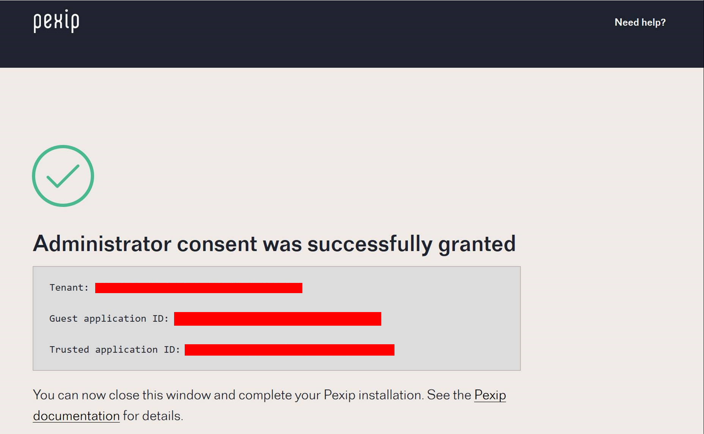

# Setup Instructions for OneMeeting CVI service

OneMeeting CVI is a fully managed, Azure hosted version of the Teams Cloud Video Interop (CVI) service using Pexip as the video interop technology.    For further information on the Teams CVI service, please  [**click here**](https://docs.microsoft.com/en-us/microsoftteams/cloud-video-interop)

## Pre-requisite steps for setting up your OneMeeting CVI account:

We need the below information to provision your OneMeeting CVI account:

### Your O365 tenant ID:

Your Office 365 tenant ID is a globally unique identifier (GUID) that is different than your tenant name or domain. It’s allocated to you by Microsoft and never changes.  For details of how to find your tenant ID, please click here:

### IP address:

We also require the IP address of the Office 365 administrator that will authorise the Teams connector applications.  To confirm, this is the public IP address of the laptop or device from which the Office 365 admin will perform the authorisation.

### Add trusted domain

In order to enable OneMeeting CVI to connect to your environment, please ensure that videosrv.net* is added as a trusted domain in your Microsoft Teams environment.

**VideoSRV.net is the domain name of our Azure hosted Pexip infrastructure which powers the OneMeeting service**

Once successfully provisioned, a member of the Modality team will send you your unique tenant key to access the service and also confirm you are able to proceed with the consent process to finalise the integration between your O365 tenant and OneMeeting.

## Step 1 - Grant consent allowing OneMeeting CVI to access your tenant:

In order to provision your account, we need you to grant consent for our hosted OneMeeting service to integrate with your O365 tenant.  This allows our hosted Teams connector to perform lookups and use signalling and media between the tenants.

We need a user with O365 global admin rights for your tenant will need to approve this integration.  We will send a unique approval url via email which they will need to click to authorise the connection. Below are further details on the permissions required for OneMeeting CVI to deliver this service - these permissions are what you grant us by consenting to the service.

Permission | Full Details 
--- | ---
Read all users' full profiles | [https://docs.microsoft.com/en-us/graph/permissions-reference#application-permissions-24](https://docs.microsoft.com/en-us/graph/permissions-reference#application-permissions-24)
Initiate outgoing 1 to 1 calls from the app | [https://docs.microsoft.com/en-us/graph/permissions-reference#calls-permissions](https://docs.microsoft.com/en-us/graph/permissions-reference#calls-permissions)
Initiate outgoing group calls from the app |
Join group calls and meetings as an app |
Join group calls and meetings as a guest |
Access media streams in a call as an app |
Read online meeting details | [https://docs.microsoft.com/en-us/graph/permissions-reference#online-meetings-permissions](https://docs.microsoft.com/en-us/graph/permissions-reference#online-meetings-permissions)
Read and create online meetings |
Sign in and read user profile | [https://docs.microsoft.com/en-us/graph/permissions-reference#user-permissions](https://docs.microsoft.com/en-us/graph/permissions-reference#user-permissions)

Modality will confirm to you once your account is provisioned.  When this is setup, the user identified as the O365 global administrator will need to click the below link to grant consent to our service.  Upon clicking the below link, you will be prompted for your username and password to sign into Office 365.  Please use your account with Global Admin rights from the PC with the IP address sent to Modality at the start of this process.

**Please note, you can only grant consent once Modality have whitelisted your IP address.**

[https://modalitygw1.eu.teams.videosrv.net/adminconsent](https://modalitygw1.eu.teams.videosrv.net/adminconsent)

Once you have successfully granted consent, you will see the below confirmation page.

## Step 2 - Build CVI policies and assign to users in your O365 tenant:

Once you have granted consent to the OneMeeting service, you will need to build the necessary policies and assign these to the users you wish to enable for the service.  These are created and managed using Powershell.

*Please note, you need the Skype for Business Online Windows PowerShell Module to create these policies.  This module can be downloaded and installed from here - [https://www.microsoft.com/en-us/download/details.aspx?id=39366](https://www.microsoft.com/en-us/download/details.aspx?id=39366)*

**Open Powershell and run the below code to import the SkypeOnlineConnector module and build the PSSession to create and administer the Teams CVI policy**

*Import-Module SkypeOnlineConnecton*

*$sfbSession = New-CsOnlineSession -OverrideAdminDomain "<tenant_name>.onmicrosoft.com"*

*Import-PSSession $sfbSession*

**Build the Pexip CVI policy to assign to users:**

Modality will send you details of your custom IVR, custom instruction URI and unique application ID once consent has been granted.

*New-CsVideoInteropServiceProvider -name Pexip -TenantKey "YOUR CUSTOM IVR" -InstructionUri "YOUR CUSTOM URL" -AllowAppGuestJoinsAsAuthenticated $true -AadApplicationIds "YOUR TRUSTED APPLICATION ID"*

**Assign the Pexip CVI policy to users:**

For testing purposes you can enable interop to named users by using the -Identity switch instead of -Global, for example:

*Grant-CsTeamsVideoInteropServicePolicy -PolicyName PexipServiceProviderEnabled -Identity tom@example.com*

To grant interoperability for all users:

*Grant-CsTeamsVideoInteropServicePolicy -PolicyName PexipServiceProviderEnabled -Global*

The following cmdlets are also available to administer the Teams CVI service policy on your tenant

  *Get-CsVideoInteropServiceProvider:* list the existing interop service providers

  *Set-CsVideoInteropServiceProvider:* modify an interop service provider (see Changing the alternative dialing instructions for more information)

  *Remove-CsVideoInteropServiceProvider:* remove a provider

  *Get-CsTeamsVideoInteropServicePolicy -Filter "*enabled*":* list the existing service policies

  *Get-CsOnlineUser -Identity alice@example.com:* returns user information

