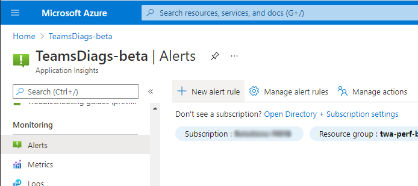
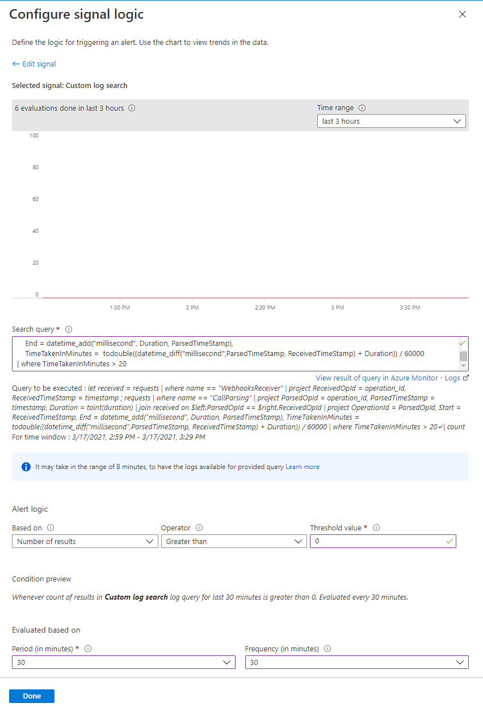

# Alert on Delayed Inserts Setup

Using [Application Insights](https://docs.microsoft.com/en-us/azure/azure-monitor/app/app-insights-overview) we are able to set up alerts to notify users. This is a step by step guide showing how to set this up using the Azure portal, but this can also be done in both the Azure cli and Powershell.

## Creating an Action Group

It's better to create the [Action Group](https://docs.microsoft.com/en-us/azure/azure-monitor/alerts/action-groups) first so we can select it during the alert setup later. This is a collection of actions that can range from email and mobile notifications to custom http requests and custom Azure function triggers. If you already have an action group you'd like to use then skip to creating the alert, else you'll find the Actions Group page under the Monitoring header in your Application Insights resource. Clicking on Manage Actions will bring you to the right page.


> Then Add Action Group to create a new one. 


> Name the resource. The Display Name is what will be used in notifications.


> In the Notifications tab we can set up Email, sms, voice and Azure push notifications. You can see below i've set up a Notification to all owners of this resource as well as an Email to the Development team. You can find out more about the different notifications [here](https://docs.microsoft.com/en-us/azure/azure-monitor/alerts/action-groups#configure-notifications).


> In the Actions tab you can set up the automatic triggering of many azure services as well as custom Http request. I won't be going over these but more info can be found [here](https://docs.microsoft.com/en-us/azure/azure-monitor/alerts/action-groups#configure-actions)

> Complete the creation of the action group to move onto the next step.

## Creating an Alert

An Alert now lets us set a condition that we can then trigger the notifications in the action group. In this case we will be creating a custom log search, you can find out more about the other alerts [here](https://docs.microsoft.com/en-us/azure/azure-monitor/alerts/alerts-overview?WT.mc_id=Portal-Microsoft_Azure_Monitoring#create-an-alert-rule). To start go back to the alerts page in Application Insights and click New Alert Rule to create a new one.



> Under the Condition section click Add Condition and then on the right pane select Custom Log Search.


> Here we can configure a custom query against the Azure Monitoring Logs, more info can be found [here](https://docs.microsoft.com/en-us/azure/azure-monitor/alerts/alerts-log) on how to create and optimise queries. There's a few things to configure.

- **Search Query :** This where we define the Monitoring Log search. The one we need for this Delayed Insert Alert can be found below. There is a where clause at the end, ```| where TimeTakenInMinutes > 20```, You can this change the amount of minutes to be whatever delay would be considered too long for your Tenant.

- **Alert Logic :** Here we define how to interpret the results from the query. Setting the fields to the following will Alert whenever a single column is returned within the time period. Set up yours the same or change to fit your Tenant needs.
    - Based On: Number of results
    - Operator: Greater than
    - Threshold value: 0

- **Evaluated Based On :** Here we define the evaluation period and frequency of the alert logic. 
    - Period: This sets the time range that the threshold value is asserted to. If we were to set the threshold value to 5 an the period to 30. Then there would have to be 5 results in 30 minutes to trigger an Alert.
    - Frequency: This sets how often the Alert logic is ran. It can be equal or less than the Evaluation Period. Setting it less than the Evaluation period will allow for some overlap. 

```
let received = requests
| where name == "WebhooksReceiver"
| project ReceivedOpId = operation_Id, ReceivedTimeStamp = timestamp
;
requests
| where name == "CallParsing"
| project ParsedOpId = operation_Id, ParsedTimeStamp = timestamp, Duration = toint(duration)
| join received on $left.ParsedOpId == $right.ReceivedOpId
| project OperationId = ParsedOpId, Start = ReceivedTimeStamp, End = datetime_add("millisecond", Duration, ParsedTimeStamp), TimeTakenInMinutes = todouble((datetime_diff("millisecond",ParsedTimeStamp, ReceivedTimeStamp) + Duration)) / 60000
| where TimeTakenInMinutes > 20
```

> You should have something that looks like this. 



> There are few more things to configure and then we should be finished.

- **Actions :** Here we can select the action group we made previously. You can select more than one if needed.

- **Customize Actions :** Here you can optionally customize the email subject from Microsoft's default and even include custom json payloads using by defining a template using the [parameters](https://docs.microsoft.com/en-us/azure/azure-monitor/alerts/alerts-log-webhook) Microsoft provide.

- **Alert Rule Details :** Define the name and description here as well the resource group this alert should belong to. The severity will depend on your Tenant needs. Microsoft helpfully provides the option to suppress alerts for a configurable amount of minutes to avoid spamming of notifications or other actions. 


> Once you've clicked done you should be fully configured to receive alerts once they have been detected. You can view the scheduled execution of the alert search criteria in the application insights activity log.