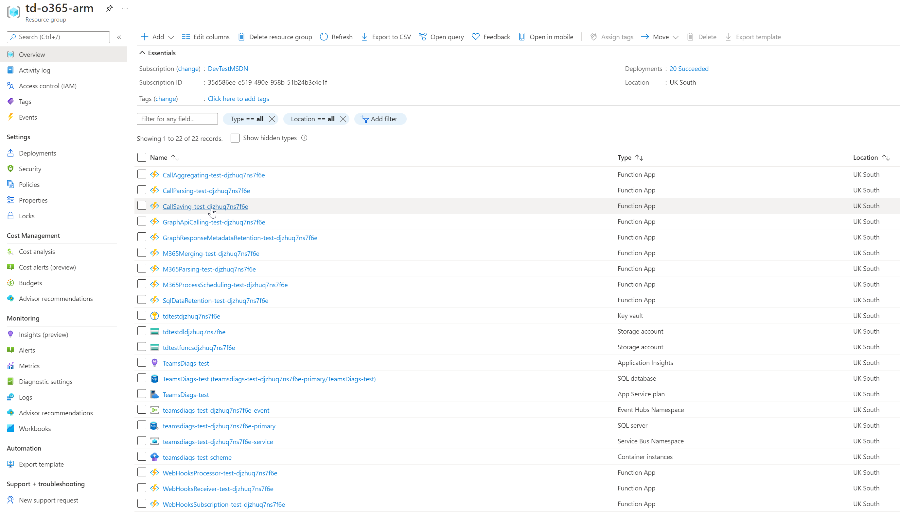
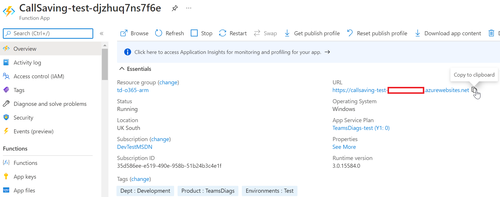
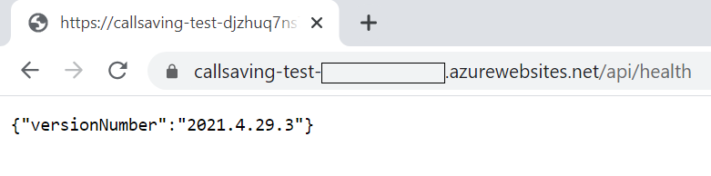

# Azure Function Health

Each function has it's own health endpoint that displays information regarding the status of that function.

Currently the following information is shown on the endpoint:
* VersionNumber

## Browsing Function App Health Endpoint

1. Go to your resource group.

2. Select the function app which you would like to view the status of

3. Find the "URL" property and copy the value

4. Append "api/health" to the end of the url and go to the URL in order to view the health status of the function app

When browsing the URL, you should be able to see health related information for that endpoint. 