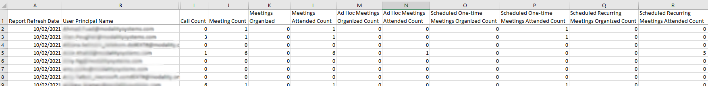

# Microsoft 365 Usage Reports

## Teams User Activity User Detail Report

While Microsoft do have an official documentation page found [here](https://docs.microsoft.com/en-us/graph/api/reportroot-getteamsuseractivityuserdetail?view=graph-rest-1.0), it appears to be outdated and lacking in any useful explanations on each column. There are also additional columns included in the actual report download that are not documented anywhere. We've inferred their meaning by their names and cross referencing, when possible, to other resources.

Comparisons made between Usage Reports and TWA Performance data are done in sql with [this](MSFT-UsageReports-ComparisonSqlScripts.md) script. Running these queries could put significant load on your SQL server due to the large aggregations they are computing. Where possible, run the queries against a replica. Seek advice from us if you are unsure.

## DailyActivityUserDetails Report Response for 10th Feb

In TWA we only save the Call Count and Meeting Count.

#

### Call Count

This is the total number of Peer to peer calls / 1:1 calls. This number closely resembles the TotalPeerToPeer count in the sql script, however there are some discrepancies. As mentioned in our [TAC comparison](TAC-comparison.md), we don't filter out voicemail calls as we have no current way to differentiate them. This will account for some of the extra calls we count in TWA Performance. 

Additionally TWA Performance includes calls to and from External users where we have found the Usage Reports to filter these out. This will also account for some of the additional calls in TWA Performance. 

We also believe that MSFT Usage reports are returning wrong information. This is because in many cases the report count is lower than ours, and we can trace our numbers back to individual calls of valid lengths which shouldn't be filtered out as voicemail or other.

In some cases the Usage reports have higher call counts than us for a certain user. We are currently not sure what is causing this.

#

### Meeting Count

This is the total number of Group calls / Meetings. This number closely matches the TotalGroup count in the sql script, however again with some small differences. These counts can affected by external meeting organisers, which account for some of the additional counts in TWA Performance that are missing from the Usage Reports.

We also believe, much like for calls, some of the Usage reports are also wrong for meetings. This is again because we can trace the missing calls back to individual calls that shouldn't have been filtered out.

In some cases the Usage reports have higher meeting counts than us for a certain user. Same as calls, we are currently not sure what is causing this.