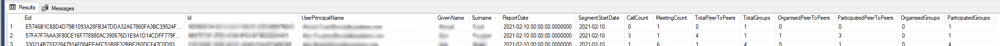
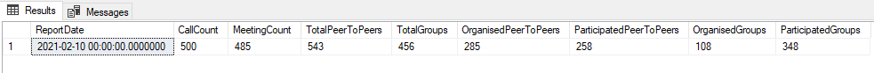

# Microsoft 365 Usage Reports Comparison Scripts

In order to run these scripts yourself, you will need access to both Microsoft Usage Report data from TWA and Call Stream data from TWA Performance. We used Sql Cross Database Queries in these scripts.

## Per User Comparisons

This script will give you a per user comparison. Displaying the Total Call/Meeting Count provided by Usage Reports vs the aggregated call counts collected from TWA Performance.



```
SELECT 
	Eid,
	Id,
	UserPrincipalName,
	GivenName,
	Surname,
	ReportDate,
	SegmentStartDate,
	CallCount,
	MeetingCount,
	SUM(CASE WHEN CallType = 1 THEN 1 ELSE 0 END) AS TotalPeerToPeers,
	SUM(CASE WHEN CallType = 2 THEN 1 ELSE 0 END) AS TotalGroups,
	SUM(OrganisedPeerToPeer) AS OrganisedPeerToPeers,
	SUM(ParticipatedPeerToPeer) AS  ParticipatedPeerToPeers,
	SUM(OrganisedGroup) AS OrganisedGroups,
	SUM(ParticipatedGroup) AS ParticipatedGroups
FROM
	(SELECT
		daud.Eid,
		u.Id,
		u.UserPrincipalName,
		u.GivenName,
		u.Surname,
		daud.ReportDate,
		daud.CallCount,
		daud.MeetingCount,
		CAST(s.SegmentStart as DATE) SegmentStartDate,
		CAST(s.SegmentStart as DATE) SegmentEndDate,
		s.CallType,
		CASE WHEN SUM(CASE WHEN s.UserId = s.OrganiserUserId AND CallType = 1 THEN 1 ELSE 0 END) > 0 THEN 1 ELSE 0 END AS OrganisedPeerToPeer,
		CASE WHEN SUM(CASE WHEN s.UserId != s.OrganiserUserId AND CallType = 1 THEN 1 ELSE 0 END) > 0 THEN 1 ELSE 0 END AS ParticipatedPeerToPeer,
		CASE WHEN SUM(CASE WHEN s.UserId = s.OrganiserUserId AND CallType = 2 THEN 1 ELSE 0 END) > 0 THEN 1 ELSE 0 END AS OrganisedGroup,
		CASE WHEN SUM(CASE WHEN s.UserId != s.OrganiserUserId AND CallType = 2 THEN 1 ELSE 0 END) > 0 THEN 1 ELSE 0 END AS ParticipatedGroup
	FROM 
		[dbo].[DailyActivityUserDetails] daud
		JOIN [dbo].[Users] u on u._HashUserPrincipalName = daud.Eid
		JOIN [dbo].[Streams] s on s._HashUserId = u._HashId
			AND CAST(s.SegmentStart as DATE) = daud.ReportDate
	WHERE
		daud.ReportDate = '2021-02-10 00:00:00.0000000'
	GROUP BY
		daud.Eid,
		daud.ReportDate,
		daud.CallCount,
		daud.MeetingCount,
		u.Id,
		u.UserPrincipalName,
		u.GivenName,
		u.Surname,
		s.CallId,
		s.CallType,
		CAST(s.SegmentStart as DATE)
	) i
GROUP BY
	Eid,
	Id,
	UserPrincipalName,
	GivenName,
	Surname,
	ReportDate,
	SegmentStartDate,
	CallCount,
	MeetingCount
```

## Total Counts

This next script uses the existing base but then aggregates the entire thing to give you total count comparisons.



```
SELECT 
	ReportDate,
	SUM(CallCount) AS CallCount,
	SUM(MeetingCount) AS MeetingCount,
	SUM(TotalPeerToPeers) AS TotalPeerToPeers,
	SUM(TotalGroups) AS TotalGroups,
	SUM(OrganisedPeerToPeers) AS OrganisedPeerToPeers,
	SUM(ParticipatedPeerToPeers) AS ParticipatedPeerToPeers,
	SUM(OrganisedGroups) AS OrganisedGroups,
	SUM(ParticipatedGroups) AS ParticipatedGroups
FROM
	(SELECT 
		Eid,
		Id,
		UserPrincipalName,
		GivenName,
		Surname,
		ReportDate,
		SegmentStartDate,
		CallCount,
		MeetingCount,
		SUM(CASE WHEN CallType = 1 THEN 1 ELSE 0 END) AS TotalPeerToPeers,
		SUM(CASE WHEN CallType = 2 THEN 1 ELSE 0 END) AS TotalGroups,
		SUM(OrganisedPeerToPeer) AS OrganisedPeerToPeers,
		SUM(ParticipatedPeerToPeer) AS  ParticipatedPeerToPeers,
		SUM(OrganisedGroup) AS OrganisedGroups,
		SUM(ParticipatedGroup) AS ParticipatedGroups
	FROM
		(SELECT
			daud.Eid,
			u.Id,
			u.UserPrincipalName,
			u.GivenName,
			u.Surname,
			daud.ReportDate,
			daud.CallCount,
			daud.MeetingCount,
			CAST(s.SegmentStart as DATE) SegmentStartDate,
			CAST(s.SegmentStart as DATE) SegmentEndDate,
			s.CallType,
			CASE WHEN SUM(CASE WHEN s.UserId = s.OrganiserUserId AND CallType = 1 THEN 1 ELSE 0 END) > 0 THEN 1 ELSE 0 END AS OrganisedPeerToPeer,
			CASE WHEN SUM(CASE WHEN s.UserId != s.OrganiserUserId AND CallType = 1 THEN 1 ELSE 0 END) > 0 THEN 1 ELSE 0 END AS ParticipatedPeerToPeer,
			CASE WHEN SUM(CASE WHEN s.UserId = s.OrganiserUserId AND CallType = 2 THEN 1 ELSE 0 END) > 0 THEN 1 ELSE 0 END AS OrganisedGroup,
			CASE WHEN SUM(CASE WHEN s.UserId != s.OrganiserUserId AND CallType = 2 THEN 1 ELSE 0 END) > 0 THEN 1 ELSE 0 END AS ParticipatedGroup
		FROM 
			[dbo].[DailyActivityUserDetails] daud
			JOIN [dbo].[Users] u on u._HashUserPrincipalName = daud.Eid
			JOIN [dbo].[Streams] s on s._HashUserId = u._HashId
				AND CAST(s.SegmentStart as DATE) = daud.ReportDate
		WHERE
			daud.ReportDate = '2021-02-10 00:00:00.0000000'
		GROUP BY
			daud.Eid,
			daud.ReportDate,
			daud.CallCount,
			daud.MeetingCount,
			u.Id,
			u.UserPrincipalName,
			u.GivenName,
			u.Surname,
			s.CallId,
			s.CallType,
			CAST(s.SegmentStart as DATE)
		) i
	GROUP BY
		Eid,
		Id,
		UserPrincipalName,
		GivenName,
		Surname,
		ReportDate,
		SegmentStartDate,
		CallCount,
		MeetingCount
	) i
GROUP BY
	ReportDate
```