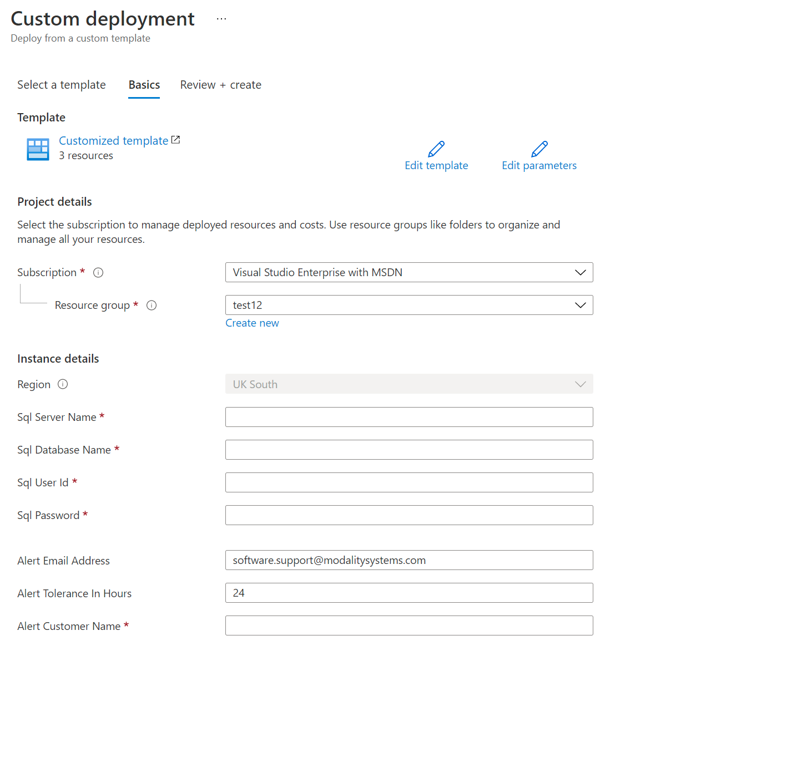
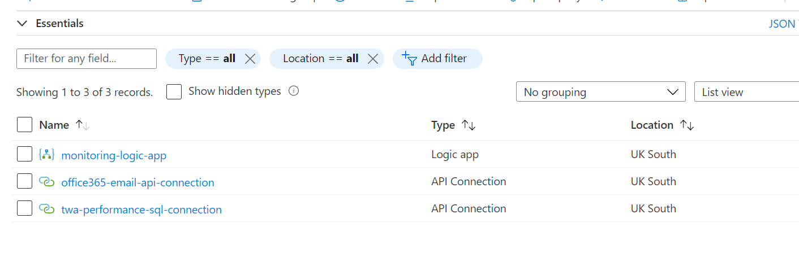
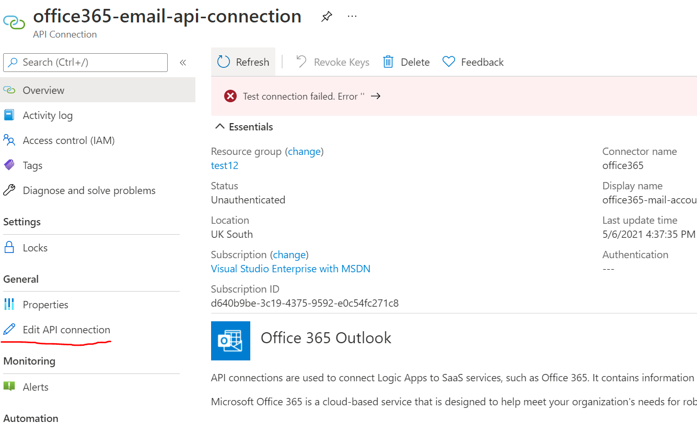
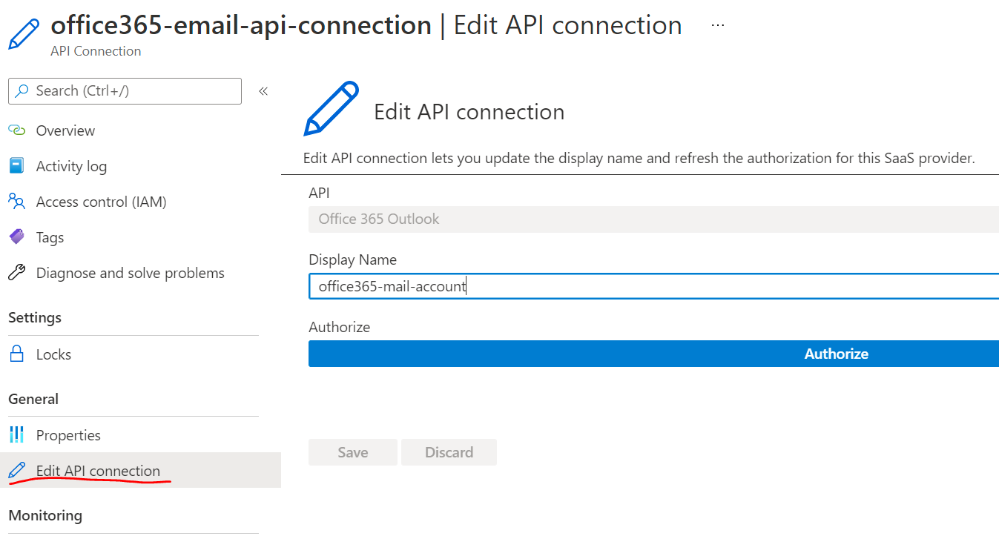
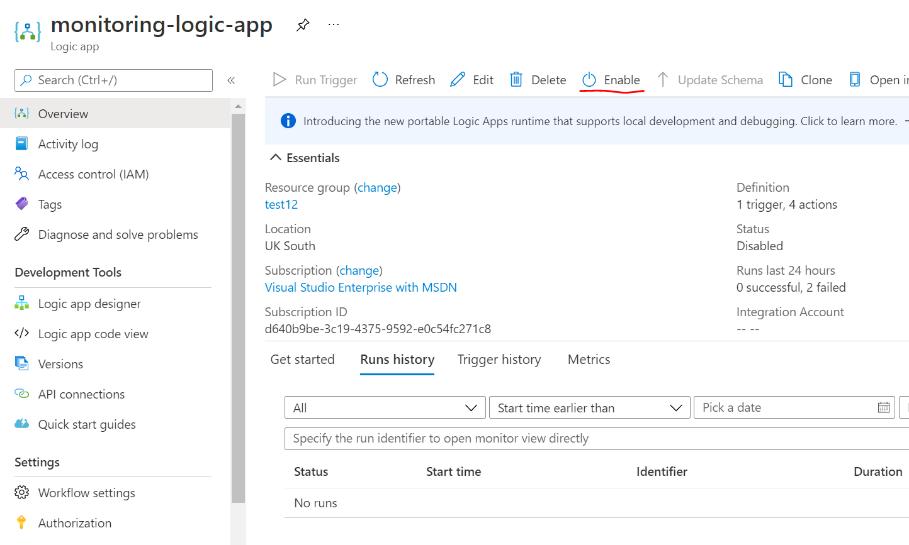
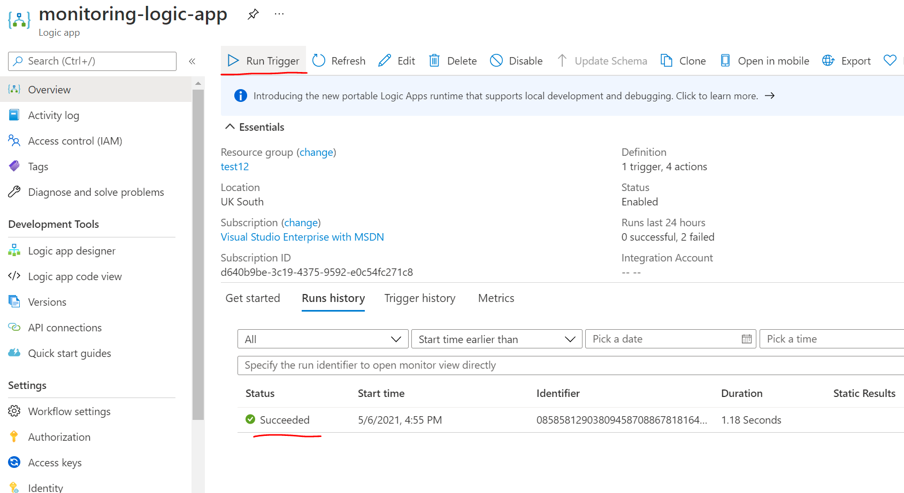
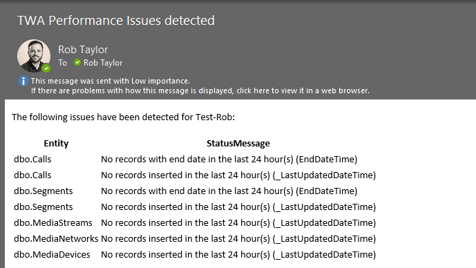

# Monitoring

Monitoring of Teamwork Analytics Performance can be configured using a Logic App. The Logic App periodically checks for new calls being inserted into the database and that those calls were inserted in a timely manner and if any issues are detected, sends an email to a configurable address. The Logic App is deployed via an ARM template.

## Logic App Deploy

An ARM template is used to deploy the Logic App. The template requires the following parameters;

 - Sql Server Name - The Server that the TWA Performance Database is deployed on.
 - Sql Database Name - The name of the TWA Performance Database.
 - Sql User Id - User Id used to connect to the TWA Performance Database (Can be read only, but needs Stored Procedure execution rights).
 - Sql Password - Password for the User account.
 - Alert Email Address - The email alerts will be sent to by default.
 - Alert Tolerance In Hours - The number of hours without a Call Record to be inserted before an alert is generated (please consider if there will be any calls happening overnight or at weekends and factor this in accordingly).
 - Alert Customer Name - A name for the customer which will appear in the email (for a case where there are multiple deploys)

An example of the parameters screen is as follows;

Once the parameters have been completed, follow the ARM deployment wizard to complete the deployment.

## Logic App Configuration

1. Once the logic app has been deployed, go to your target resource group, you should see the following resources (it may take some time for them to fully provision).

- monitoring-logic-app - the Logic App which polls the database hourly to check the status of new records.
- office365-email-api-connection - API connection to Office365 which allows the Logic App to send emails.
- twa-performance-sql-connection - API connection which allows the Logic App to read the TWA Performance database.

2. The Email API connection requires more configuration, you can see this by clicking on the "office365-email-api-connection" item. You will see a red error at the top of the screen.

3. Click "Edit API connection" and you will be presented with the following screen. To allow access to send emails, click the "Authorise" button and provide credentials for the Office365 you want the alert emails to come from.

4. Return to the Overview page, and you should see the red error has disappeared.

5. Go back to the resource group, and then click on the Logic App. The Logic App is disabled by default, click the "Enable" button to enable it.

6. Now you should be able to use the "Run Trigger" button, you can use this to check that the Logic App is functioning correctly. If so, you should see a "Succeeded" record appear in the Runs History tab.

When browsing the URL, you should be able to see health related information for that endpoint. 

## Alert Email

An example of the alert sent is as follows;

If any Call Record entity has not been inserted within the tolerance hours, then it will be present in this email.