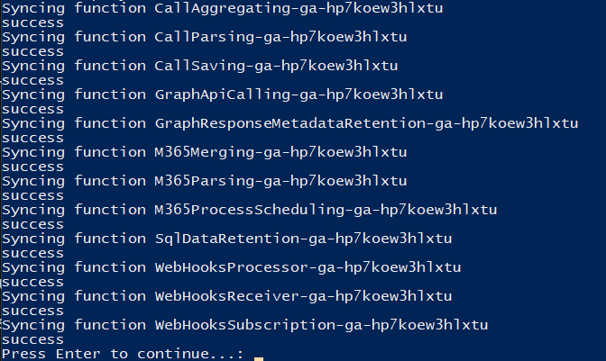

# Teamwork Analytics Performance ARM Deployment

1. Download the following powershell script
   
   - [RefreshFunctions.ps1](https://github.com/modalitysystems/TWAPerformanceGABuilds/releases/download/RefreshFunctions/RefreshFunctions.ps1)

2. Ensure that you have [Az Powershell module](https://docs.microsoft.com/en-us/powershell/azure/new-azureps-module-az) installed on your machine and run the script

3. When prompted Log into Azure

4. Enter the Subscription ID where Teamwork Analytics Performance has been deployed

5. Enter the Resource Group name that Teamwork Analytics Performance has been deployed to

6. Wait until all functions have been successfully synchronised

   

## Deployment Complete

1. The deployment of Teamwork Analytics Performance is now complete. You should now start to see data appear in the SQL Database.