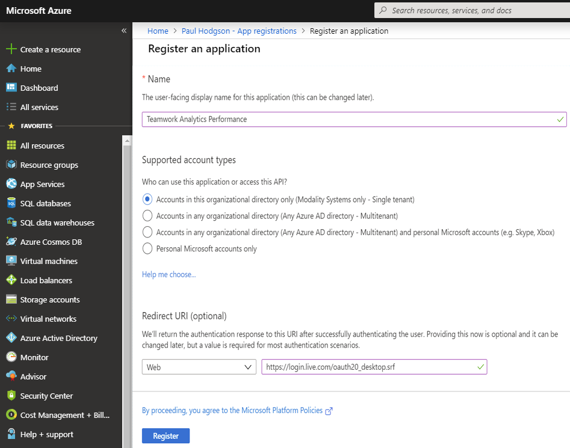
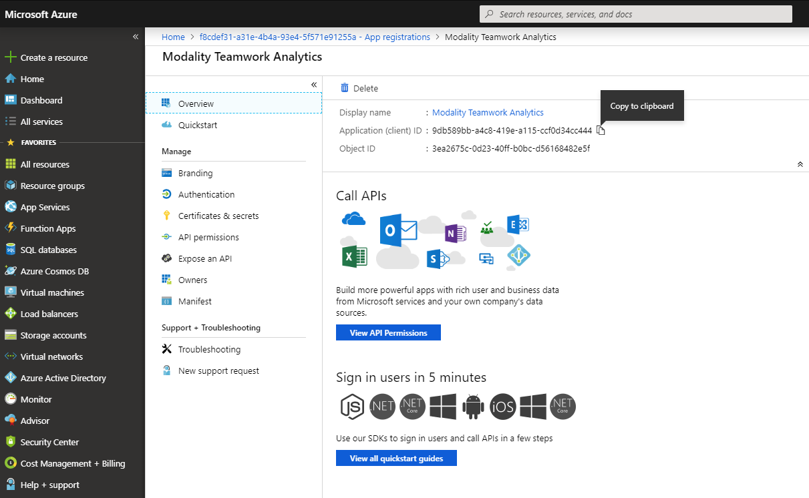
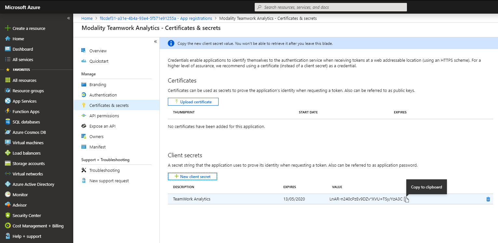
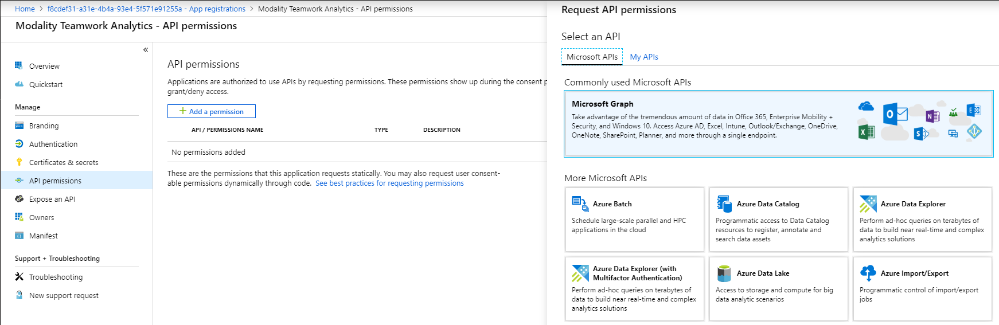
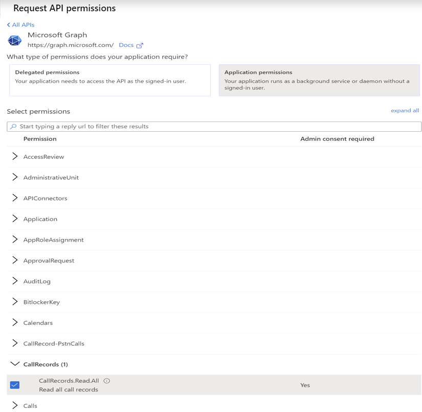
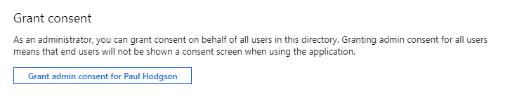
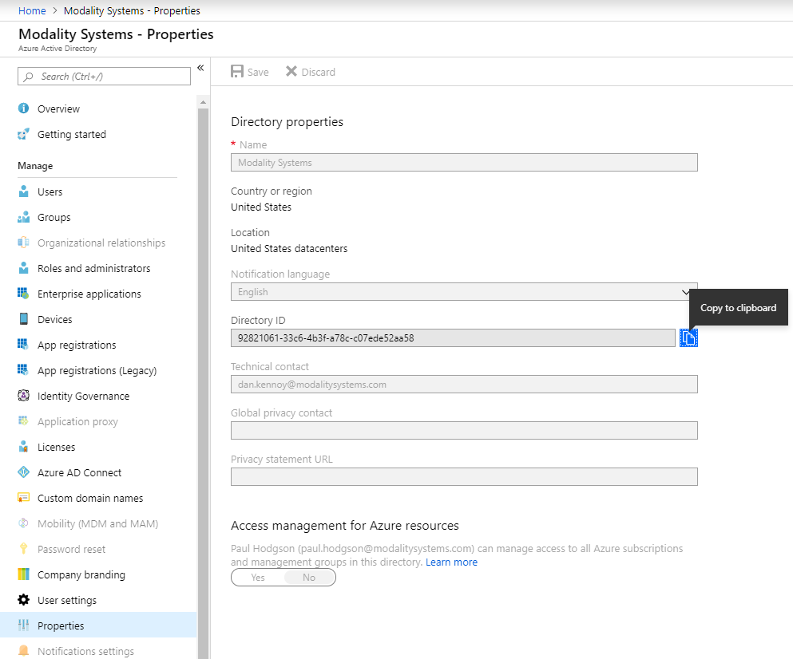

# Teamwork Analytics Performance (Customer Azure Tenant) Deployment Guide

## Before you start

There are a number of required steps to complete before deploying TWA Performance. These are required even if you have other TWA modules already installed.

As you progress through these steps, make a note of the following three pieces of information which will be required to complete your deployment.

   * Application ID
   * Application Secret
   * Tenant ID

### Register Teamwork Analytics with Azure Active Directory
1. Sign in to the [Azure Portal](https://azure.microsoft.com/en-gb/features/azure-portal/)
1. Select the **Azure Active Directory** service from the navigation pane on the left 
1. Select **App Registrations** and click **New Registration** (Take care not to select **App Registrations (Legacy)** as these instructions do not apply to them)
1. Enter the following application registration details
   * **Name** - Suggested name: **Teamwork Analytics Performance** 
   * **Supported Account Types** - Set this to **Accounts in this Organisational Directory Only**
   * **Redirect URI** - Set this value to **https://login.live.com/oauth20_desktop.srf**
1. Click **Register** and Azure AD will create an Application ID and present the Overview page

1. Take note of the **ApplicationID** as this will be required further in the deployment process

### Add a Client Secret
1. Navigate to the **Azure Active Directory** from the navigation pane on the left
1. Select **App Registrations** and select the **Teamwork Analytics Performance** app 
1. Select **Certificates & secrets** from the Manage menu
1. Select **New client secret** and enter an appropriate description and expiry period
   * **Description** - Recommend setting this to **TWA-Secret**
   * **Expiry** - Recommend setting this to **Never**
1. Click **Add**
1. Immediately take note of the **Secret** as this can not be retrieved later and will be required further in the deployment process

### Declare API Permissions for Teamwork Analytics
1. Navigate to the **Azure Active Directory** from the navigation pane on the left
1. Select **App Registrations** and select the **TWA Performance** app 
1. Select **Api permissions** from the Manage menu
1. Find and select **Microsoft Graph** from the **Request API permissions** blade

1. Ensure that the permission type is set to "Application permissions" and not "Delegated permissions"

1. Select the follow permission from Microsoft.Graph
    * User.Read.All
1. Click **Add permissions** to be returned to the "API permissions" blade
1. Click the **Grant Admin Consent for [Your Company]** button

### Retrieve your Tenant ID
1. Navigate to the **Azure Active Directory** from the navigation pane on the left
1. Select **Properties** 
1. Your Tenant ID is listed as **Directory ID**, copy this for later use

## Next Steps

At the point, you should have values collected for:
   * Application ID
   * Application Secret
   * Tenant ID
   
## Perform ARM Template Deployment

1. Now that the Azure App Registration had been configured, please follow steps [ARM Template Deployment](armDeploy.md) to continue.