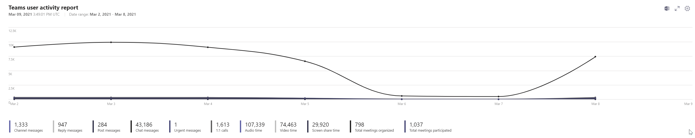
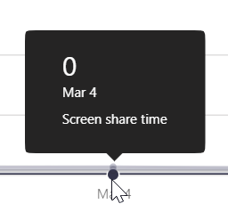
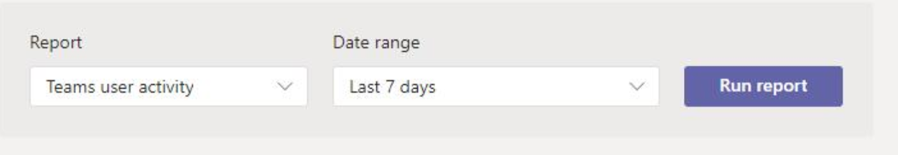
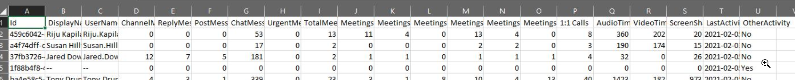

# Teams Admin Centre (TAC)

## Teams User Activity Report

Microsoft have official documentation [here](https://docs.microsoft.com/en-us/microsoftteams/teams-analytics-and-reports/user-activity-report). Our findings indicate the documentation to be incorrect for the most part, find below our reasons. The headline numbers contradict the per user csv report download for the most part. The graph contradicts both the headline numbers and the csv report. Exercise caution and refer to this guide where possible.

### Headline numbers

#### Channel messages, Reply messages, Post messages, Chat messages

Out of scope

 TWA Support

#### Meetings Organized

It is unkown what this number actually represents, it does not equal the total meetings organised (scheduled + adhoc) from the per user report, or TWA Performance.

 TWA Support

#### Meetings Participated

It is unkown what this number actually represents. It does not equal the total meetings participated (scheduled + adhoc) from the per user report, or TWA Performance. It also does not equal the unique number of meetings joined below ("Total Meetings").

 TWA Support

#### Total Meetings

The unique number of meetings joined. It does not equal any number in the per user report.

 TWA Support - [SQL Validation](tac-sql/total-meetings.sql)

#### 1:1 Calls

The unique number of 1:1 calls. Also known as Peer 2 Peer (P2P) calls, not meetings. It does not equal any number in the per user report. 

 TWA Support - TWA does not exclude voicemail calls, this is currently skewing the numbers - [SQL Validation](tac-sql/p2p-calls.sql)

#### Audio Time

The number of audio minutes the users in your tenant are involved in (send, receive or both) 

- If you were in a call or conference and were on mute for the duration, your send audio minutes would be 0. 
- If you were in a call or conference and were receiving audio, your recieve audio minutes would be the duration of your participation in that call or meeting
- If you were in a call or conference and were on mute and receiving audio, your total audio minutes for that call or conference would be the duration of your paricipation in that call or meeting
- If you were in a call or conference and were on mute for the duration and not receiving audio, your total audio minutes for that call or conference would be 0.

To calculate total audio time, each users total audio time for each call is summed. The result is Audio Time, or total audio time.

The number in the per user report for audio does not add up to equal this headline number, we believe the bug is with the headline number.

 TWA Support - Matches the per user count below, not this number - [SQL Validation](tac-sql/p2p-calls-joined.sql)

#### Video Time

The same logic as Audio time, but for the video modality. It does not equal any number in the per user report. 

 TWA Support - TWA does not include "receive only" minutes, this is currently skewing the numbers - [SQL Validation](tac-sql/video-minutes.sql)

#### Screen Share Time

The same logic as Audio time, but for the screen/app share modality. It does not equal any number in the per user report. 

 TWA Support - TWA does not include "receive only" minutes, this is currently skewing the numbers - [SQL Validation](tac-sql/app-share-minutes.sql)

### The Graph

If you hover over a day, the number presented is incorrect. It therefore stands to reason the graph itself is completely incorrect.  Please ignore these numbers and refer to the TAC per user CSV download or Teams Diags reports.

 TWA Support.

### Per User CSV Download

Download the file

This will give you a csv like this

#### ChannelMessages, ReplyMessages, PostMessages, ChatMessages, UrgentMessages

Out of scope

 TWA Support

#### Total Meetings

If you sum this column, you end up with a number that doesnt correspond with any number in the headlines. 

 TWA Support

#### Meetings Organised

If you sum this column, you get the Meetings Organised number from the headlines above (or very close to). You don't get what we believe is the correct number (scheduled + adhoc). Therefore, it is not known what this number actually represents. It does not match TWA Performance. Please see below for "Meetings Organised Scheduled + Meetings Organised Adhoc" for what we believe is the true meetings organised count.

 TWA Support

#### Meetings Organised Scheduled

If you sum this column, we can only assume this is the number of scheduled meetings organised. 

 TWA Support - TWA does not currently collect this metric.

#### Meetings Organised Adhoc

If you sum this column, we can only assume this is the number of adhoc meetings organised. 

 TWA Support - TWA does not currently collect this metric.

#### Meetings Organised Scheduled + Meetings Organised Adhoc

If you sum the sum of meetings organised scheduled and meetings organised adhoc, you get a number that matches (or very close to) the TWA Performance metric for total meetings organised. This does not equal the meetings organised column (we believe a MSFT bug).

 TWA Support - [SQL Validation](tac-sql/total-meetings-organised.sql)

#### Meetings Participated

If you sum this column, you get a number different to the meetings participated number from the headlines above. We believe this is mainly because the headline figure is a unique count of meetings participated, whereas the per user report is a count of per user meeting join.
However, this number still does not add up what we believe is the total number of meetings participated (scheduled + adhoc). Therefore, it is not known what this number actually represents. It does not match TWA Performance. Please see below for "Meetings Organised Scheduled + Meetings Organised Adhoc" for what we believe is the true meetings organised count.

 TWA Support

#### Meetings Participated Scheduled

If you sum this column, we can only assume this is the number of per user scheduled meetings participated. 

 TWA Support - TWA does not currently collect this metric.

#### Meetings Participated Adhoc

If you sum this column, we can only assume this is the number of per user adhoc meetings participated. 

 TWA Support - TWA does not currently collect this metric.

#### Meetings Participated Scheduled + Meetings Participated Adhoc

If you sum the sum of meetings participated scheduled and meetings participated adhoc, you get a number that matches (or very close to) the TWA Performance metric. This does not equal the meetings participated column (we believe a MSFT bug).

 TWA Support - [SQL Validation](tac-sql/total-meetings-participated.sql)

#### 1:1 calls

If you sum this column, you get a number different to the 1:1 number from the headlines above. We believe this is mainly because the headline figure is a unique count of 1:1 calls, whereas the per user report is a count of per user 1:1 call participation. It is not exactly double, because some 1:1 calls are with external users, the CSV download "mostly" does not contain external users or phone numbers. 

 TWA Support - [SQL Validation](tac-sql/p2p-calls-joined.sql)

#### Audio Time

if you sum this column, you get a number different to the Audio time number from the headline above. We do not know why this is. 

 TWA Support - TWA does not include "receive only" minutes, this is currently skewing the numbers - [SQL Validation](tac-sql/audio-minutes.sql)

#### Video Time

if you sum this column, you get a number close to the Video time number from the headline above.

 TWA Support - TWA does not include "receive only" minutes, this is currently skewing the numbers - [SQL Validation](tac-sql/video-minutes.sql)

#### Screen Share Time

if you sum this column, you get a number close to the Screen Share time number from the headline above.

 TWA Support - TWA does not include "receive only" minutes, this is currently skewing the numbers  - [SQL Validation](tac-sql/app-share-minutes.sql)
