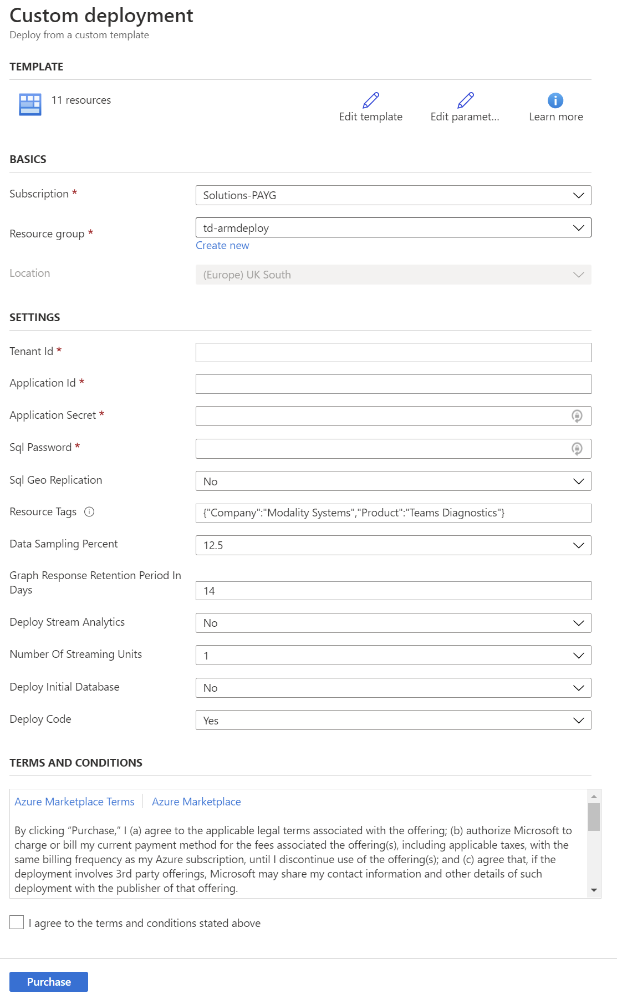
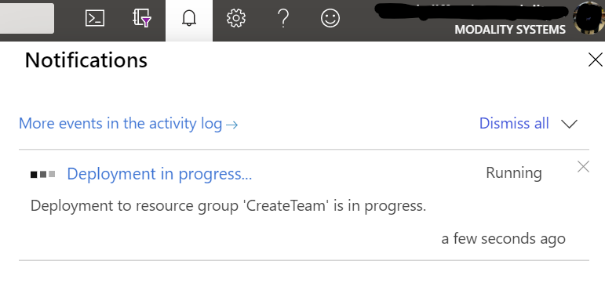
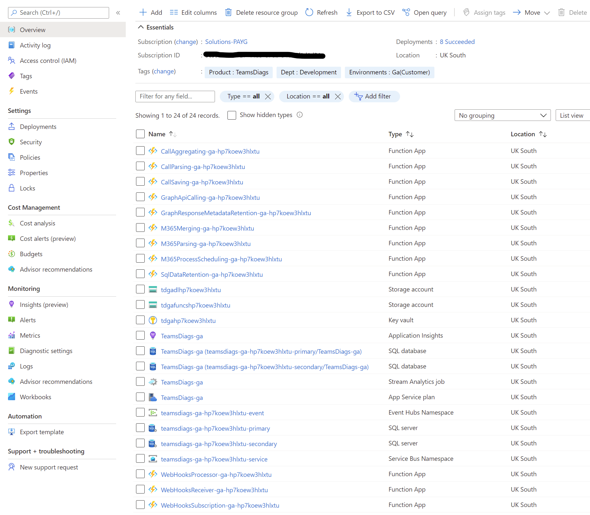
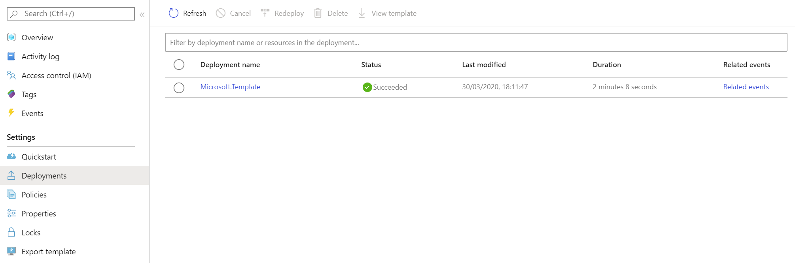

# Teamwork Analytics Performance ARM Deployment

Teamwork Analytics Performance can be provided as an Azure Resource Manager (ARM) template that automatically provisions and starts the required resources in your Azure subscription.

> Note: You must have [registered an application](RegisterApp.md) beforehand.

> Note: For an introduction to Azure Resource Manager see [docs.microsoft.com](https://docs.microsoft.com/en-us/azure/azure-resource-manager/resource-group-overview).

This ARM Template will install resources in your Azure tenant. The template will deploy the following resources:

| Service Type         | Description                                                                                            |
| -------------------- | ------------------------------------------------------------------------------------------------------ |
| 12x Function App     | Consumption Plan                                                                                       |
| Storage Accounts     | Block Blob Storage, General Purpose V2, RA-GRS Redundancy, 1,000 GB Capacity, 100 Storage transactions |
| DL Storage Accounts  | Block Blob Storage, General Purpose V2, RA-GRS Redundancy, 1,000 GB Capacity, 100 Storage transactions |
| Key Vault            | Securely stores Function Secrets                                                                       |
| Azure SQL DB         | Single Database, DTU purchase model, Standard tier, S0: 10 DTUs, 250 GB included storage per DB        |
| GeoRedundant SQL DB  | Optional Mirror as above so that reporting doesn't impact performance                                  |
| Service Bus          | Reliable cloud messaging as a service for the Functions to communicate with each other                 |
| Event Hub            | Simple, secure and scalable real-time data ingestion                                                   |
| Stream Analytics     | Serverless real-time analytics, from the cloud to the edge                                             |
| Application Insights | Logs for Teamwork Analytics Performance                                                                |

## Installation

1. Click on the **Deploy to Azure** button above . You will be taken to Microsoft Azure Portal and a deployment form will open as shown below.

   

1. Carefully fill in the fields. In some cases the tooltips may provide extra guidance.

   - Basics
     - **Subscription** - Choose the Azure subscription to which deployed resources will be billed.
     - **Resource group** - It is strongly recommended that you create a new resource group for logical grouping and management of Teamwork Analytics Performance. _When applying an upgrade choose the Resource Group that already contains Teamwork Analytics Performance._
     - **Location** - The location of the newly created resource group. All deployed resources will match this value.
   - Settings
     - **Tenant ID** - ID of the Tenant that you would like to gather performance data from.
     - **Azure Application details** - Use the details you generated when [registering an application](RegisterApp.md).
     - **SQL Password** - The desired password credential for administrative access to the SQL Database.
     - **SQL Geo Replication** - Deploy secondary SQL Server and DB for reporting. Reduce this to reduce cost but also logs less.
     - **Resource Tags** - Tags that will be applied to all deployed components. If changing ensure format is maintained.
     - **Data Sampling Percent** - Sampling rate for Application Insights.
     - **Graph Response Retention Period in Days** - Number of days to retain response from graph.
     - **Deploy Stream Analytics** - Deploy Stream Analytics.
     - **Number of Streaming Units** - Number of streaming units for Stream Analytics.
     - **Deploy Initial Database** - Set to Yes on initial deployment, otherwise set to No.
     - **Deploy Code** - Deploy Teamwork Analytics Performance code.

2. Read the Terms and Conditions, then click "I agree to the terms and conditions stated above" and click "Purchase" (this refers to the resources hosted on Azure, and is not a usage agreement for Teamwork Analytics Performance.)

3. The notification bell will show the deployment in progress, the when complete click Go to resource group

   

   * By clicking on Deployment in progress you will be able to see what it is actually doing.

4. After a period of deployment should get a Resource group in your tenant with the following components

   

5. On the left hand menu, click Deployments and then the name of the Deployment that just completed

   

## Refresh Functions

1. To complete the deployment it is a requirement to synchronise all of the functions
   - Please follow steps [Refresh Functions](RefreshFunctions.md) for next steps.