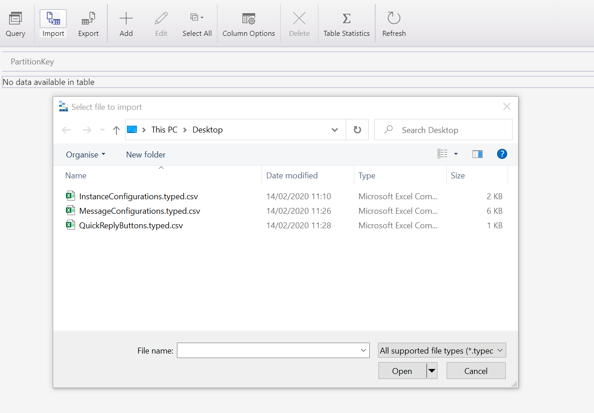

1. Create 3 tables called InstanceConfigurations, MessageConfigurations and QuickReplyButtons

   

1. Download the following 3 csv files

   - [InstanceConfigurations.typed.csv](http://docs.modalitysoftware.com/TeamsChatAssist/images/InstanceConfigurations.typed.csv)
   - [MessageConfigurations.typed.csv](http://docs.modalitysoftware.com/TeamsChatAssist/images/MessageConfigurations.typed.csv)
   - [QuickReplyButtons.typed.csv](http://docs.modalitysoftware.com/TeamsChatAssist/images/QuickReplyButtons.typed.csv)

1. Open all files and change all PartionKey values in each row to the user's Azure App Registration Application ID. In the InstanceConfigurations.typed.csv file, the RowKey values also need updating to the user's Azure TenantId.

   > Note: See [whatsmytenantid.com](https://www.whatismytenantid.com/) to help find this

1. Import all files into their respective tables that you created in the previous step

   

1. Adjust values using [Table Storage Configuration](TableStorageConfiguration.md) for guidance
