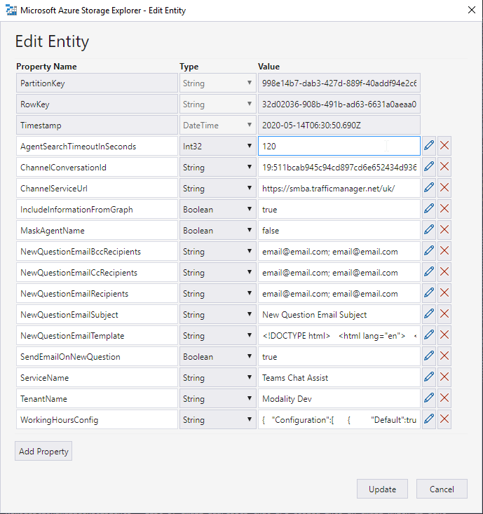
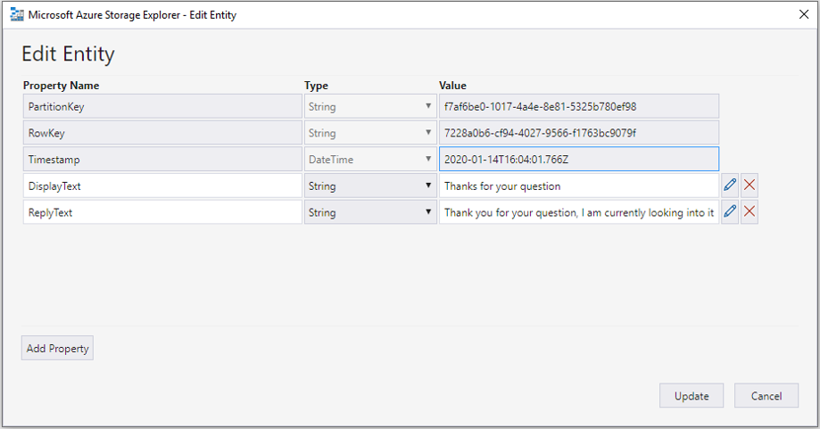
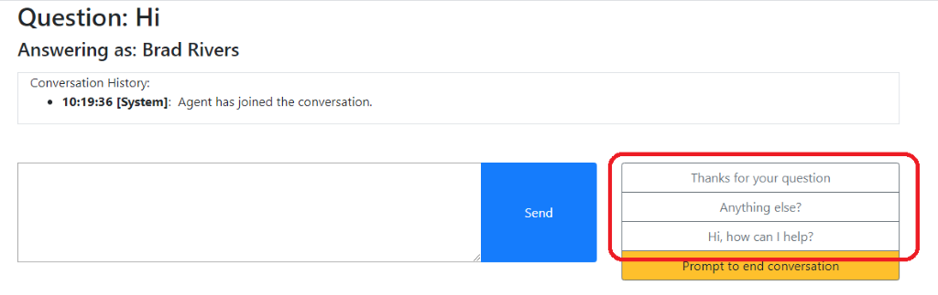
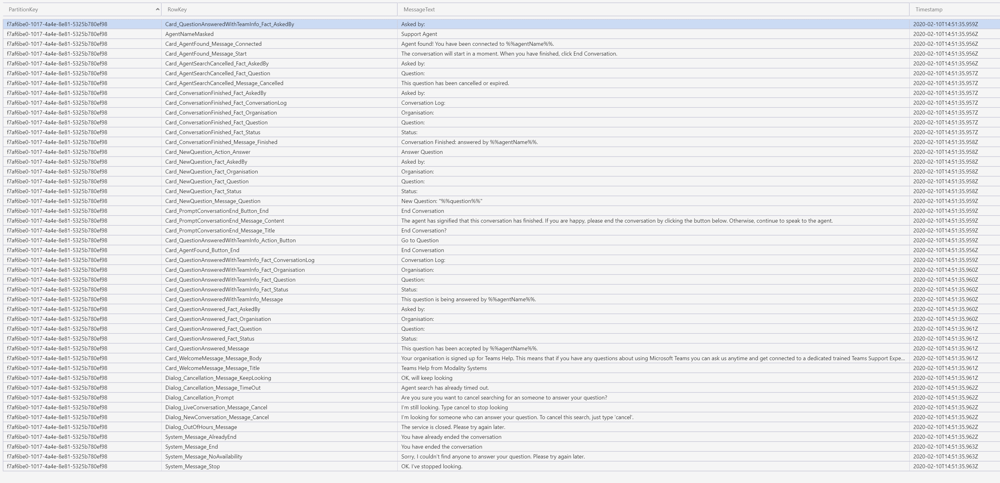
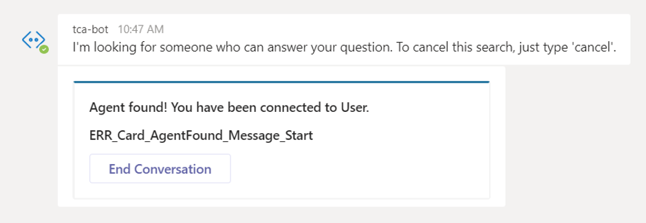

# Azure Table Storage Configuration

1. Open Azure Storage explorer on your PC (Download from https://azure.microsoft.com/en-us/features/storage-explorer/) add your PROD account and subscription if required

2. Open the storage account associated with TCA

3. Add/Edit rows individualy, or [import the default values into table storage](ImportDefaultValuesTableStorage.md)

## InstanceConfiguration Table 

> Default Values can be downloaded from here: [InstanceConfigurations.typed.csv](http://docs.modalitysoftware.com/TeamsChatAssist/images/InstanceConfigurations.typed.csv)



- PartitionKey = [App Registration Application ID]

- RowKey = [TenantId]

- Timestamp = autopopulated (not visible when creating first entity)

- AgentSearchTimeoutInSeconds (Int32) a number up to 2,147,483 seconds, The length of time in seconds that the system will allow between the initial question being asked and the agent responding

- ChannelConversationId = [Id of agent channel] this is the channel the agent questions will appear.

- ChannelServiceUrl = https://smba.trafficmanager.net/ + [region of tenant, eg uk, amer, emea], you can use [Location of Data](https://docs.microsoft.com/en-us/microsoftteams/location-of-data-in-teams) to determine this.

- IncludeInformationFromGraph (boolean) = Enable to report on users’ manager’s name and email address

- MaskAgentName (boolean) = Enable to mask agents name (will look at AgentNameMasked value in MessageConfig)

- NewQuestionEmailBccRecipients = List of email addresses that are blind copied into an email which is sent when a user asks a new question. Multiple addresses should be semi-colon separated. This field is ignored if ‘SendEmailOnNewQuestion’ is false.

- NewQuestionEmailCcRecipients = List of email addresses that are copied into an email which is sent when a user asks a new question. Multiple addresses should be semi-colon separated. This field is ignored if ‘SendEmailOnNewQuestion’ is false.

- NewQuestionEmailRecipients = List of email addresses which an email which is sent when a user asks a new question. Multiple addresses should be semi-colon separated. This field is ignored if ‘SendEmailOnNewQuestion’ is false.

- NewQuestionEmailSubject = The subject of an email which is sent when a user asks a new question. This field is ignored if ‘SendEmailOnNewQuestion’ is false.

- NewQuestionEmailTemplate = The body of an email which is sent when a user asks a new question. Pattern matching is supported for the ‘InitialQuestion’. The template uses Razor syntax – below is an example. This field is ignored if ‘SendEmailOnNewQuestion’ is false.

- SendEmailOnNewQuestion (boolean) = When true bot sends an email when a new question is asked by a user.

- ServiceName = [friendly name for service] (whatever you want)

- TenantName = [friendly name of tenant] (whatever you want)

- WorkingHoursConfig = [configuration for the service work hours/run time] is an optional value, if left blank then the service runs 24/7 however, if you wish to configure service hours then update the json config for your service – below is an example.

**NewQuestionEmailTemplate sample:**

> @Model.InitialQuestion = Initial question asked

```html
<!DOCTYPE html>
<html lang="en">
  <head>
    <style></style>
  </head>
  <body>
    <p>A new Teams Chat Assist message has been posted.</p>
    <p>Question: @Model.InitialQuestion</p>
  </body>
</html>
```

**NewQuestionEmail validation/rules:**

If ‘SendEmailOnNewQuestion’ is true and the other email fields are empty or incorrect, the bot will error. This error will not be displayed to the user, but can be viewed in the logs.

Due to limitations of the email client, when ‘SendEmailOnNewQuestion’ is true, ‘NewQuestionEmailRecipients’ must contain at least one email address. The same email address must not appear in more than one of the three recipient fields (NewQuestionEmailRecipients, NewQuestionEmailCcRecipients’ NewQuestionEmailBccRecipients)

**WorkingHoursConfig sample:**

```javascript
{
   "Configuration":[
      {
         "Default":true,
         "Name":"Service Desk",
         "WorkingDays":[
            {
               "Day":"Monday",
               "StartHours":"09:00",
               "EndHours":"17:00"
            },
            {
               "Day":"Tuesday",
               "StartHours":"09:00",
               "EndHours":"17:00"
            },
            {
               "Day":"Wednesday",
               "StartHours":"09:00",
               "EndHours":"17:00"
            },
            {
               "Day":"Thursday",
               "StartHours":"09:00",
               "EndHours":"17:35"
            },
            {
               "Day":"Friday",
               "StartHours":"09:00",
               "EndHours":"17:00"
            }
         ],
         "Holiday":[
            {
               "Name":"Christmas Day",
               "Date":"2020-12-25"
            },
            {
               "Name":"New Year's Day",
               "Date":"2020-01-01"
            }
         ]
      }
   ]
}


```

**WorkingHoursConfig validation/rules:**

Below are the validations rules that the service abides by for working hours – logs will output if these requirements are not met.

- Default:

  - 1 configuration must have this property set to true

  - Optional (as long as 1 is set to true)

  - Cannot have multiple configurations set to true

- Name:

  - Must be unique

- WorkingDays.Day (English only supported):

  - "Monday"

  - "Tuesday"

  - "Wednesday"

  - "Thursday"

  - "Friday"

  - "Saturday"

  - "Sunday"

- WorkingDays.StartHours/EndHours:

  - Must be a string representing a valid 24hour digital time e.g. ##:##, values supported are between 00:00 - 23:59

  - The times need to be entered as UTC for your service to work as expected

- Holiday.Date

  - Must be in a default SQL date format "yyyy-MM-dd"

## QuickReplyButtons Table

> Default Values can be downloaded from here: [QuickReplyButtons.typed.csv](http://docs.modalitysoftware.com/TeamsChatAssist/images/QuickReplyButtons.typed.csv)



Add Entity for each predefined reply button to be displayed in the Agent View. The predefined reply buttons are highlighted in the screenshot below.

- PartitionKey = [App Registration Application ID]

- RowKey = This should be a unique Guid. To generate a Guid visit https://www.guidgenerator.com/, press the “Generate some GUIDs!” button and copy the result into this field. A new Guid needs generating for each row.

- Timestamp = autopopulated (not visible when creating first entity)

- DisplayText (String) = The text to be displayed in each predefined reply button

- ReplyText (String) = The text that is sent to the user when the button is pressed (the text can also be viewed by hovering over the button in the agent view)



## MessageConfigurations Table

> Default Values can be downloaded from here: [MessageConfigurations.typed.csv](http://docs.modalitysoftware.com/TeamsChatAssist/images/MessageConfigurations.typed.csv)



- PartitionKey = [App Registration Application ID]

- RowKey = This is a unique string used to identify the message id

- MessageText = Value that is displayed for different areas within solution, this is configurable. Pattern matching is also supported for some fields\*

**Pattern matching:**

_The following messages support pattern matching:_

Any Message ID starting with:

- Card\_

- System\_

_The following variables are available to be used in MessageText_

- &&question&& = Initial question asked

- &&askedBy&& = The user who is asking the questions/speaking to the bot

- &&agentName&& = the name of the agent dealing with the current question

- &&tenantName&& = the name of the tenant the solution is running against

> Note: If the value fails to load for whatever reason, TCA would output an error message in the format of “ERR_MessageId”. For example if the value for “Card_AgentFound_Message_Start” failed to read/write, this would display in the respective area:


