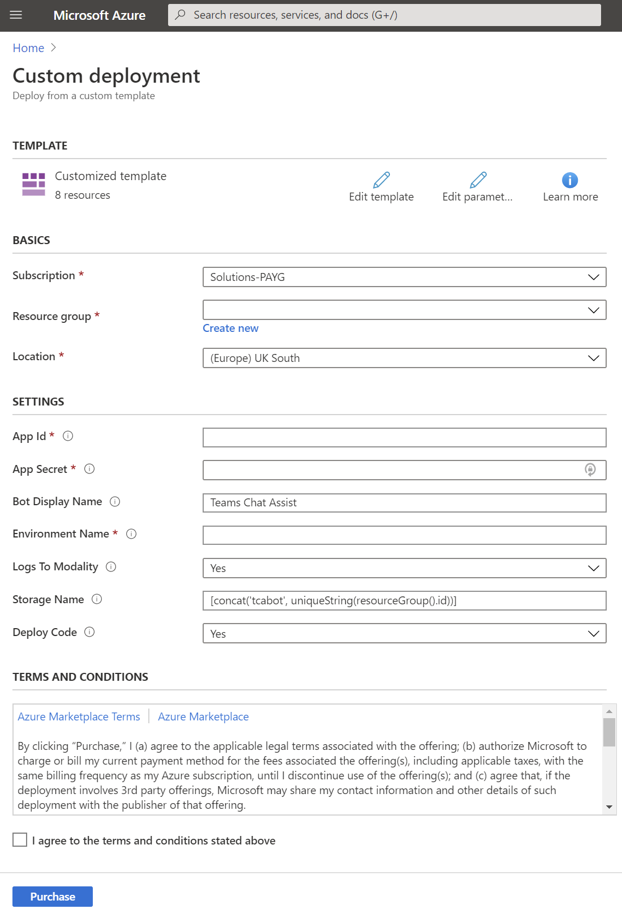

# Teams Chat Assist ARM Deployment

Teams Chat Assist Bot can be provided as an Azure Resource Manager (ARM) template that automatically provisions and starts the required resources in your Azure subscription.

> Note: You must have [registered an application](registerapplication.md) beforehand.

> Note: For an introduction to Azure Resource Manager see [docs.microsoft.com](https://docs.microsoft.com/en-us/azure/azure-resource-manager/resource-group-overview).

This ARM Template will install resources in your Azure tenant. The template will deploy the following resources:

| Service Type         | Description                                                                                            |
| -------------------- | ------------------------------------------------------------------------------------------------------ |
| Web App Bot          | S1 Standard                                                                                            |
| Web App Service      | S1, 100 Total ACU, 1.75GB memory, A-Series Compute Equivalent                                          |
| Key Vault            | Securely stores Web App Bot Secret                                                                     |
| SignalR Service      | 1 Unit, 1K Connections, 1M Messages per day                                                            |
| Application Insights | Logs for Web App Bot and Web App Service                                                               |
| Storage Accounts     | Block Blob Storage, General Purpose V2, RA-GRS Redundancy, 1,000 GB Capacity, 100 Storage transactions |

## Installation

1. Click on the ARM template link that was provided by us. You will be taken to Microsoft Azure Portal and a deployment form will open as shown below.

   

1. Carefully fill in the fields. In some cases the tooltips may provide extra guidance.

   - Basics
     - **Subscription** - Choose the Azure subscription to which deployed resources will be billed.
     - **Resource group** - It is strongly recommended that you create a new resource group for logical grouping and management of Teams Chat Assist. _When applying an upgrade choose the Resource Group that already contains Teams Chat Assist._
     - **Location** - The location of the newly created resource group (this only determines the geographical location of resource group and its metadata, to change the location of the resources themselves, see _Location_ below).
   - Settings
     - **Azure Application details** - Use the details you generated when [registering an application](applicationRegistration.md).
     - **Bot Display Name** - This is the name of the Bot that your users will see
     - **Environment Name** - This is the name of your environment and is used by Modality to help identify within logs when "Logs To Modality" is set to yes. **The name of your company would be a good choice**. Must be between 2 and 6 characters long and contain letters only.
     - **Logs To Modality** - Defaults to Yes will send logging information to Modality for better troubleshooting
     - **Storage Name** - It is strongly advised to leave this as default which will create a storage account starting tg followed by a unique string.
     - **Deploy Code** - For changes that require no updates to the Teams Chat Assist codebase, such as adding additional Bot instances, choose No. Otherwise stick with the default which is Yes

1. Read the Terms and Conditions, then click "I agree to the terms and conditions stated above" and click "Purchase" (this refers to the resources hosted on Azure, and is not a usage agreement for Teams Chat Assist.)

1. After a period of deployment should get a Resource group in your tenant with the following components

   

   > The name of the Web App Bot is the Azure Application ID you entered in step 2. The other resources have a suffix of the ResourceGroup ID (not visible in Microsoft Azure Portal).

1. The next step is to provision settings for your tenant in the storage account. The easiest way to do this is using the [Azure Storage Explorer](https://azure.microsoft.com/en-us/features/storage-explorer/)

   > If your company uses AD FS then you might have trouble signing into Azure Storage Explorer so try:

   - On the left vertical tool bar, open Settings. In the Settings Panel, go to Application > Sign in. Enable Use device code flow sign-in.
   - Open the Connect dialog box (either through the plug icon on the left-side vertical bar or by selecting Add Account on the account panel).
   - Choose the environment you want to sign in to.
   - Select Sign In.
   - Follow the instructions on the next panel.

1. Using Azure Storage Explorer that you have just installed, connect to your Azure Tenant and locate that storage account that was created as part of the ARM Deployment

1. [Import the default values into table storage](ImportDefaultValuesTableStorage.md)

1. Use the [Teams Web App](https://teams.microsoft.com/) to create a new Team for the bot to post agent messages too

   - On the Get Windows App screen click **Use web app instead**
     
   - Create a new Team and call it something like Teams Chat Assist Agents
   - Make it Private, skip adding members for now but revisit this when the deployment has finished and add your Agents as members
   - Create a Channel for the Bot to post agent messages too. Call it something appropriate to the bot such as company name or workload description
     
   - Copy Thread ID from address bar as indicated above and paste into the ChannelConversationId property in the instance configuration table

1. [Edit the InstanceConfigurations table as desired](TableStorageConfiguration.md)
   
## Applying Upgrades to Teams Chat Assist

To apply an upgrade to Teams Chat Assist you would simply click on the "Deploy to Azure" button above and ensure that all options are the same as from the initial installation. By redeploying to the same resource group and subscription, you are in affect updating things that are different.

## Adding additional Bot Instances

Teams Chat Assist supports multiple Bot Instances for different workloads. Each Bot requires its own unique bot registration in a 1 to 1 relationship. Multiple Bot instances will all link to the same underlying infrastructure so updating the codebase for 1 Bot Instance will upgrade all. To add additional Bot Instances simply click on the "Deploy to Azure" button above and specify the new:

  - App ID
  - App Secret
  - Bot Display Name
  
> Set Deploy Code to No and ensure that all other values match the initial deployment

> When applying updates to environments with multiple Bot Instances, you can use the App ID, App Secret, Bot Display Name of any of your Bot Instances

## Bot Manifest

1. The backend deployment is now complete but for people to interact with the Bot you will need to create a manifest file and install into Microsoft Teams.
   - Please see [Teams Chat Assist Manifest for ARM Deployment](armmanifest.md) for details.