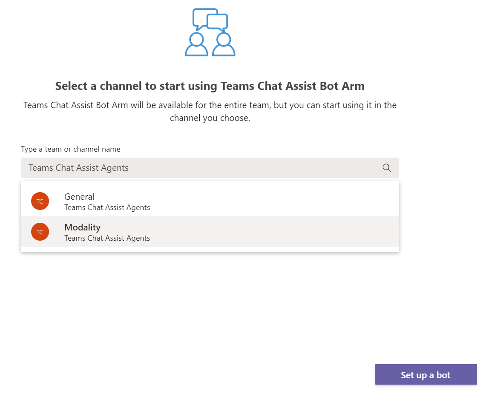
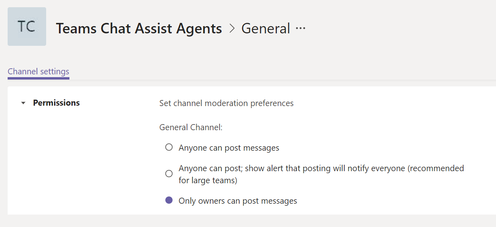
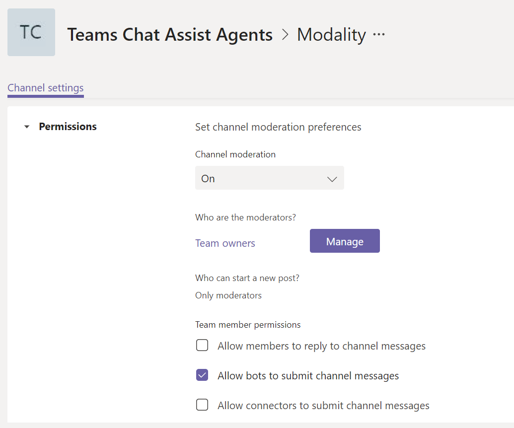
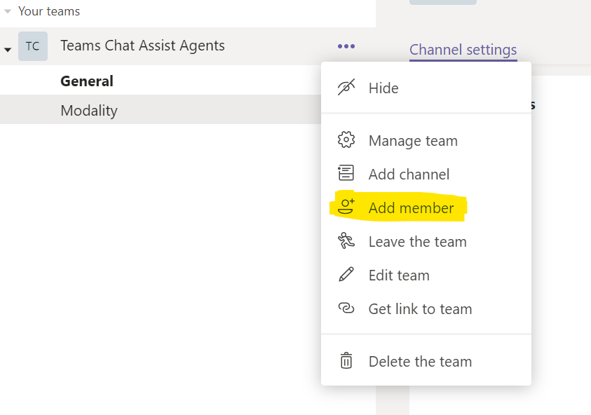

# Teams Chat Assist Manifest for ARM Deployment

Teams Chat Assist Bot requires a manifest file that defines all components of the Bot so that it can be installed into Microsoft Teams and used by people within your organization. To create this file we will be using a Microsoft Utility called [App Studio](https://docs.microsoft.com/en-us/microsoftteams/platform/concepts/build-and-test/app-studio-overview).

## Create Manifest

1. Start by [downloading](http://docs.modalitysoftware.com/TeamsChatAssist/images/TeamsChatAssistBot.zip) the base manifest file with common values defined.

1. Load App Studio from Micrsoft Teams, goto 'Manifest editor' and 'Import and existing app'.

   

1. Select the base manifest zip file that you downloaded, click the 3 dots in the top right corner of the App.

   

1. The App ID needs to be unique for each manifest that is created so to ensure this click the 'Generate' button to create a new randomly generated GUID. All other values on this page don't need changing.

   

1. Under Capabilites click the Bots tab and then click the 'Set up' button.

   

1. Select Existing bot, connect to different bot id and enter the same App ID that you created for the ARM Deployment and give it a name. Under Scope, Tick Personal and Team, then click Save.

   

1. You should then see the following and then the manifest can be downloaded by clicking 'Test and distribute'.

   

1. Click 'Download' to download the manifest zip file to your downloads folder. The validation is intended for when the Manifest is going to be added to the Microsoft Store so is not always relevant here.

   

1. To install the manifest into Microsoft Teams click the 3 dots and then More apps.

   
         
1. Click Upload for (complany name) and select the manifest zip file that you downloaded

   

   > Note: This step will require the Teams Admin Role

1. Click the down arrow next to add and select 'Add to a team'. Select the team that you created previously.

   

   

1. Set permissions on the **Teams Chat Assist Agents** team as follows:
   - General: Go to General Channel of the team, click 3 dots opposite to General, then select Manage Channel
   
   - Channel: Go to Agents Channel, click 3 dots opposite to Channel Name, then select Manage Channel
   
   - Add members: Select Team amd then 3 dots oppposite to Team name. select Add Member from menu opened
   
   
