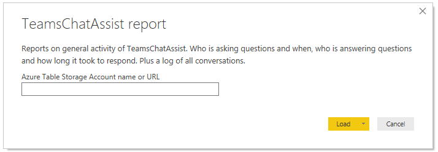
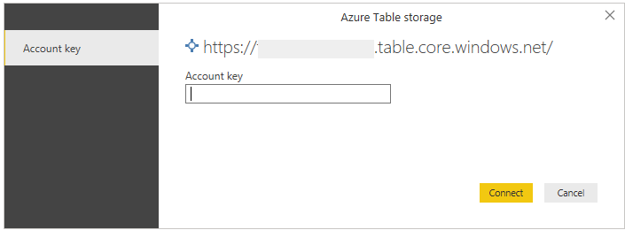
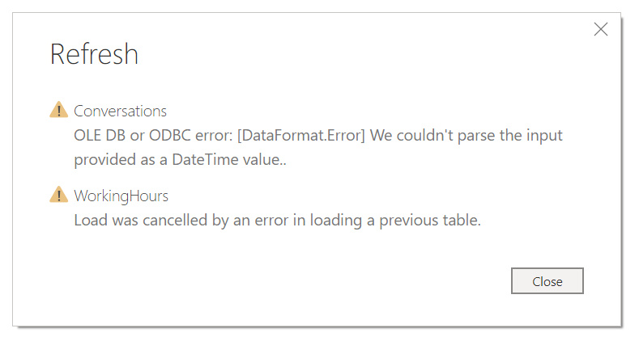
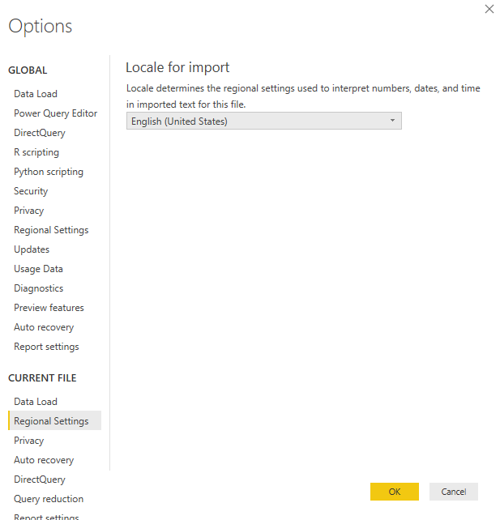

# Teams Chat Assist Power BI Report Import Guide

This document explains how to install and run the Teams Chat Assist Power BI Report. The report provides general details of how Teams Chat Assist is being used: Who is asking questions and when, who is answering questions and how long it took to respond. Plus a log of all conversations.

> Note: In order to view the report you must have access the Azure Table Storage Account for your Teams Chat Assist instance. Specifically the Account name or URL and Account Key.

> Note: The report requires an installed and licensed version of Power BI Desktop.

## Import Report

1. Start by [downloading](http://docs.modalitysoftware.com/TeamsChatAssist/images/TeamsChatAssistReport.pbit) the Power BI report.

2. In Power BI Desktop, select File > Import > Power BI template. Navigate to the location of report downloaded above, select the report and Open.

3. You will be presented with a dialog that allows you to specify the data source for the report. You should enter your Azure Table Storage Account name or URL and select Load.

4. If this is the first time you have connected to this account in Power BI Desktop, another dialog is displayed. Enter your Azure Table Storage Account Key.

5. If your region is set to United States, then the report will be displayed. The Questions page provide an overview of how many questions have been asked, by who and when. The Agents page details who has been answering questions and how quickly they have answered the. Finally the Conversations page lists all details about every question asked. They are multiple filters providing a means for finding individual records.

> Note: If your region is not set to United States then you will see the following error.
>
> 
>
> The reports 'Locale for import' setting has defaulted to an incorrect value. This can be resolved by [updating your reports Locale for import](#Update-the-reports-Locale-for-import-setting).
>
> After selecting 'Close' in the above dialog. You may also see the following warnings, these can both be ignored. [Updating the Locale setting](#Update-the-reports-Locale-for-import-setting) will also remove the warnings.
>
> 

## Update the reports 'Locale for import' setting

> Note: Your Power BI region only needs updating if it is not already set to United States

1. Select File > Options and settings > Options. Scroll down to the 'Current File' section and select 'Regional Settings'. Update the 'Locale for import' setting to be English(United States). Press OK.

2. In the Home tab of the toolbar press the refresh button. The data will be reloaded and the report will now display correctly.
