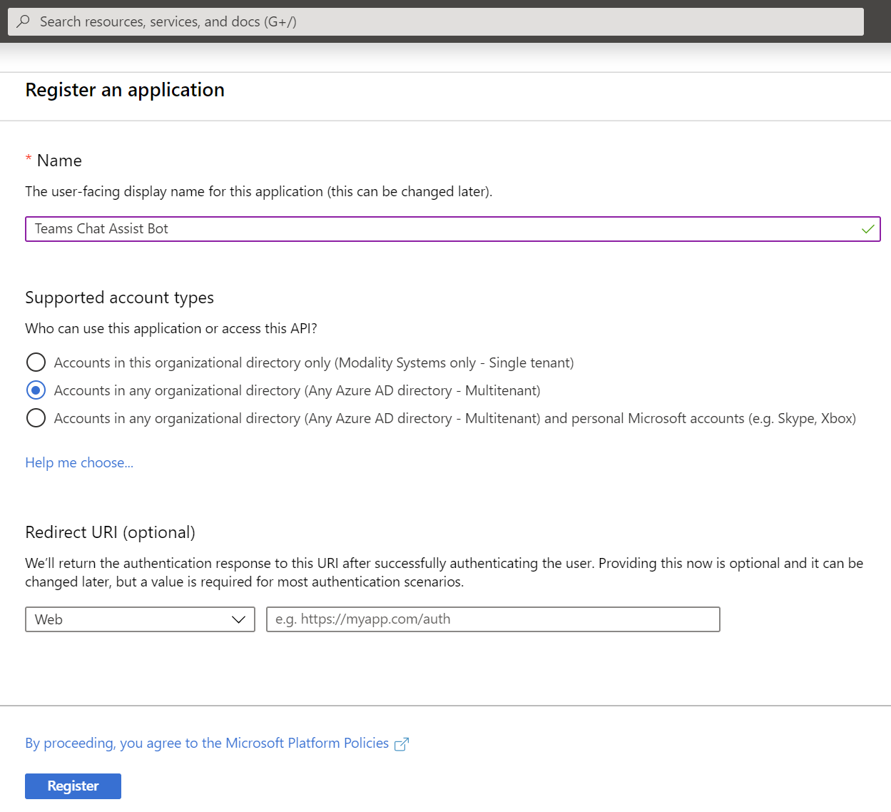
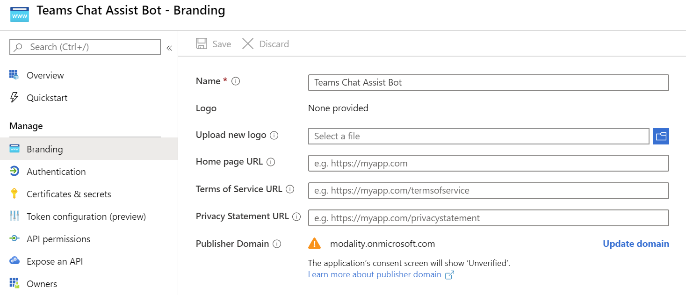
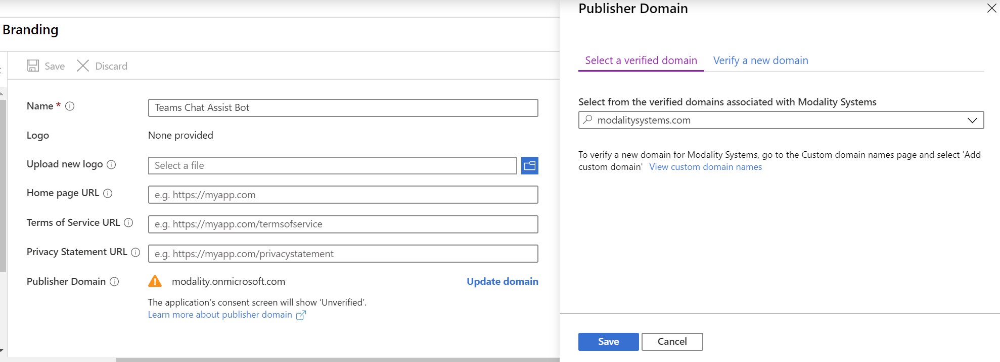
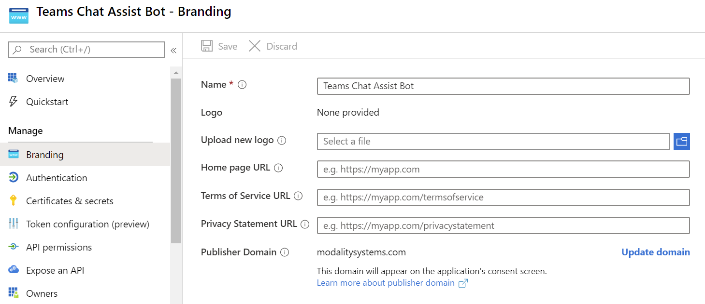
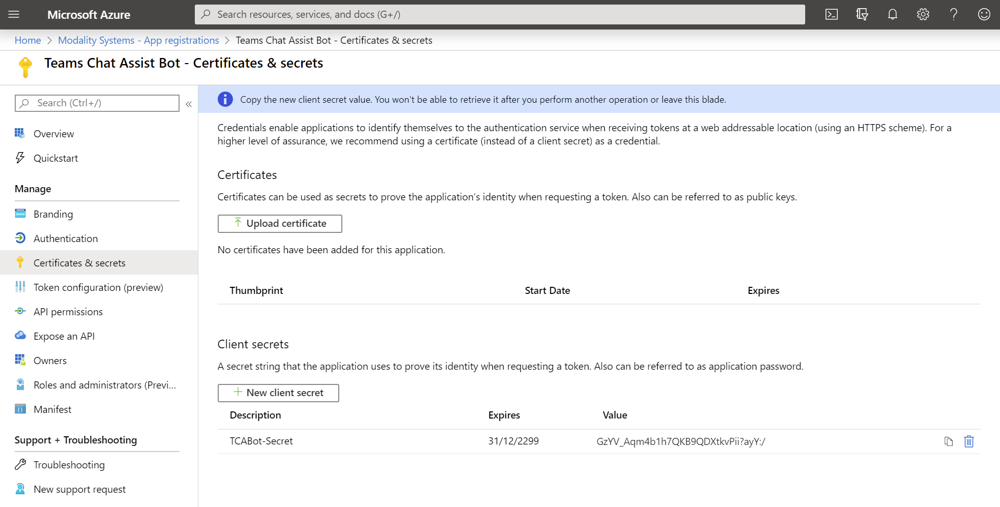
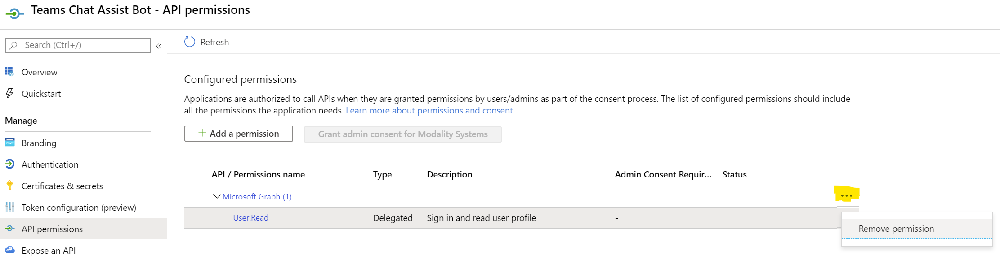
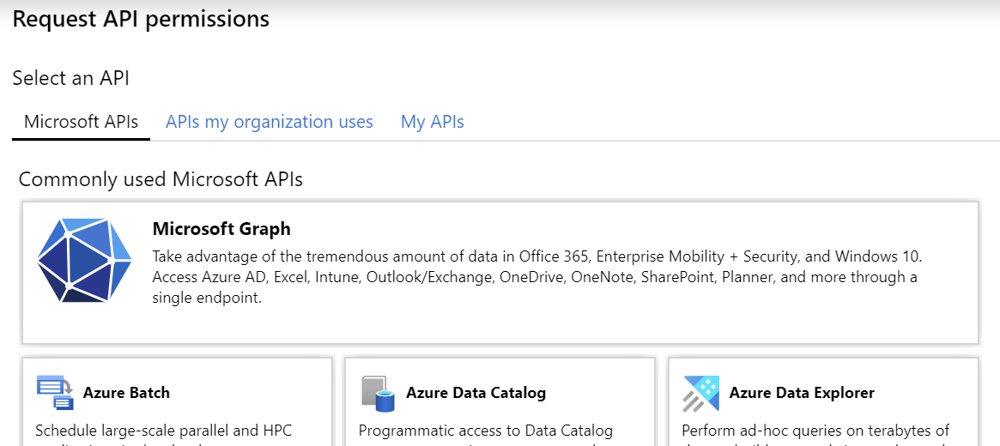
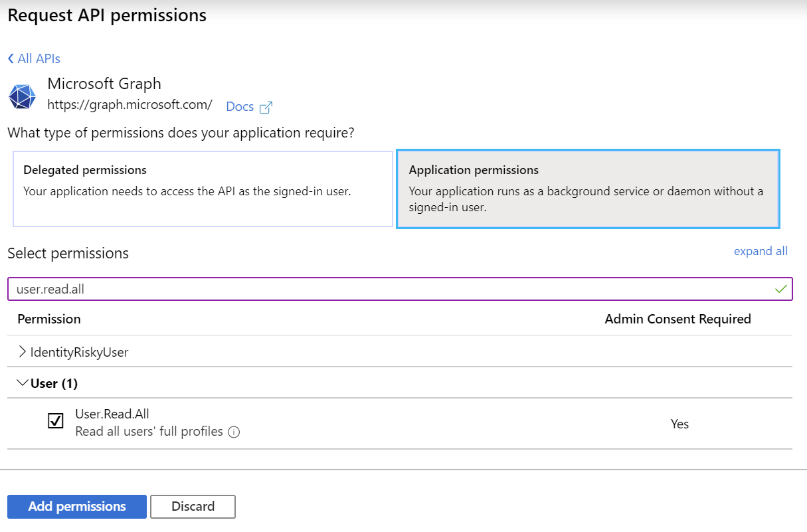
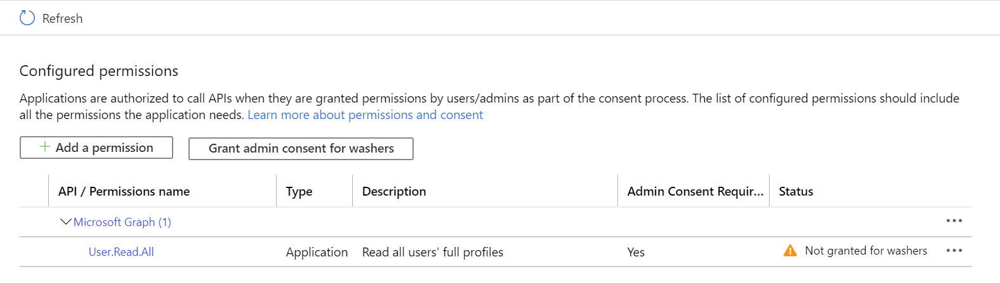

## Registering Teamwork Analytics as an Azure Application
This document describes the process of registering Teams Chat Assist Bot as an Azure Application as the first step to deployment.  As part of the registration you will gather the following information for use further along the deployment process.
   * Application ID
   * Application Secret

### Register Teamwork Analytics with Azure Active Directory
1. Sign in to the [Azure Portal](https://portal.azure.com)
1. Select the **Azure Active Directory** service from the navigation menu on the top
1. Select **App Registrations** from navigation pane on the left and then click **+ New Registration** (Take care not to select **App Registrations (Legacy)** as these instructions do not apply to them)
1. Enter the following application registration details
   * **Name** - Recommend setting this to **Teams Chat Assist Bot**
   * **Supported Account Types** - This needs to be set to **Accounts in any Organizational Directory**
1. Click **Register** and Azure AD will create an Application ID and present the Overview page

   

### Branding
1. Set the Publisher Domain to a valid Domain Name such as your company domain

   

   

   

### Add a Client Secret
1. Navigate to the **Azure Active Directory** from the navigation pane on the left
1. Select **App Registrations** and select the **Teams Chat Assist Bot** app 
1. Select **Certificates & secrets** from the Manage menu
1. Select **New client secret** and enter an appropriate description and expiry period
   * **Description** - Recommend setting this to **TCABot-Secret**
   * **Expiry** - Recommend setting this to **Never**
1. Click **Add**
1. Immediately take note of the **Secret** as this can not be retrieved later and will be required further in the deployment process

### API permissions
1. Remove the Delegated User Read Graph permission by clicking the 3 dots next to Microsoft Graph

   

1. Add the Application User Read Graph permission by clicking Add a permission and then click Microsoft Graph

   

1. Select Application permissions, search for user.read.all, tick it and click Add permissions

   

1. Click the **Grant admin consent** button as a Global Admin. If the button is not available you might need to click Refresh

   > Note: Admin consent will need to be granted by someone with the **Global Admin** role within your organisation

   

1. Once Admin Consent has succesfully been granted, the permission will turn grean

   

### Continue to ARM Deployment
1. Take your note of the **Application (client) ID** and **Client secrets** to the [ARM Deployment phase](armdeploy.md)
