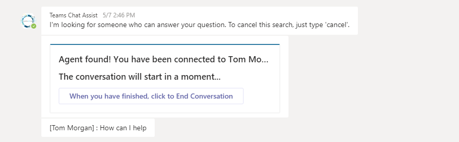
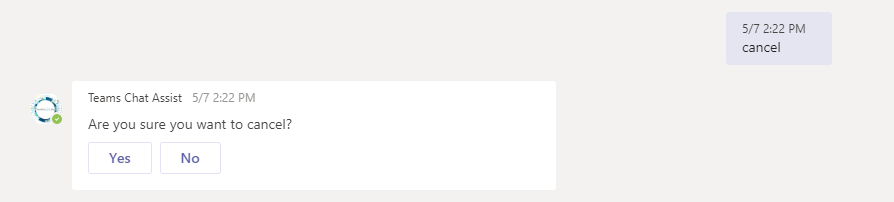

# Teams Chat Assist User Guide

> How to use Teams Chat Assist to get answers to your Microsoft Teams questions from experts, any time.

To ask a question about Microsoft Teams, use the Teams Chat Assist app. Depending on how your system administrator has configured Teams Chat Assist, you may see this as an icon in the left-hand menu in Microsoft Teams. If you do not see this, click the ellipses at the bottom of the menu and choose Teams Chat Assist.

If you do not see Teams Chat Assist in the list, then you will need to install it. Click **More apps** to open the App Store, then click "Built for [Your Company]" and choose Teams Chat Assist. Click Install.

You will communicate with an expert via instant message (IM). To begin, type your question in the Teams Chat Assist chat window:

Teams Chat Assist will start looking for an agent. As soon as one is found, you'll see a message that you have been connected to an agent.

If you want to cancel the agent search before an agent is found, type cancel:

Once an agent has been found and connected, any messages you send to the Teams Chat Assist chat window will be routed through the agent. This means that you can talk to the agent and explain your question by sending messages to the Teams Chat Assist chat window. The agent will respond by sending you messages via the Teams Chat Assist chat window.

You can end the conversation at any time by clicking the **End Conversation** button. The agent may send you a prompt to end the conversation but the conversation won't end until you confirm this.

You can also refer to the chat history with the Teams Chat Assist app to remind yourself of your conversations with agents.

