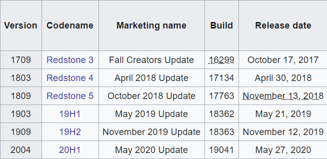

# Office Test Bed ARM Deployment

Office Test Bed ARM Deployment allows you to quickly spin up an Azure VM based on a selectable set of Windows/Office versions and starts the required resources in your Azure subscription.

> Note: For an introduction to Azure Resource Manager see [docs.microsoft.com](https://docs.microsoft.com/en-us/azure/azure-resource-manager/resource-group-overview).

This ARM Template will install resources in your Azure tenant. The template will deploy the following resources:

| Service Type         | Description                                                                                            |
| -------------------- | ------------------------------------------------------------------------------------------------------ |
| Virtual machine      | [DEFAULT] D2s_v3, 2 vCPUS, 8GiB RAM, 3200 IOPS                                                         |
| Network interface    | Allows VM to connect to network/internet                                                               |
| Disk                 | For OS, Premium SSD, 127GiB                                                                            |
| Public IP Address    | Allows for remote access to Virtual network                                                            |
| Virtual network      | The virtual network that the virtual machine sits within                                               |
| Network Security group | Firewall that protects access to the virtual network                                                 |

# Windows Selection

Professional or Enterprise

  

# Office Selection

Delivered by C2R installer 32/64 bit

Office 365 
Office 2019
Office 2016
Office 2013

Choose to install Teams 64bit or Skype for Business

> SFBO and SFBS install the same skype but the name of the VM is different

# Office Channel

This is the update ring that Office 365 installations are put on. Microsoft have recently changed the names of these

  

# Visual Studio

Installed by chocolatey

2017 Enterprise
2019 Enterprise

# Azure DevOps Deployment Group

Configure the VM to be part of an Azure DevOps Deployment group