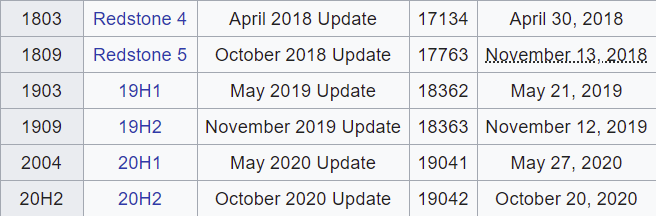
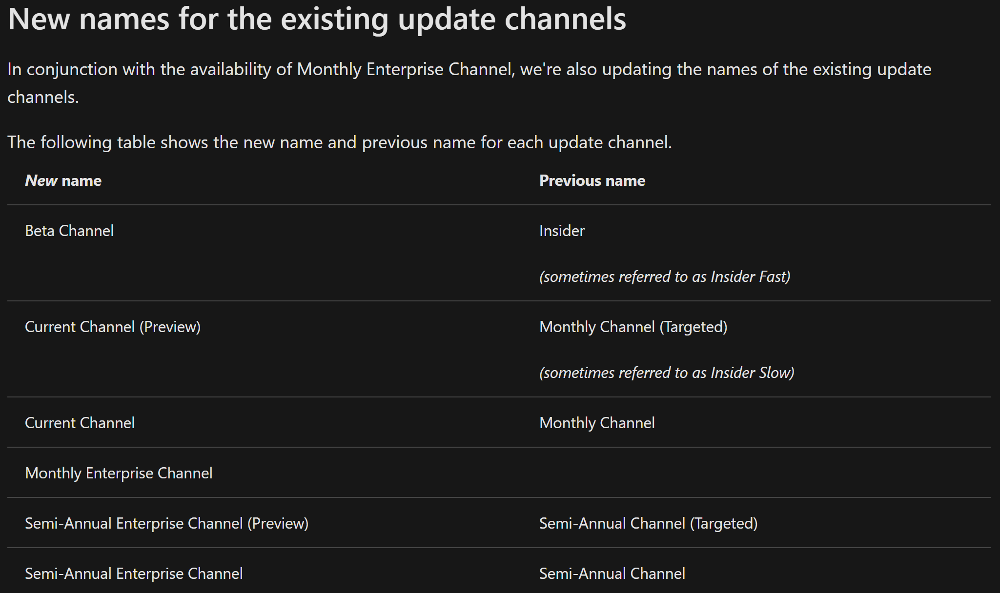
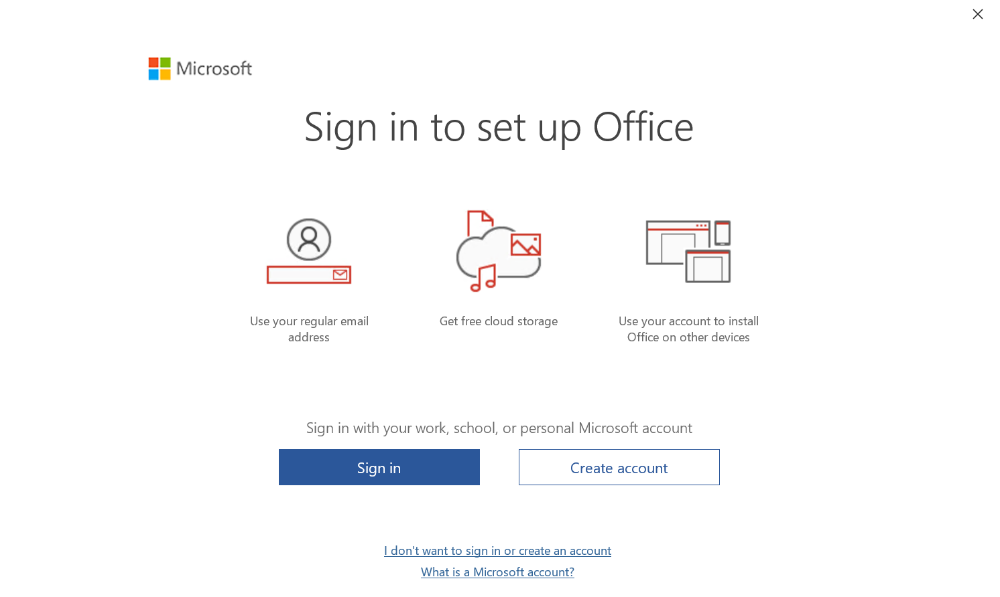
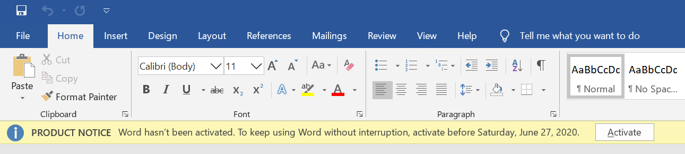

# Office Test Bed ARM Deployment

Office Test Bed ARM Deployment allows you to quickly spin up an Azure VM based on a selectable set of Windows/Office versions within your Azure subscription.

> Note: For an introduction to Azure Resource Manager see [docs.microsoft.com](https://docs.microsoft.com/en-us/azure/azure-resource-manager/resource-group-overview).

> Deployment time varies but should take about 20 minutes. If you include Visual Studio then it should take about 40 minutes.

# Windows Size

| Size             | Specification                   | Monthly Cost [Unless De-allocated] |
| ---------------- | ------------------------------- | -----------------------------------|
| Standard_D2s_v3  | 2 vCPUS, 8GiB RAM, 3200 IOPS    | £63.11                             |
| Standard_D4s_v3  | 4 vCPUS, 16GiB RAM, 6400 IOPS   | £126.33                            |
| Standard_D8s_v3  | 8 vCPUS, 32GiB RAM, 12800 IOPS  | £252.45                            |
| Standard_D16s_v3 | 16 vCPUS, 64GiB RAM, 25600 IOPS | £504.90                            |

# Windows Version

  

# Windows Edition

- Enterprise
- Professional

# Office Version

Delivered by C2R installer

- Office 365 
- Office 2019
- Office 2016
- Office 2013

# Office Focus

Choose to install Teams 64bit or Skype for Business

- Teams
- SFBO
- SFBS

> SFBO and SFBS installs are the same but the name of the VM is different

# Office Bitage

- 64 bit
- 32 bit

# Office Channel

This is the update ring that Office 365 installations are put on. Microsoft have recently changed the names of these

  

# Office License

All Office versions will install without a license, when you first load an office product such as Word you should see an activation screen similar to this. If you sign in with an account that has an Office 365 license assigned then the version of office will change to Office 365. It will also consume one of the allowed client installs for that user up to a maximum of 5 devices. To avoid this scenario click **I don't want to sign in or create an account** and enter a product key from your visual studio subscription.

  

If you only require short term use of Office that you can cancel the activation screen and you will be able to use all features of Office for 5 days.

  

# Visual Studio

Installed by chocolatey

- 2017 Enterprise
- 2019 Enterprise
  
# Web Browsers

Installed by chocolatey

- Chromium Edge
- Google Chrome 83.0.4103.106
- Mozilla Firefox

# Azure DevOps Deployment Group

Configure the VM to be part of an Azure DevOps Deployment group. This will allow Azure DevOps pipelines to be able to interact with the VM. Leave defaults if not required.

Azure DevOps Agent will install as a service by default. For scenarios such as running automated tests from a pipeline that require interactive access to the desktop:

- Navigate to folder **C:\AzurePiplinesAgent_Extension**
- Run script **autologin** to remove agent configuration
- Run script **autologin** again and enter windows password to configure agent to run in interactive mode

The VM should automatically restart then automatically login and start the agent