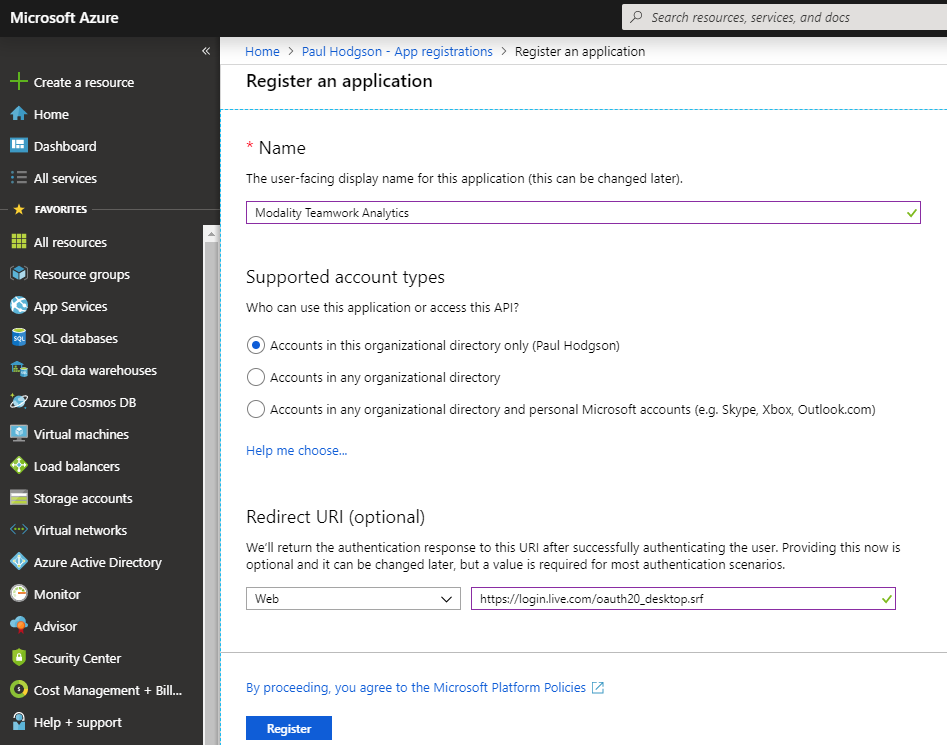
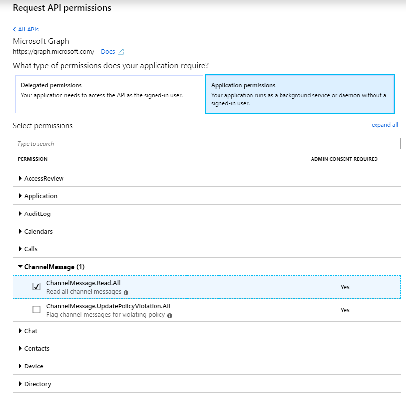

## Register Azure Application

1. Sign in to the [Azure Portal](https://azure.portal.com)
1. Select the **Azure Active Directory** service from the navigation pane on the left 
1. Select **App Registrations** and click **New Registration** (todo not legacy)
1. Enter the follow application registration details
   * **Application Name** - A meaningfull user-facing name for the application such as **Modality Teamwork Analytics**
   * **Supported Account Types** - Recommend setting this to **Accounts in this Organisational Directory Only**
   * **Redirect URI** - Recommend setting this to **https://login.live.com/oauth20_desktop.srf** (todo default for desktops)
1. Click **Register** and Azure AD will create an Application ID and present the Overview page

1. Take note of the **ApplicationID** as this will be required futher in the deployment process

1. Select **Certificates & secrets** from the Manage menu
1. Select **New client secret** and enter an appropriate description and expiry period
   * **Description** - Recommend setting this to **Primary** (todo twa secret)
   * **Expiry** - Recommend setting this to **Never**
1. Click **Add**
1. Immediately take note of the secret as this can not be retrieved later and will be required futher in the deployment process

1. Select **Api permissions** from the Manage menu
1. Find and select **Microsoft Graph** from the **Request API permissions** pane

1. Ensure that the permission type is set to "Application permissions" and not "Delegated permissions"

1. Select the follow 6 permissions from Microsoft.Graph
   * Directory.Read.All
   * Files.Read.All
   * Group.Read.All
   * Reports.Read.All
   * Sites.Read.All
   * User.Read.All
1.  Click **Add permissions** to be returned to the "API permissions" pane

(todo how to get tenant id)
(check spellings)
