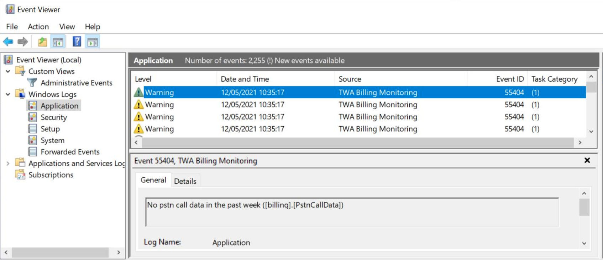

# Monitoring - PSTN Billing *

PSTN Billing is monitored via a combination of a SQL Stored Procedure and a Powershell Script. To configure please go through the following steps.

1\. Load the following stored procedure in the billing database.

```sql
IF EXISTS(SELECT 1 FROM sys.procedures WHERE Name = 'GetBillingStatus' And schema_id = SCHEMA_ID('billing'))
	DROP PROCEDURE [billing].[GetBillingStatus]
GO

CREATE PROCEDURE [billing].[GetBillingStatus]
AS

	Declare @BillingStatus Table 
	(
		[StatusMessage] nvarchar(max)
	)

	If Not Exists (Select * From [billing].[CurrentLicenses])
	Begin
		Insert Into @BillingStatus Select 'No current license data ([billing].[CurrentLicenses])'
	End

	If Not Exists (Select * From [billing].[UserPropertiesDaily] Where [date] > getdate() - 3)
	Begin
		Insert Into @BillingStatus Select 'No user properties data in the past 3 days ([billing].[UserPropertiesDaily])'
	End

	If Not Exists (Select * From [billing].[UserSkuDaily] Where [date] > getdate() - 3)
	Begin
		Insert Into @BillingStatus Select 'No Sku data in the past 3 days ([billing].[UserSkuDaily])'
	End

	If Not Exists (Select * From [billing].[PstnCallData] Where [Start Time] > getdate() - 7)
	Begin
		Insert Into @BillingStatus Select 'No pstn call data in the past week ([billing].[PstnCallData])'
	End

	Select * From @BillingStatus

GO
```

2\. Configure a windows scheduled task on the Billing Virtual Machine to run the following powershell script using an Local Administrator account (be sure to update the SQL connection string to the billing database).

```powershell
$connectionString = "." # !!!! ENTER CONNECTION STRING HERE !!!!

If ([System.Diagnostics.EventLog]::SourceExists("TWA Billing Monitoring") -eq 0){
    [System.Diagnostics.EventLog]::CreateEventSource("TWA Billing Monitoring", "Application")
}

$conn = New-Object System.Data.SQLClient.SQLConnection($connectionString)
$conn.Open()

$command = New-Object System.Data.SQLClient.SQLCommand
$command.Connection = $conn

$command.CommandText = "exec [billing].[GetBillingStatus]"

$reader = $command.ExecuteReader()

while($reader.Read())
{
	$statusMessage = $reader["StatusMessage"]

	Write-EventLog -LogName Application -Source "TWA Billing Monitoring" -EventID 55404 -Message $statusMessage -EntryType Warning
	write-host "Billing Monitoring Event Warning Triggered -" $statusMessage
}
```

3\. If the script detects any issues, it will raise a Warning in the event log with an ID of 55404, as illustrated in the screen shot below.


