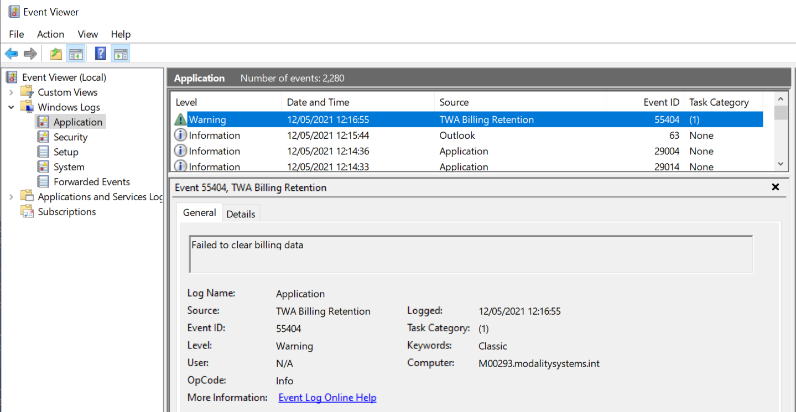

# Retention - PSTN Billing *

PSTN Billing has a year of data removed, which is ran once a day via a combination of a SQL Stored Procedure, a Powershell Script and Windows Task Scheduler. To configure please go through the following steps.

1\. Load the following stored procedure in the billing database.

```sql
IF EXISTS(SELECT 1 FROM sys.procedures WHERE Name = 'ClearExpiredData' And schema_id = SCHEMA_ID('billing'))
    DROP PROCEDURE [billing].[ClearExpiredData]
GO
CREATE PROCEDURE [billing].[ClearExpiredData]
    @RetentionPeriodInDays int = 365
AS
    declare @RetentionDate date = dateadd(day, @RetentionPeriodInDays * -1, GETUTCDATE())
    delete from [billing].[CommunicationCredits] where [ValidTo] < @RetentionDate
    delete from [billing].[PstnCalls] where [EndTimeUtc] < @RetentionDate
    delete from [billing].[SubscribedSkus] where [ValidTo] < @RetentionDate
    delete from [billing].[UserPropertiesLog] where [Date] < @RetentionDate
    delete from [billing].[UserSkusLog] where [Date] < @RetentionDate
GO
```

2\. Configure a windows scheduled task on the Billing Virtual Machine to run the following powershell script using an Local Administrator account (be sure to update the SQL connection string to the billing database).

```powershell
$connectionString = "." # !!!! ENTER CONNECTION STRING HERE !!!!

If ([System.Diagnostics.EventLog]::SourceExists("TWA Billing Retention") -eq 0){
    [System.Diagnostics.EventLog]::CreateEventSource("TWA Billing Retention", "Application")
}

$conn = New-Object System.Data.SQLClient.SQLConnection($connectionString)
$conn.Open()

$transaction = $conn.BeginTransaction();

$command = New-Object System.Data.SQLClient.SQLCommand
$command.Connection = $conn
$command.CommandTimeout = 3600
$command.Transaction = $transaction


$command.CommandText = "exec [billing].[ClearExpiredData]"

try { 
    $command.ExecuteNonQuery(); 
    $transaction.Commit();
}
catch {
    $errorMessage = "Failed to clear billing data : " + $_
    Write-EventLog -LogName Application -Source "TWA Billing Retention" -EventID 55404 -Message $errorMessage -EntryType Warning
	write-host "Billing Retention Event Warning Triggered - " $errorMessage
    $transaction.Rollback();
}
```

3\. If the script detects any issues, it will raise a Warning in the event log with an ID of 55404, as illustrated in the screen shot below.


