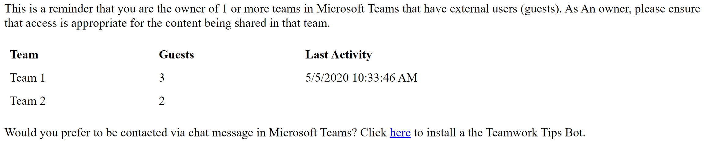
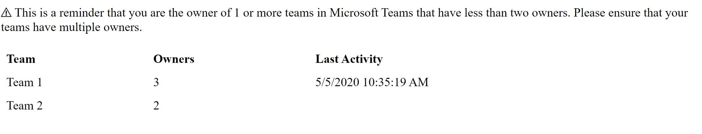
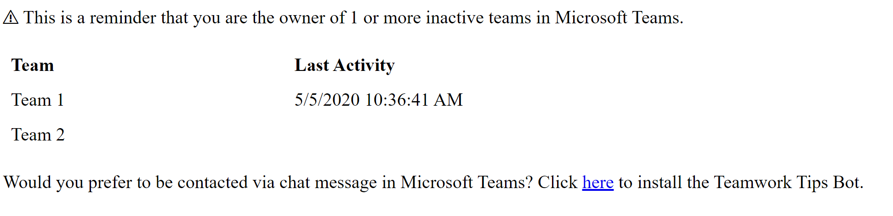
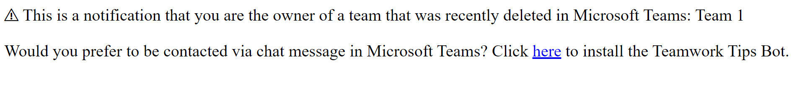

## Default Bot Scenarios and Content
Below are the default Bot scenarios deployed with TWA, if you have selected to include the notification service.

For each scenario you will find a description of the scenario and any default configured values. For each scenario we are able to configure the **Message Subject** and **Message Content.**

Please email Software.Support@modalitysystems.com if you require any customisation to the default scenarios or wish to discuss additional scenarios.

### Default Message Behaviour ###
If a scenario is triggered and the message sent, this will initially be delivered via email, as per the examples below. Within each default message, we provide the end user the ability to recieve future messages via the Teamwork Tips Bot. This is achieved by clicking the link provided within the message.

## Scenario 1 - Guest Reminder

### 1.	Scenario
The owner will recieve this message if they are the owner of a team which includes external guests. Team owners can then review Team content and guest membership to ensure it's still valid for use as initially intended.

### 2.	Default Message Subject
Teams with Guests Reminder

### 3.	Default Message Content
This is a reminder that you are the owner of 1 or more teams in Microsoft Teams that have external users (guests). As an owner, please ensure that access is appropriate for the content being shared in that team.

## Scenario 2 - Owner Reminder

### 1.	Scenario
The owner will recieve this message if they are the owner of a team which has less than **2 owners**. It is advised that the existing owner should the take action to nomiate/request an additional team owner.

### 2.	Default Message Subject
Teams with Owner Counts Reminder

### 3.	Default Message Content
This is a reminder that you are the owner of 1 or more teams in Microsoft Teams that have less than two owners. Please ensure that your teams have multiple owners.

## Scenario 3 - Inactive Teams Reminder

### 1.	Scenario
The owner(s) will recieve this message if they are the owner of a team which has had no activity within the last **30** days.

### 2.	Default Message Subject
Teams Last Activity Reminder

### 3.	Default Message Content
This is a reminder that you are the owner of 1 or more inactive teams in Microsoft Teams.

## Scenario 4 - Deleted Team Reminder

### 1.	Scenario
The owner(s) will recieve this message if they are the owner of a team which has been recently deleted. The team name will also be shown.

### 2.	Default Message Subject
Deleted Team Reminder

### 3.	Default Message Content
This is a notification that you are the owner of a team that was recently deleted in Microsoft Teams: TEAMNAME