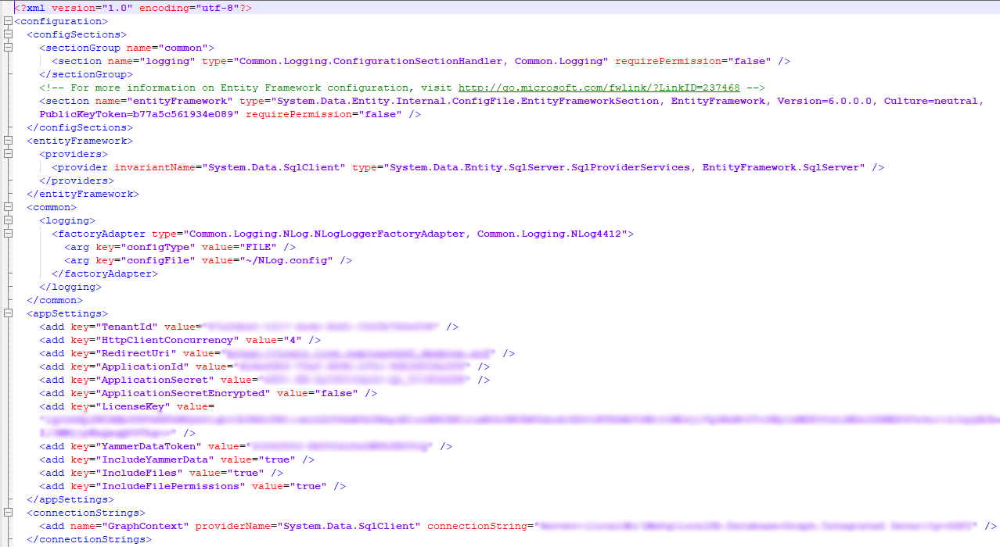

# Changing Feature Flags

Teamwork Analytics allows you to change feature flags that decide what data is collected. These can be changed from the config file found in the default installation path. By setting their respective values to either 'true' or 'false' you can toggle these features on or off.

>`C:\Program Files\Modality\GraphETL\Modality.Graph.Etl.SingleTenant.Service.exe.config`

- **IncludeFiles** - collection of SharePoint file data from Microsoft Teams.
- **IncludeFilePermissions** - if IncludeFiles is set to true then you can also set whether their permissions data per file is also collected. 

