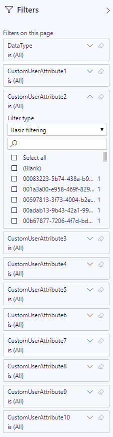

# Custom User Attributes

In addition to basic user attributes like `id`, `country` and `department`, Teamwork Analytics allows you to report on _custom user attributes_ from your active directory (we currently support [Directory Extensions](https://docs.microsoft.com/en-gb/azure/active-directory/hybrid/how-to-connect-sync-feature-directory-extensions)).

## Gathering the attributes

To configure custom attributes, you must add their names to the `configuration.CustomUserProperties` table in the TWA SQL database.

The table has one column called `Name` which supports alphanumeric characters and underscores (`a-z`, `A-Z`, `0-9`, `_`), as in the following examples:

| Name |
| ---- |
| companyName |
| faxNumber |
| mailNickname |
| preferredColour |
| 6de96c607cfe43e4993fad78004f59a4_shoeSize <sup>†</sup> |
| 6de96c607cfe43e4993fad78004f59a4_favouriteSuperhero <sup>†</sup> |

The next time TWA queries user data it will search for these attributes and save any values it finds to the SQL database within the `dbo.UserProperties` table.

> <sup>†</sup> Properties that were migrated from on-premesis Active Directory will often have a legacy ID in their names. This must be included.

# Troubleshooting missing attributes

Customer attributes can be checked in advance by using [Microsoft Graph Explorer](https://developer.microsoft.com/en-us/graph/graph-explorer) to run a query for `GET https://graph.microsoft.com/beta/users` (clicking this URL in your browser will not work).

However, the most thorough way to check is to configure the attribute as above, run TWA and let it complete a scan, then run the following SQL. This will give you and idea

```sql
WITH ValueCountByProperty AS (
	SELECT
		q1.[Property],
		CASE
			WHEN up.[Value] IS NULL THEN '[Microsoft Graph API did not return a value]'
			WHEN LEN(RTRIM(LTRIM(up.[Value]))) = 0 THEN '[Microsoft Graph API returned a blank]'
			ELSE up.[Value]
		END AS [Value],
		COUNT(*) AS [UserCount]
	FROM (
		SELECT u.[Id] AS [UserId], cup.[Name] AS [Property]
		FROM [configuration].[CustomUserProperties] cup, [dbo].[Users] u
		WHERE u.[Deleted] = 0) q1
	LEFT OUTER JOIN [dbo].[UserProperties] up ON q1.[Property] = up.[Path] AND q1.[UserId] = up.[UserId] AND up.[Deleted] = 0
	GROUP BY q1.[Property], up.[Value]
)
SELECT
	q1.[Property],
	q1.[Value],
	q1.[UserCount],
	ROUND(q1.[UserCount] / CAST((SELECT COUNT(*) FROM dbo.[Users] WHERE [Deleted] = 0) AS FLOAT) * 100, 2) AS [UserPercent]
	FROM (
		SELECT
			[Property],
			'[Microsoft Graph API returned a unqiue value for a User]' AS [Value],
			COUNT(*) AS [UserCount]
		FROM ValueCountByProperty
		WHERE [UserCount] = 1
		GROUP BY [Property]
		UNION ALL
		SELECT [Property], [Value], [UserCount]
		FROM ValueCountByProperty
		WHERE [UserCount] <> 1
	) q1
--WHERE q1.[Property] = 'property'
ORDER BY 1, 4 DESC
```

The results will show the spread of values for each attribute accross the whole userbase.

| Property | Value | UserCount | UserPercent |
| --------- | ---- | ---- | -------- |
| ... | ... | ... | ... |
| preferredColour | Blue | 1980 | 97.11 |
| preferredColour | [Graph API returned a blank] | 36 | 1.77 |
| preferredColour | [Graph API returned a unqiue value for a User] | 16 | 0.78 |
| preferredColour | Red | 3 | 0.15 |
| preferredColour | Yellow | 2 | 0.1 |
| preferredColour | Green | 2 | 0.1 |
| ... | ... | ... | ... |

If an attribute has been misconfigured, or it doesn't exist, the results will show "Graph API did not return a value":

| Property | Value | UserCount | UserPercent |
| --------- | ---- | ---- | -------- |
| ... | ... | ... | ... |
| shoeSize | [Graph API did not return a value] | 2039 | 100 |
| ... | ... | ... | ... |

## Filtering by custom attributes in Power BI

To configure custom attributes to show up in your Power BI reports, you must add their names to the `configuration.CustomUserPropertiesForReports` table in the TWA SQL database.

The table has numbered CustomAttribute columns for their corresponding filter in Power Bi. The values must match whichever custom attributes names you have previously configured in the `configuration.CustomUserProperties` table to use. They can be in whatever order you wish for them to show up in, such as in the following example. 

| CustomAttribute1 | CustomAttribute2 | CustomAttribute3 | etc.. |
| --- | --- | --- | --- |
| companyName | favouriteSuperhero | faxNumber

There can only be one row in this table and we currently only support up to 10 custom attributes to show in Power BI at a time.

These configured filters will then be displayed in the filter bar in all supported pages.


