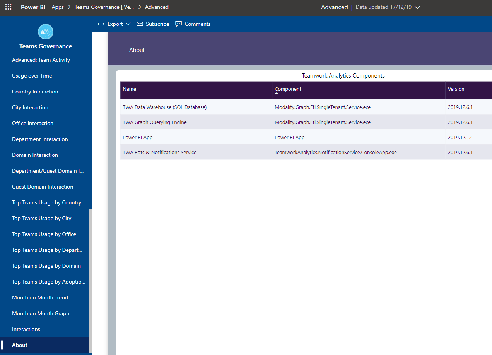

## How to check your versions and find out the latest released version

Your current versions are listed in the PowerBI apps under Advanced / About

You can check the latest versions of the backend released here: [Github Releases List](https://github.com/modalitysystems/TeamworkAnalyticsGABuilds/releases)

For PowerBI apps, our version number appears in the description of the app in the AppSource Microsoft App Store. Note Microsoft don't have any publicly accessible version numbering for PowerBI apps so we label our PowerBI apps with our own versioning.

When upgrading either the PowerBI or the backend, please make sure you are on the latest of both. You can upgrade the app or the backend in any order, but it is only tested and supported to work on the current version of both.

