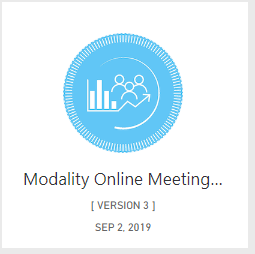
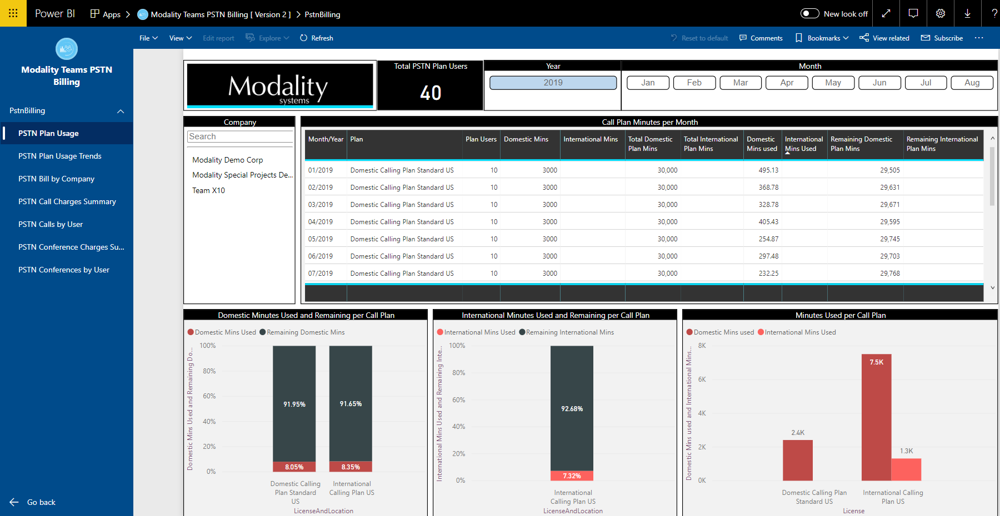

# Modality Online Meeting Usage

Thank you for installing the Modality Online Meeting Usage Power BI app. 

> This application reports on information from the Modality Teamwork Analytics data engine. 
It comes pre-installed with demo data, allowing you to navigate the app and explore how the 
app visualises online meeting information to identify user adoption requirements and track usage of different providers.
If you have already have Teamwork Analytics deployed, follow the deployment instructions below to connect these reports to your data. If, after reviewing the demo, you wish to proceed to purchase Teamwork Analytics for use with your own data, or deploy a trial in your tenant please [contact us](https://modalitysoftware.com/contact) for further details. [Read more about the Teamwork Analytics suite](https://modalitysoftware.com/teamwork-analytics).

## How to use the app

Once installed, the app will show in your [Power BI Apps](https://app.powerbi.com/groups/me/apps) list:

Clicking it will open the Getting Started dialog. Choose the **Explore app** button on the left hand side. We have pre-populated the app with sample data to enable you to explore the app.

You can explore the app using the navigation on the left hand side:

## Things to try

### Filtering

You can filter information using the top bar. For instance, on the *PSTN Plan Usage* page, try clicking one of the month buttons. All other visuals on the page will change to now only show information about that particular month.

### Visual Filtering

You can also click on visuals to set filters. Try clicking the line with the plan *Domesitc Calling Plan Standard US* to only show the usage for that specific plan.

## How to connect the app to your data

> This step requires you to have the Modality Teamwork Analytics data engine.  For more information please [contact us](https://modalitysoftware.com/contact) or find out more here > [Read more about the Teamwork Analytics suite](https://modalitysoftware.com/teamwork-analytics).

Once you have configured the Teamwork Analytics data collection engine for your environment you can connect the PowerBi app to your live data.  To do this go click the app again in your [Power BI Apps](https://app.powerbi.com/groups/me/apps) list.  When the prompt appears, this time click **Connect your data** button.

You will then be prompted to enter the connection details for your server and database.
  

When prompted enter your database connection credentials.  Set the **Privacy level setting for this data source** according to your requirements for sharing data in your organization, or if not sure set to 'None'

Once connected you can proceed to the reports as before, but now you should be seeing information from your environment.
