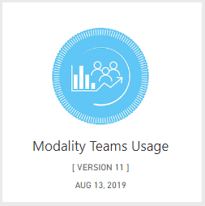
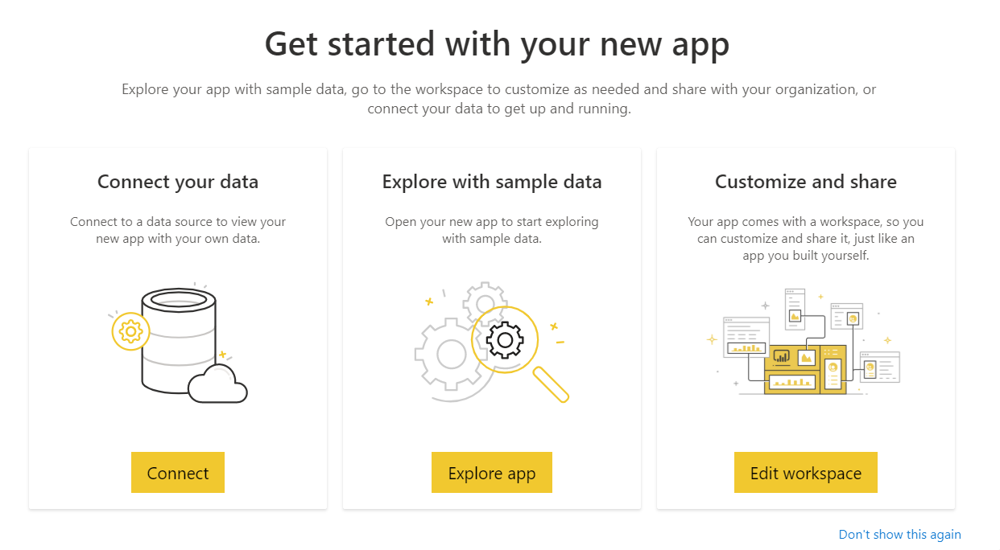
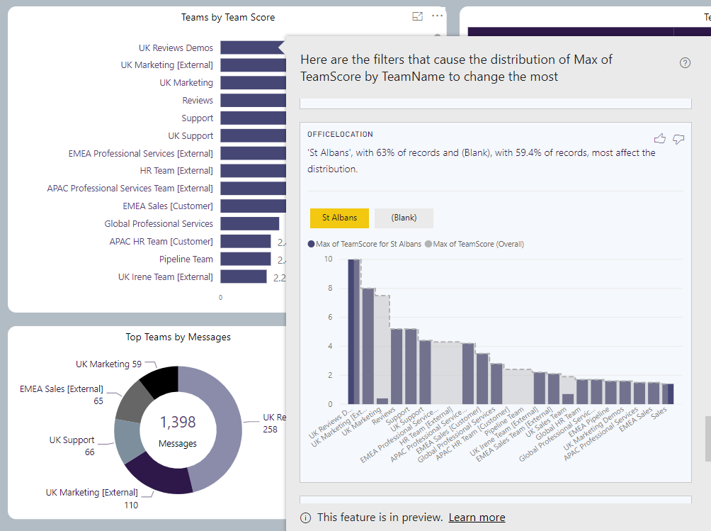
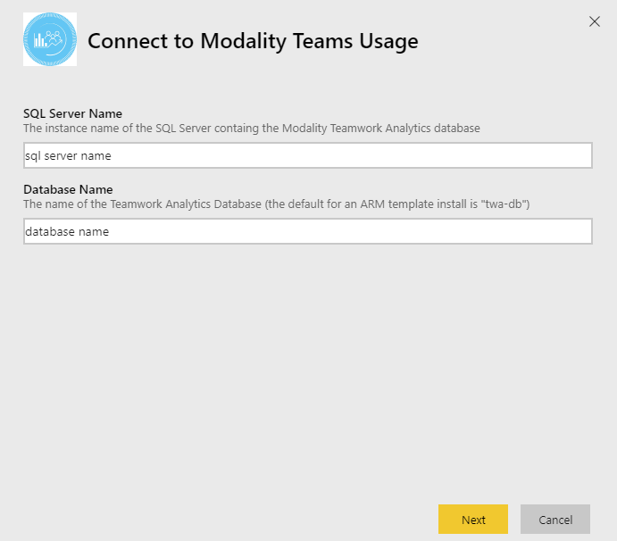
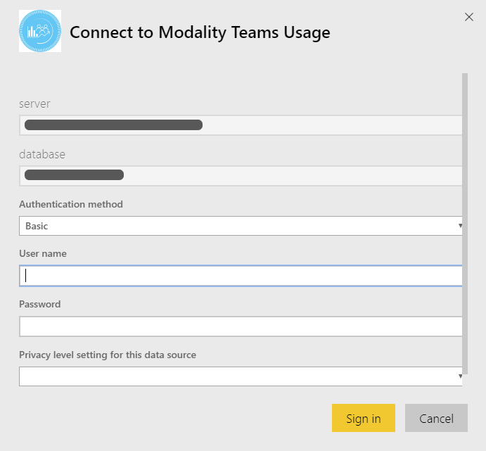

# Modality Teams Usage

Thank you for installing the Modality Teams Usage Power BI app. 

> This application reports on information from the Modality Teamwork Analytics data engine.  Initially it will report on demo data, allowing you to navigate the app and explore how the app visualises Microsoft Teams information to monitor and improve user adoption of Microsoft Teams.  If, after reviewing the demo, you wish to proceed to purchase Teamwork Analytics for use with your own data, or deploy a trial in your tenant please [contact us](https://modalitysoftware.com/contact) for further details. [Read more about the Teamwork Analytics suite](https://modalitysoftware.com/teamwork-analytics).

## How to use the app

Once installed, the app will show in your [Power BI Apps](https://app.powerbi.com/groups/me/apps) list:

Clicking on the app will take you to the **Getting Started** dialog. Choose the **Explore app** button in the middle. We have pre-populated the app with sample data to enable you to explore the app.

You can explore the app using the navigation on the left hand side:

## Things to try

### Filtering

You can filter information using the top bar. For instance, on the *Summary* page, try changing the *Country* dropdown to *United Kingdom*. All other visuals on the page will change to now only show information about Teams activity in the United Kingdom.

### Visual Filtering

You can also click on visuals to set filters. Try clicking the *Top Departments by Messages in Last 30 Days* ring to only show *Sales (UK)*. The other visuals on the page will refresh to only show information related to that specific department.

### Drillthrough
Some pages support Drillthrough, enabling you to move between different reports to gain more detail. Start with the *Interactions* page. Choose a country from the top-left visual, for instance *Australia*. Let's say you are interesed in knowing more about the message usage for Australia. Right-click on the *Australia* slice and choose *Drillthrough > Month on Month Graph*. This shows more detail about usage in Australia. 

### Insights
When looking at graphs, you can also use insights to attempt to explain changes. Right-click on a point in a graph, choose *Analyze > Explain*:

## How to connect the app to your data

> This step requires you to have the Modality Teamwork Analytics data engine.  For more information please [contact us](https://modalitysoftware.com/contact) for further details. [Read more about the Teamwork Analytics suite](https://modalitysoftware.com/teamwork-analytics).

Once you have configured the Teamwork Analytics data collection engine for your environment you can connect the PowerBi app to your live data.  To do this go click the app again in your [Power BI Apps](https://app.powerbi.com/groups/me/apps) list.  When the prompt appears, this time click **Connect your data** button.

You will then be prompted to enter the connection details for your server and database.
  

When prompted enter enter your database connection credentials.  Set the **Privacy level setting for this data source** according to your requirements for sharing data in your organization, or if not sure set to 'None'

Once connected you can proceed to the reports as before, but now you should be seeing information from your environment.
