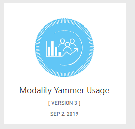
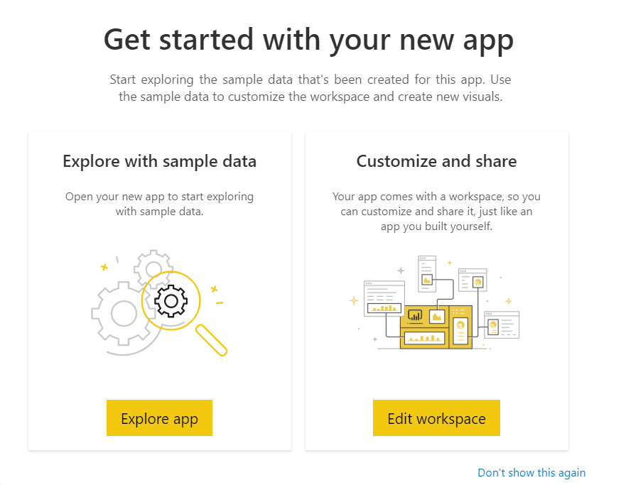

# Modality Yammer Usage

Thank you for installing the Modality Yammer Usage Power BI app. 

> This application reports on information from the Modality Teamwork Analytics data engine. 
It comes pre-installed with demo data, allowing you to navigate the app and explore how the 
app visualises Yammer information to improve user adoption and enhance corporate social efforts.
If you have already have Teamwork Analytics deployed, follow the deployment instructions to connect these reports to your data. If, after reviewing the demo, you wish to proceed to purchase Teamwork Analytics for use with your own data, or deploy a trial in your tenant please [contact us](https://modalitysoftware.com/contact) for further details. [Read more about the Teamwork Analytics suite](https://modalitysoftware.com/teamwork-analytics).

## How to use the app

Once installed, the app will show in your [Power BI Apps](https://app.powerbi.com/groups/me/apps) list:

Clicking it will open the Getting Started dialog. Choose the **Explore app** button on the left hand side. We have pre-populated the app with sample data to enable you to explore the app.

You can explore the app using the navigation on the left hand side:

## Things to try

### Filtering

You can filter information using the top bar. For instance, on the *Housekeeping* page, try changing the *Country* dropdown to *Australia*. All other visuals on the page will change to now only show information about Teams related to users with their country set to Australis.

### Visual Filtering

You can also click on visuals to set filters. Try clicking the *Teams and Owners* ring to only show *Teams with One Owner*. The list of Teams will now only show those Teams which need remediation (based on best practice to have more than 1 Team owner).

### Drillthrough
Some pages support Drillthrough, enabling you to move between different reports to gain more detail. Start with the *Interactions* page. Choose a country from the top-left visual, for instance *Australia*. Let's say you are interesed in knowing more about the message usage for Australia. Right-click on the *Australia* slice and choose *Drillthrough > Month on Month Graph*. This shows more detail about usage in Australia. 

### Insights
When looking at graphs, you can also use insights to attempt to explain changes. Right-click on a point in a graph, choose *Analyze > Explain*:

