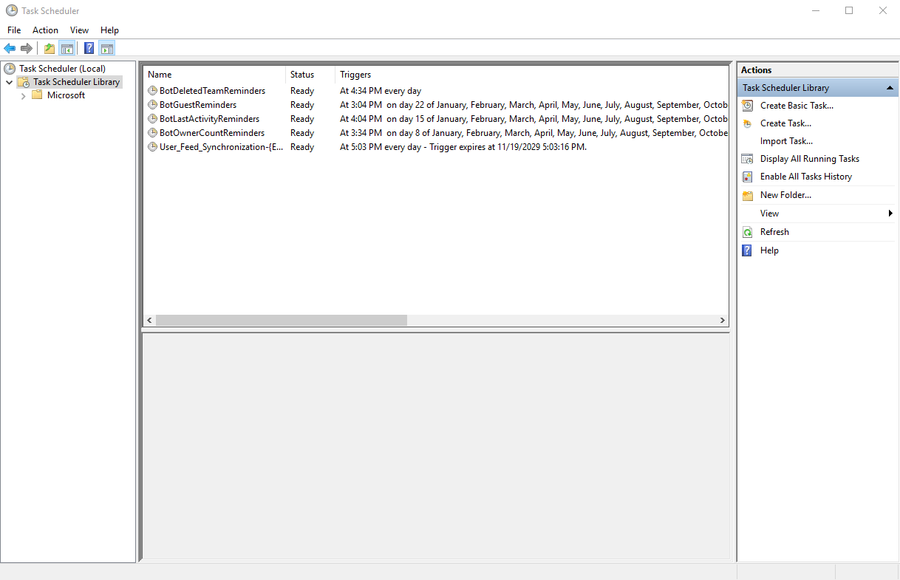
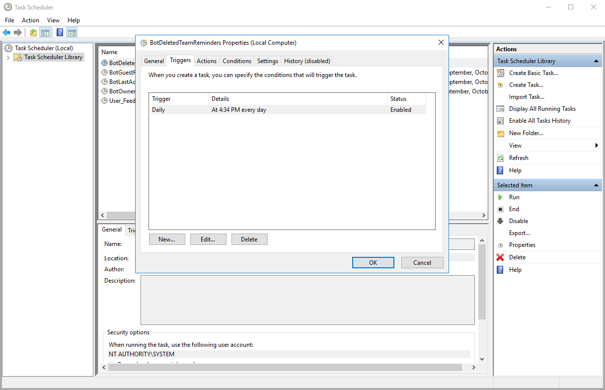
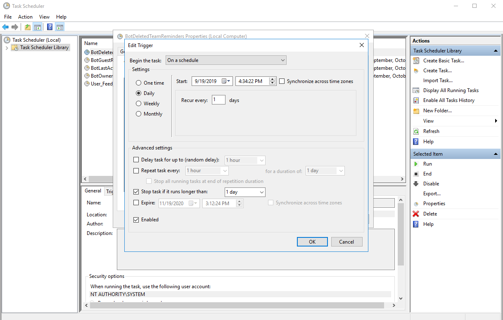

# How to Configure Task Scheduler Reminders for Teamwork Analytics Notification Service

The Notification Service will create several Task Schedules to run each notification reminder. Some will be configured to run once a month and others, such as the deleted team reminder, will run daily by default.

These can be configured by the Windows Task Scheduler which you can achieve by following the steps bellow.

## Configuring Task Scheduler

This process requires access to the virtual machine that you have [deployed Teamwork Analytics](README.md) onto.

1. Open Windows Task Scheduler and select **Task Scheduler Library** on the left panel. You should see a list of Reminder Schedules set to run on their respective dates.
  >Task Scheduler can be found in the start menu in the *Windows Administrative Tools* folder.

  >Alternatively you can run `"taskschd.msc"`.

2. Right click the schedule you wish to change and select properties. Then select the **Triggers** tab in the interface that pops up. You should see a list of triggers for the selected schedule. By default there should be only one trigger per schedule.

3. Select the trigger you wish to change and then click on **Edit** button below. You should se a new interface with details of the selected trigger.

4. Here you can change the values under the **Settings** section. 
  > **Daily:** Select how many days to wait before the trigger recurs again for the selected schedule.

  > **Weekly:** Select how many weeks to wait before the trigger recurs again for the selected schedule and on which day of the week to trigger on.

  > **Monthly:** Select which months you would like the trigger to recur in. Then either select ***Days*** to pick which days of the month or ***On*** to let windows pick more intelligently which days of the month to recur on.