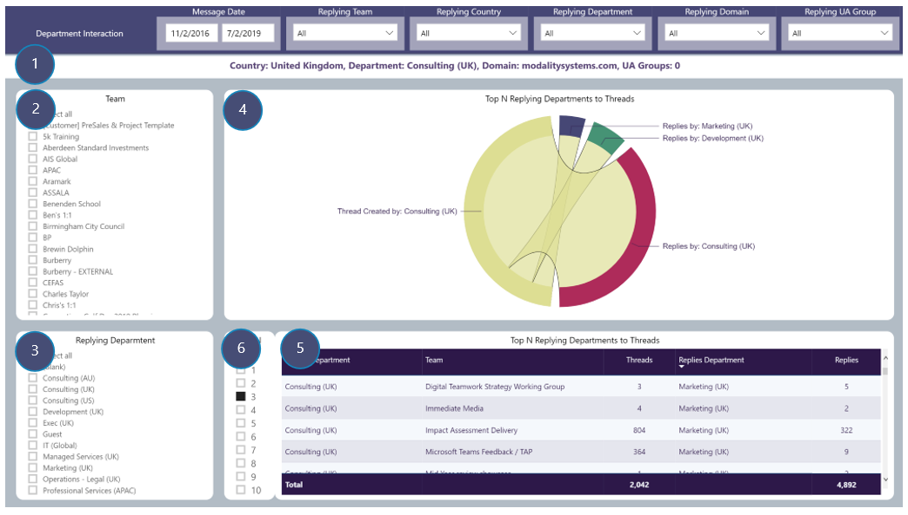

# Department Interaction
View number of Channel message threads by selected drill-through Department and number of replies by replying Departments to those threads

### Drill-through available from: 
Table visuals displaying Department

## Page Visuals

### 1.	Drill-through Summary
Country of selected Department, selected Department, Domains and UA Groups in selection

### 2.	Team
Filter report page by replying Team

### 3.	Replying Department
Filter report page by replying Departments

### 4.	Top N Replying Countries to Threads
Interaction between selected Department creating Channel message threads and Top N Departments replying to those threads

### 5.	Top N Replying Countries to Threads
Details of Department creating Channel message threads in each Team and replying Departments

### 6.	Top N Selector
Limit visuals in 5 and 6 to only displaying Top N replying Departments
