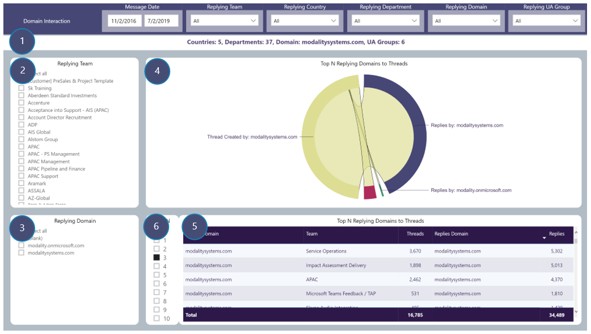

# Domain Interaction
View number of Channel message threads by selected drill-through Domain and number of replies by replying Domains to those threads. Useful in bigger orgs.
### Drill-through available from: 
Table visuals displaying Domain

## Page Visuals

### 7.	Drill-through Summary
Countries, Departments, selected Domain and UA Groups in that Domain

### 8.	Team
Filter report page by replying Team

### 9.	Replying Department
Filter report page by replying Departments

### 10.	Top N Replying Countries to Threads
Interaction between selected Department creating Channel message threads and Top N Departments replying to those threads

### 11.	Top N Replying Countries to Threads
Details of Department creating Channel message threads in each Team and replying Departments

### 12.	Top N Selector
Limit visuals in 5 and 6 to only displaying Top N replying Departments
