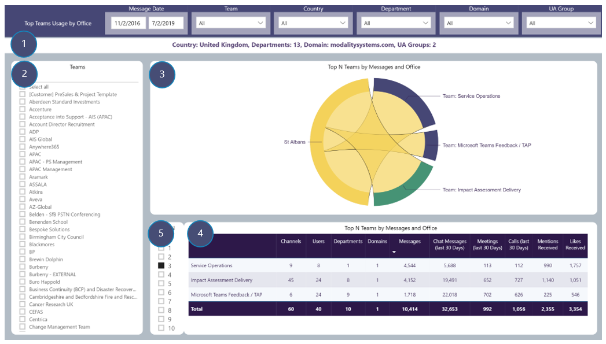

# Top Teams Usage by Office
View number of Channel messages by selected drill-through Office and which Teams created those messages
### Drill-through available from: 
Table visuals displaying Office

## Page Visuals

### 1.	Drill-through Summary
Country for selected Office, Departments, Domains and UA Groups in selection

### 2.	Team
Filter report page by Team(s)

### 3.	Top N Teams by Messages and Office
Selected Office and number of Channel messages and each Team contributing to those messages

### 4.	Top N Teams by Messages and Office
Details of Top N Teams for selected Office including number of Channels, Users, Departments, Channel messages etc

### 5.	Top N Selector
Limit visuals in 3 and 4 to only displaying Top N Teams for selected Office
