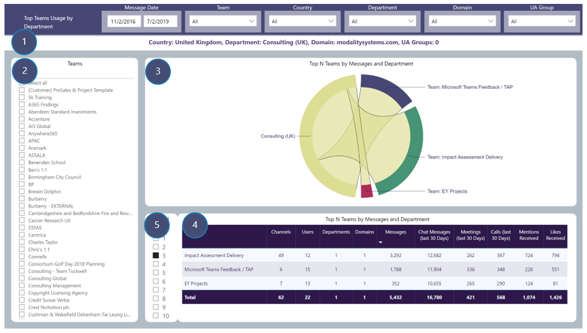

# Top Teams Usage by Department
View number of Channel messages by selected drill-through Department and which Teams created those messages
### Drill-through available from: 
Table visuals displaying Department

## Page Visuals

### 1.	Drill-through Summary
Country of selected Department, selected Department, Domains and UA Groups in selection

### 2.	Team
Filter report page by Team(s)

### 3.	Top N Teams by Messages and Department
Selected Department and number of Channel messages and each Team contributing to those messages

### 4.	Top N Teams by Messages and Department
Details of Top N Teams for selected Department including number of Channels, Users, Departments, Channel messages etc

### 5.	Top N Selector
Limit visuals in 3 and 4 to only displaying Top N Teams for selected Department
 
