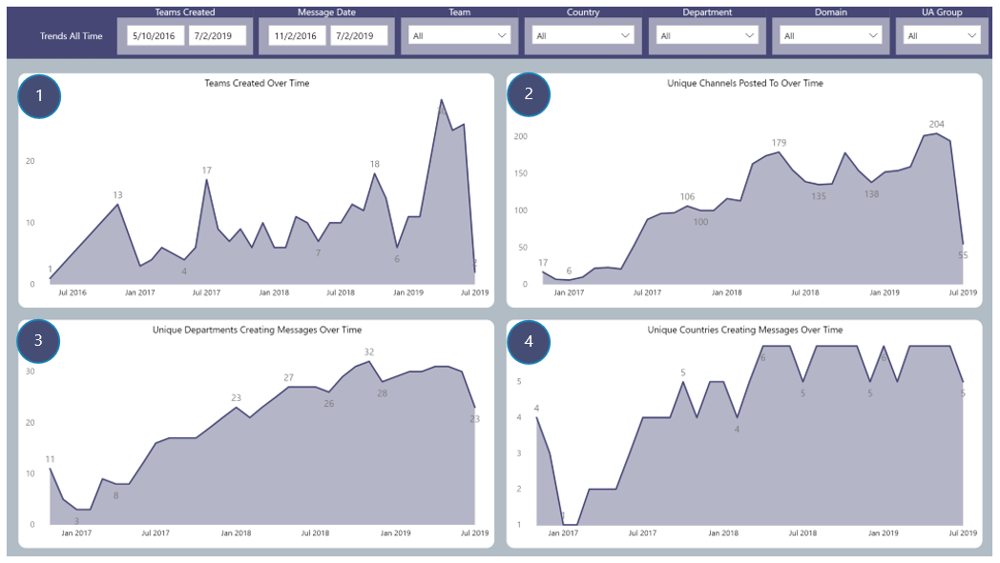

## Trends All Time
Trend reporting on the number of Teams created over time, the number of unique Channels having messages created in them over time and how many Countries and Departments are creating messages over time

## Page Visuals

### 1.	Teams Created Over Time
Number of Teams created over time

### 2.	Unique Channels Posted to Over Time
Number of unique Channels that messages are created in over time

### 3.	Unique Departments Creating Messages Over Time
Number of unique Departments creating Channel messages over time

### 4.	Unique Countries Creating Messages Over Time
Number of unique Countries creating Channel messages over time
